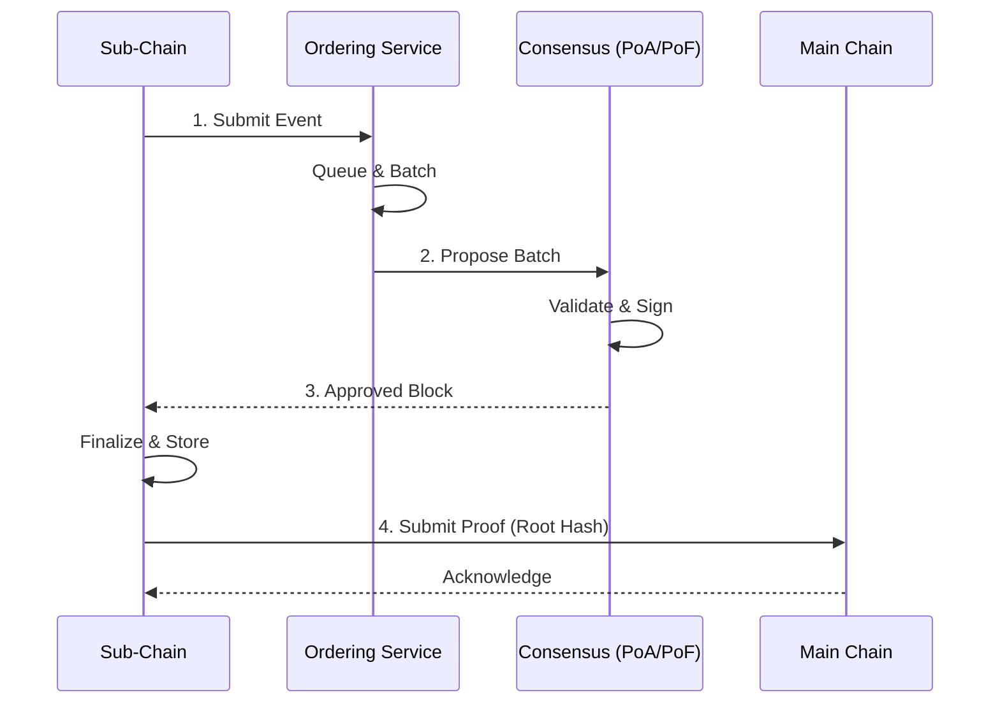

# Consensus & Ordering

## Purpose

This page describes the consensus mechanisms and the Ordering Service that HieraChain uses to keep blocks and events ordered, intact and verifiable.

## Architecture and concepts

* Base Consensus: `hierachain/consensus/base_consensus.py` defines the base interface and framework for consensus algorithms.
* Proof of Authority (PoA): `hierachain/consensus/proof_of_authority.py` provides intra-organization consensus with a single MainChain that manages internal domain Sub-Chains.
* Proof of Federation (PoF): `hierachain/consensus/proof_of_federation.py` provides inter-organization P2P MainChain alliance consensus for a consortium without a central RootChain.
* BFT Consensus: `hierachain/consensus/bft/` adds Byzantine fault tolerance at the hierarchical level.
* Ordering Service: `hierachain/consensus/ordering/` orders events before block creation and is built from several components (Processor, Certifier, BlockBuilder).

### Typical flow



1. A Sub-Chain receives an event and pushes it to the Ordering Service queue.
2. The Ordering Service builds a batch based on size and time thresholds and sends it to the selected consensus mechanism.
3. The consensus mechanism (PoA, PoF or BFT) confirms the batch or block, then the Sub-Chain closes the block.
4. If Main Chain anchoring is enabled, the Sub-Chain sends the proof (Merkle root or hash) to the Main Chain for recording.

## Configuration

Variables in `hierachain/config/settings.py`:

* `CONSENSUS_TYPE`: `proof_of_authority` (default) or `proof_of_federation`.
* `BFT_ENABLED`: turns the BFT layer on or off for Byzantine-resistant scenarios.
* `VALIDATOR_TIMEOUT`: timeout between validators.
* `CONSENSUS_FEDERATION_CONFIG`: federation parameters (for example `min_validators` and `block_interval`).

Environment example:

```dotenv
HRC_CONSENSUS_TYPE=proof_of_authority
HRC_ZK_REQUIRED_MAINCHAIN=false
```

## Features and limitations

* PoA is simple to deploy and has low latency, but it depends on a central validator for trust.
* PoF balances trust and distribution, but it requires federation membership to be managed.
* BFT tolerates Byzantine faults well, but it adds complexity and higher message overhead.
* Ordering keeps event order and batching stable before a block is finalized.

## Related

* Architecture Overview: [Overview](overview.md)
* Hierarchical module: [Hierarchical](../modules/hierarchical.md)
* Data Models: [Data Models](../reference/data-models.md)
* Config: [Config](../reference/config.md)
