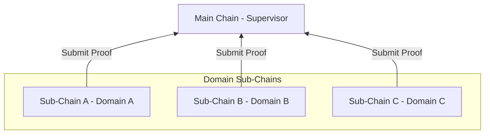
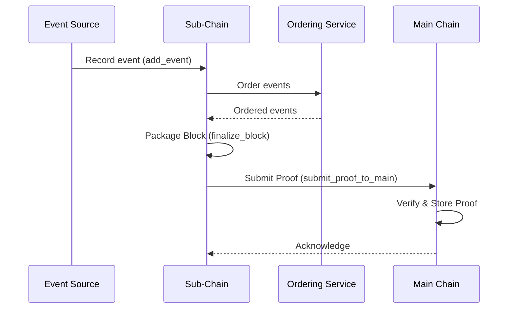

# Architecture Overview

## Purpose

HieraChain uses a hierarchy. The Main Chain is the root authority and keeps only proofs from Sub-Chains. Sub-Chains handle business data (events) for each domain. This page describes what each component does and how the main flows work.

## Architecture & Concepts

* Sub-Chains record domain events, order them into blocks, and keep their own world state.
* The Main Chain does not keep detailed domain data. It keeps only cryptographic proofs, which provide system-wide integrity.
* HierarchyManager handles Sub-Chain creation and registration, proof submission, and other multi-chain tasks.

### Key Components

* `hierachain/hierarchical/main_chain/base.py` is the Main Chain. It stores and verifies proofs from Sub-Chains and aggregates integrity reports.
* `hierachain/hierarchical/sub_chain/base.py` is the Sub-Chain. It records domain events, orders them into blocks, generates proofs and sends them to the Main Chain.
* `hierachain/hierarchical/hierarchy_manager/base.py` is the HierarchyManager. It coordinates the multi-chain system, manages the Sub-Chain lifecycle, handles automatic proof submission and cross-chain verification.
* `hierachain/api/storage/ipfs_client.py` provides off-chain IPFS storage. It keeps large or sensitive business data off chain and anchors only the CID on the blockchain.
* `hierachain/consensus/ordering/service.py` is the Ordering Service. It orders events before block creation and is initialized by the Sub-Chain.

### Typical Flow

1. Record event and create block on the Sub-Chain. `SubChain.add_event()` receives the event and passes it through internal ordering. Events are batched into a block and `finalize_block()` runs when conditions are met.
2. Submit proof to the Main Chain. `SubChain.submit_proof_to_main()` generates a proof from the Merkle root or block hash and calls `MainChain.add_proof()` to anchor it.
3. Global reporting. The Main Chain aggregates results from `get_main_chain_stats()` and per Sub-Chain statistics.
4. System coordination. `HierarchyManager` handles periodic proof submission with `configure_auto_proof_submission`, plus synchronization and cross-chain consistency checks.

## Related

* Quickstart: [Quickstart](../getting-started/quickstart.md)
* Glossary: [Glossary](../glossary.md)
* Core Module: [Core](../modules/core.md)
