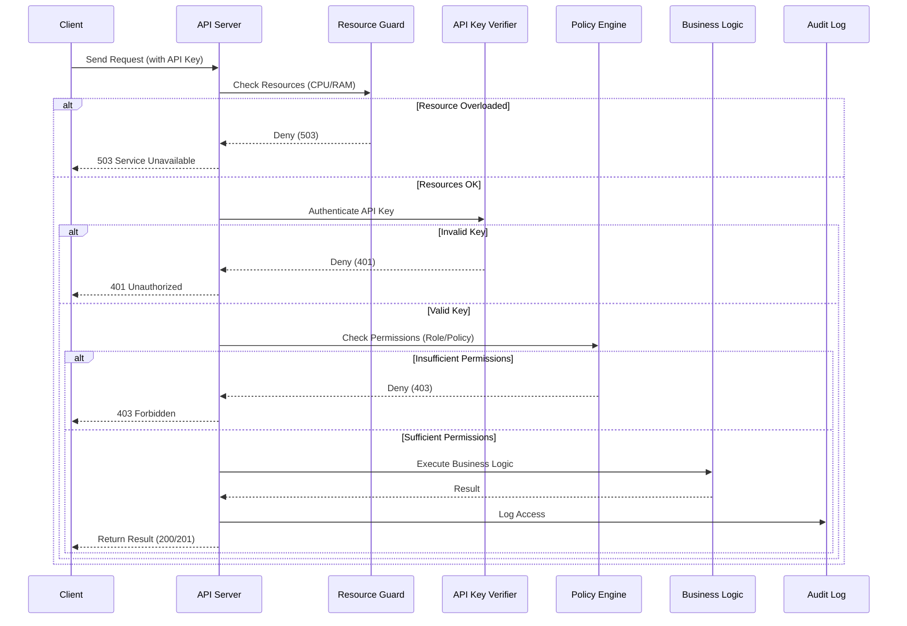

# Security Architecture

This page describes security mechanisms at the architectural level and how they fit into HieraChain. The system uses a layered defense that covers the whole application lifecycle.

## Main security pillars

The defense is organized into six coordinated areas:

* Authorization and access control:

    * `hierachain/security/{msp.py, identity.py}` manages Organization, User, Role and PKI identity.
    * `hierachain/security/policy_engine.py` handles permission control (ABAC).
    * `hierachain/security/verify/api_key_verifier.py` handles API key authentication.

* Lockdown and logging:

    * `hierachain/security/secure_logging.py` provides tamper-evident logs and masks PII.
    * `hierachain/cluster/lockdown_protocol.py` provides emergency lockdown with quorum and contains `ClusterLockdownManager`.

* Fault tolerance and integrity:

    * `hierachain/error_mitigation/{rollback_manager.py, consensus_validator.py, resource_validator.py}` and `hierachain/cluster/lockdown_types.py` provide integrity checks, rollback snapshots and HMAC lockdown. There is no `security/resource_guard.py` or `security/integrity.py`; those paths were removed or never existed.

* Risk analyzer:

    * `hierachain/risk_management/risk_analyzer.py` handles risk scoring and uses validators in `hierachain/error_mitigation/*`.
    * `hierachain/security/sanitization.py` helps prevent injection by neutralizing HTML/templates and enforcing a filename allowlist.

* Encryption and keys:

    * `hierachain/security/{key_manager.py, key_provider.py}` and `hierachain/security/msp.py` (`Certificate`/`CertificateAuthority`) provide Ed25519 support and `FileVaultProvider` (Fernet/PBKDF2, dev only). There is no `key_backup_manager.py` or `certificate.py` and no mTLS.

* Decentralized zero-knowledge proofs:

    * `hierachain/security/zk_prover.py` and `hierachain/security/verify/zk_verifier.py` implement zero-knowledge proofs for anonymous Sub-Chain data verification.

System security configuration is toggled in `hierachain/config/settings.py` (AUTH, CORS, HSTS, rate limit and others).

## System integration

* API Server (`hierachain/api/server.py`) adds middleware (`add_payload_limit`, `add_rate_limit`, `add_cors_middleware` via `CORSMiddleware`) and API key authentication (`verify/api_key_verifier.py`) when `HRC_AUTH_ENABLED=true`. There is no `ResourceGuardMiddleware`.
* Sub-Chain/Main Chain: every state-changing operation must pass authentication when AUTH is enabled and is logged for audit.
* Secure logging: `security/secure_logging.py` and `security/sanitization.py` reduce leakage of sensitive data.

## Related configuration (excerpt)

Variables in `settings.py` (all use the `HRC_*` prefix):

* `HRC_AUTH_ENABLED`, `HRC_API_KEY_LOCATION`, `HRC_API_KEY_NAME`
* `HRC_CORS_ALLOW_ALL`, `HRC_CORS_ORIGINS`
* `HRC_HSTS_ENABLED`, `HRC_HSTS_MAX_AGE`
* `HRC_RATE_LIMIT`, `HRC_RATE_LIMIT_RPM`, `HRC_RATE_LIMIT_BACKEND`, `HRC_TRUSTED_PROXIES` (there is no `RATE_LIMIT_REQUESTS_PER_MINUTE`)

## Typical flow

1. Request to API goes through an optional ResourceGuard CPU/RAM check, then API key authentication, then policy and role check, then execution, then audit logging.
2. Events and transactions that carry signatures or ZK proofs are verified by `verify/*` before acceptance.

## Related

* Security Module: [Security](../modules/security.md)
* Config Reference: [Config](../reference/config.md)
* API Ledger: [API Ledger](../reference/api-ledger.md)
