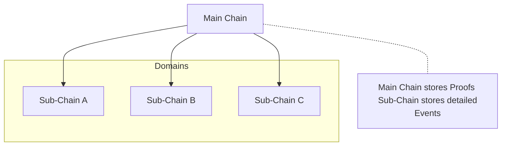
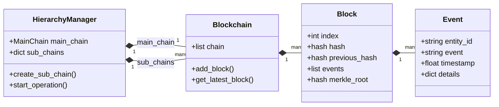

# Core Concepts

This page summarizes the foundational concepts for reading and using HieraChain effectively. When encountering new terms, see the [Glossary](../glossary.md).

## Key Concepts

* Chain: A collection of Blocks linked by `previous_hash`. HieraChain has two chain layers: `Main Chain` and domain-specific `Sub-Chains`.
* Block: A group of Events with metadata (header). See `hierachain/core/block.py`.
* Event: A business operation (not a cryptocurrency transaction). Stored as Arrow tables per schema in `hierachain/core/block.py:261` (`EVENT_SCHEMA`).
* Proof: A cryptographic footprint (e.g. Merkle root/hash) representing Sub-Chain state, anchored to the Main Chain.
* Hierarchy: Architecture where Main Chain supervises multiple Sub-Chains. Managed by `HierarchyManager`.

### Data Structure

## Basic Flow

1. Write Event to Sub-Chain → batch into Block by conditions (size/time).
2. Generate Proof from Block (e.g. Merkle root) → submit to Main Chain for anchoring.
3. Trace/Statistics: API allows entity tracking, Block/Chain viewing, and system information aggregation.

## Related Source Files

* Core: `hierachain/core/block.py`, `hierachain/core/blockchain.py`
* Hierarchical: `hierachain/hierarchical/main_chain/base.py`, `hierachain/hierarchical/sub_chain/base.py`, `hierachain/hierarchical/hierarchy_manager/base.py`
* API: `hierachain/api/ledger/router.py`, `hierachain/api/ledger/schemas.py`
* Security: `hierachain/security/*`
* Configuration: `hierachain/config/settings.py`

## Related

* Quickstart: [Quickstart](quickstart.md)
* Architecture Overview: [Overview](../architecture/overview.md)
* Glossary: [Glossary](../glossary.md)
