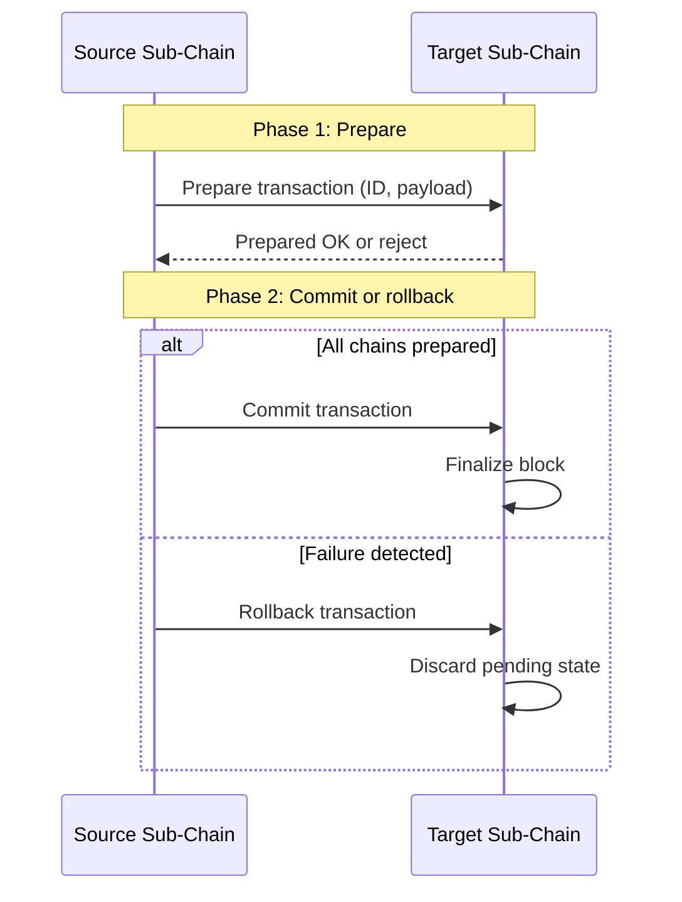

# Domains Module (`hierachain/domains/*`)

## 1. Overview

The `domains` module bridges the core blockchain infrastructure with enterprise business logic. It provides base classes for domain-specific Sub-Chains, standardized event creators, entity lifecycle helpers, and cross-chain tracing tools.

## 2. Core components

Components are organized into three sub-packages under `hierachain/domains/`:

### 2.1 Business chains (`chains/base_chain.py`, `chains/domain_chain.py`)

* `BaseChain`: Abstract base class managing chain states, entity registries, and event pipelines.
* `DomainChain`: Concrete implementation supporting domain operations, operation validation, and transaction managers.
* `chains/metrics.py`: Tracks operational metrics such as success rates and execution latencies.

### 2.2 Enterprise events (`events/base_event.py`, `events/event_creators.py`)

* `BaseEvent`: Base class for structured business events with schema validation.
* `event_creators.py`: Helper factories producing validated dictionaries for operations: `create_quality_check`, `create_approval`, `create_resource_allocation`, and `create_status_update`.

### 2.3 Integrity utilities (`utils/cross_chain_validator.py`, `utils/entity_tracer.py`)

* `CrossChainValidator`: Evaluates consistency across sub-chains and scans for forbidden cryptocurrency terminology.
* `EntityTracer`: Reconstructs complete entity histories across the chain hierarchy.
* `utils/compliance_checker.py`: Validates compliance parameters against regulatory rules.

## 3. Domain management and entity lifecycle

`DomainChain` provides built-in lifecycle transitions:

1. Registration: Links a unique `entity_id` to an entity type and metadata attributes.
2. Status updates: Tracks sequential states (`in_progress`, `quality_approved`, `completed`).
3. Resource allocation: Records assigned equipment, personnel, or storage locations.
4. Operation metrics: `OperationMetricsTracker` calculates execution metrics per operation type.

## 4. Two-Phase Commit (2PC) coordination

Cross-chain operations coordinating multiple Sub-Chains execute through the Two-Phase Commit protocol:



## 5. Compliance and cross-chain tracing

### Cryptocurrency term filtration

`CrossChainValidator` scans event payloads to enforce enterprise terminology rules. If terms such as `coin`, `token`, `mining`, or `wallet` appear in business payloads, the validator flags the event as non-compliant.

### Cross-chain entity tracing

`EntityTracer` aggregates events for an entity across all Sub-Chains:

```python
from hierachain.domains.utils.entity_tracer import EntityTracer

tracer = EntityTracer(hierarchy_manager)
trace_results = tracer.trace_entity("ORDER-789")

print(f"Total events found: {trace_results['total_events']}")
for chain_name, summary in trace_results.get("chain_summaries", {}).items():
    print(f"Activity at {chain_name}: {summary['total_events']} events")
```

## 6. Standardized operation types

| Operation Type | Business Role | Required Fields |
| :--- | :--- | :--- |
| `quality_check` | Quality inspection | `check_type`, `check_result` |
| `approval` | Management approval | `approval_type`, `approver_id` |
| `resource_allocation` | Resource assignment | `resource_type`, `resource_id` |
| `compliance_check` | Regulatory verification | `compliance_type` |

## Related

* [Hierarchical Module](./hierarchical.md)
* [Writing Domain Logic](../how-to/write-domain-contracts.md)
* [ERP Integration](../workflows/erp-integration.md)
