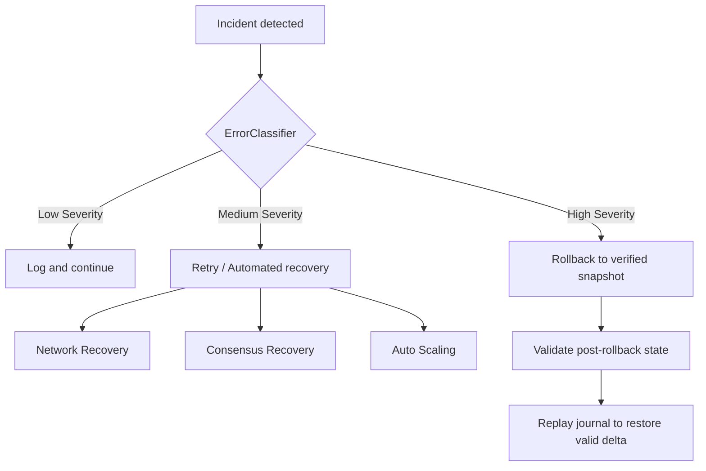

# Error Mitigation Module (`hierachain/error_mitigation/*`)

## 1. Overview

The `error_mitigation` module handles fault tolerance, state validation, and system recovery. It provides append-only event journals, automated error classification, rollback snapshots, and targeted recovery engines for network, consensus, and state failures.

## 2. Core components

Components reside in `hierachain/error_mitigation/`.

### 2.1 Validation layer (`validator.py`, `data_validator.py`)

* `Validator`: Validates block and event structure against ledger rules.
* `DataValidator`: Checks event payload consistency, Arrow schema alignment, and input constraints.

### 2.2 Durable journaling (`journal.py`)

* Implements `TransactionJournal` using Apache Parquet and Arrow for disk-backed event logging.
* Enforces append-only storage before events commit to blockchain state.
* Provides replay generators to reconstruct uncommitted events after ungraceful shutdowns.

### 2.3 Rollback manager (`rollback_manager.py`)

* Creates and verifies point-in-time state snapshots (`FULL_SYSTEM`, `CHAIN_STATE`, `CONSENSUS_STATE`, `CONFIGURATION`).
* Validates SHA-256 snapshot hashes prior to applying rollbacks.
* Integrates quarantine mechanisms for corrupt state blocks.

### 2.4 Recovery subsystems

* `backup_recovery.py`: Manages backup archives, snapshot restoration, and retention policies.
* `consensus_recovery.py`: Handles view change synchronization, leader failure recovery, and BFT round restarts.
* `network_recovery.py`: Detects network partition events, initiates reconnect backoffs, and manages peer alerts.
* `auto_scaler.py`: Monitors memory and CPU utilization to dynamically scale validator thresholds.

## 3. Error classification strategy

`ErrorClassifier` in `error_classifier.py` categorizes errors by severity and recommends mitigation actions:

| Severity Level | Category Meaning | Mitigation Action |
| :--- | :--- | :--- |
| INFO / WARNING | Minor operational anomalies | Log and continue |
| ERROR | Event validation or transient processing failures | Retry with backoff or reject |
| CRITICAL | State corruption or Merkle root mismatch | Rollback and quarantine |
| FATAL | Irrecoverable consensus or hardware failure | Emergency lockdown |

## 4. Transaction journaling

The `TransactionJournal` provides write-ahead persistence:

1. Durable writes: Writes records to Parquet files on disk before blocks finalize.
2. Schema enforcement: Guarantees every journal record matches the required event schema.
3. Replay ability: Replays logged events from disk into the ordering pipeline during node restart.

```python
from hierachain.error_mitigation.journal import TransactionJournal

journal = TransactionJournal(storage_dir="data/journal")
journal.log_event(event_dict)
```

## 5. Recovery workflow



## 6. Snapshot types

`RollbackManager` manages four snapshot scopes:

* `CONFIGURATION`: Node settings and environment parameters.
* `CHAIN_STATE`: Block hashes and world state registers across Main Chain and Sub-Chains.
* `CONSENSUS_STATE`: Current view number, validator set, and leader status.
* `FULL_SYSTEM`: Comprehensive archive combining configuration, chain blocks, and consensus state.

## Related

* [Adapters Module](./adapters.md)
* [Core Module](./core.md)
* [Cluster Lockdown](./cluster.md)
