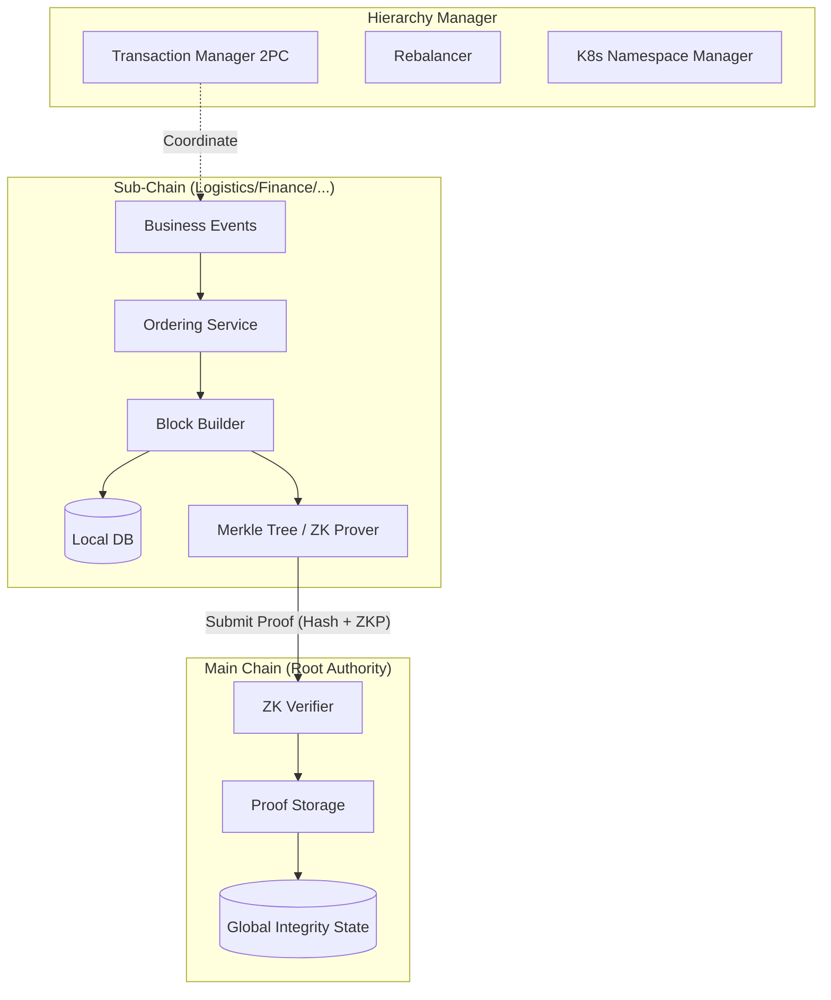

# Hierarchical Module (`hierachain/hierarchical/*`)

## 1. Overview

The `hierarchical` module implements the two-tier ledger architecture of HieraChain. Sub-Chains process domain business events and store detailed state locally. The Main Chain stores cryptographic proofs and root hashes submitted by Sub-Chains. This separation maintains business data privacy, keeps Main Chain verification lightweight, and scales horizontally by partitioning load across chains.

## 2. Foundational components

Components reside in dedicated packages under `hierachain/hierarchical/`.

### 2.1 Main Chain (`main_chain/base.py`)

* Stores cryptographic block proofs rather than raw business event records.
* Verifies state transitions using zero-knowledge proofs when enabled.
* Validates cross-chain anchors under consortium or authority consensus.

### 2.2 Sub-Chain (`sub_chain/base.py`)

* Operates dedicated business workflows for a specific domain or department.
* Packages business events into blocks and calculates Merkle roots.
* Generates periodic state proofs for submission to the Main Chain.

### 2.3 Hierarchy Manager (`hierarchy_manager/base.py`)

* Coordinates chain lifecycles, cross-chain verification, and multi-organization setups.
* Manages communication channels, private data collections, and two-phase commit (2PC) transactions.
* Compiles system-wide integrity reports across all registered chains.

### 2.4 Multi-organization, channels, and private data

* `multi_org.py`: Manages member organizations, certificates, and MSP identities.
* `channel/manager.py`: Partitions communication between specific groups of organizations.
* `private_data.py`: Stores confidential payloads off-chain while anchoring cryptographic hashes on-chain.

## 3. Data flow

Detailed data remains on Sub-Chains. Only Merkle roots and cryptographic proofs anchor to the Main Chain:



## 4. Scalability and infrastructure management

### Sub-chain rebalancer (`rebalancer/rebalancer.py`)

The rebalancer monitors throughput and splits heavily loaded Sub-Chains when events-per-second (EPS) exceed operational thresholds:

* Strategies: Hash-based, time-based, or volume-based partitioning.
* Migration: Relocates entity states to daughter chains without service interruption.

### Kubernetes namespace isolation (`k8s_namespace_manager/operations.py`)

Maps each Sub-Chain into a dedicated Kubernetes namespace, enforcing resource quotas and network policies per domain.

## 5. Cross-chain operations (2PC)

`CrossChainTransactionManager` in `hierachain/hierarchical/transaction_manager.py` implements a two-phase commit protocol to maintain atomicity across Sub-Chains:

```python
from hierachain.hierarchical.hierarchy_manager import HierarchyManager

manager = HierarchyManager()
tx_id = manager.initiate_cross_chain_transaction(
    source_chain_name="supply_chain",
    dest_chain_name="finance_chain",
    payload={"asset_id": "INV-100", "action": "settle_payment"}
)
```

## 6. Privacy and zero-knowledge verification

* Main Chain verification: Sub-Chains can submit zero-knowledge proofs confirming valid state transitions according to consensus rules without revealing raw event details.
* Private data collections: Sensitive payloads are restricted to authorized member nodes, while only hashes are propagated across the common ledger.

## Related

* [Consensus Module](./consensus.md)
* [Domains Module](./domains.md)
* [Two-Phase Commit Guide](../how-to/cross-chain-transactions.md)
