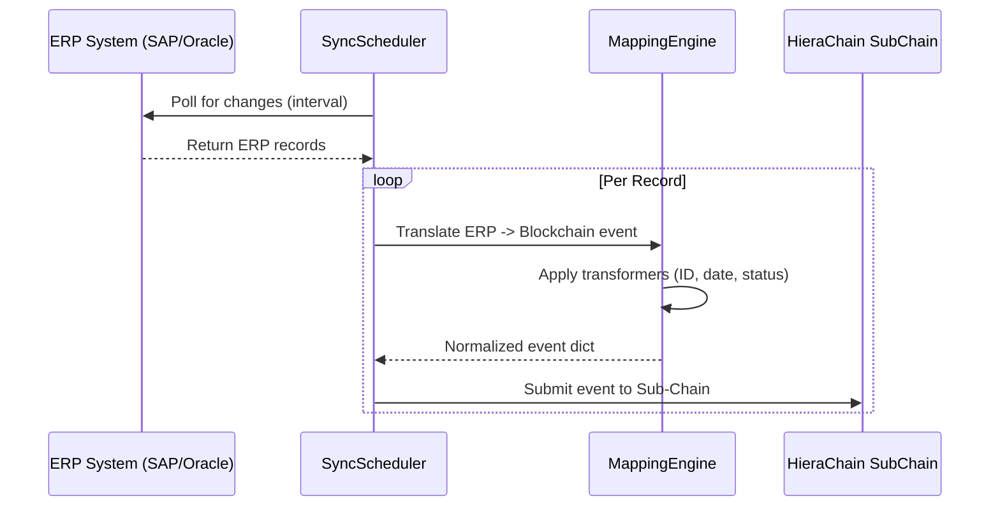

# Integration Module (`hierachain/integration/*`)

## 1. Overview

The `integration` module connects HieraChain to enterprise software systems such as SAP, Oracle, and Microsoft Dynamics. It extracts records from external ERP systems, normalizes data through a mapping engine, and records verifiable state events on domain sub-chains.

## 2. Core components

All integration components reside in `hierachain/integration/`.

### 2.1 ERP Integration Ledger (`erp_ledger.py`, `erp/base.py`)

* Coordinates data synchronization pipelines.
* Integrates `MappingEngine` for field transformations.
* Manages `SyncScheduler` to poll external APIs on recurring intervals.

### 2.2 Enterprise adapters (`enterprise.py`)

* Connectors for SAP, Oracle, and Microsoft Dynamics.
* Reads endpoint URLs and credentials from environment variables (`HRC_SAP_*`, `HRC_ORACLE_*`, `HRC_DYNAMICS_*`).
* Handles authentication handshakes and HTTP session lifecycles.

### 2.3 Change detector (`erp/change_detector.py`)

* Compares incoming ERP data against previous state snapshots.
* Isolates delta modifications to avoid recording redundant events.

## 3. Mapping engine

The `MappingEngine` transforms enterprise payload fields into standardized event properties:

| Transformer | Function | Example Transformation |
| :--- | :--- | :--- |
| `date` | Standardizes timestamp formats | `12/04/2024` -> `ISO-8601` |
| `amount` | Normalizes numbers and currencies | `5000` -> `5000.0` (float) |
| `status` | Maps business status codes | `REQ` -> `REQUESTED` |
| `id` | Prefixes identifiers | `123` -> `ERP_123` |
| `boolean` | Normalizes truth values | `1/Yes/On` -> `True` |

## 4. Synchronization flow

`SyncScheduler` manages polling and retries for external data sources:



## 5. Usage example

### Configure mapping and scheduled sync

```python
from hierachain.integration.erp_ledger import ERPIntegrationLedger

sap_mapping = {
    "entity_id": "material.document_number",
    "event": {
        "source_path": "material.event_type",
        "transformer": "status",
        "params": {"mapping": {"GR": "GOODS_RECEIPT"}}
    },
    "details.quantity": {
        "source_path": "material.qty",
        "transformer": "amount"
    }
}

ledger = ERPIntegrationLedger()
# Start syncing with a domain sub-chain
ledger.start_scheduled_sync(
    profile_name="SAP_Logistics",
    interval_seconds=60,
    chain=sub_chain_instance
)
```

## 6. Resilience and security

* Thread concurrency: Uses `ThreadPoolExecutor` to handle concurrent sync profiles without blocking main event processing.
* Secret isolation: Credentials use environment variables rather than configuration files in version control.
* Automatic retry: Sync workers use exponential backoff when encountering transient network timeouts.

## Related

* [Hierarchical Module](./hierarchical.md)
* [Core Module](./core.md)
* [Error Mitigation](./error-mitigation.md)
