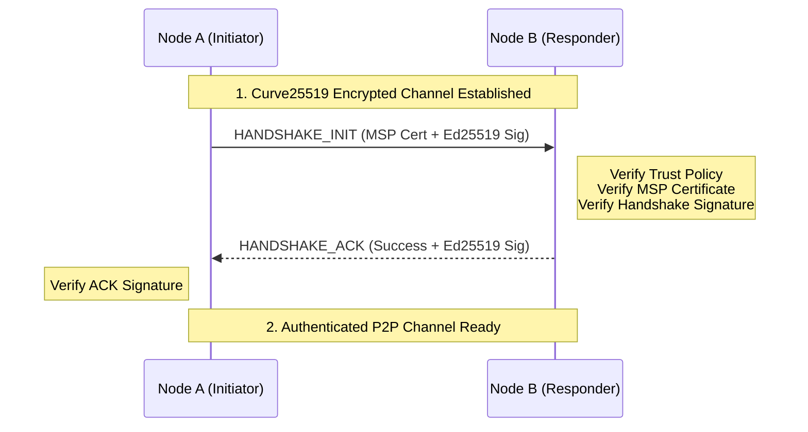

# Network Module (`hierachain/network/*`)

## Overview

The **Network** module is the backbone that allows nodes in the HieraChain network to communicate with each other. Designed with a "Defense-in-Depth" philosophy, this module combines the transmission power of **ZeroMQ** with modern cryptographic algorithms to ensure every message is encrypted, authenticated, and tamper-proof.

---

## Layered Security Architecture

HieraChain does not rely on a single security layer but combines three independent protection layers:

<div class="grid cards" markdown>

*   :material-lock-check:{ .lg .middle } __Layer 1: CurveZMQ (Transport)__

    ---

    __Technology__: Curve25519

    * Encrypts the entire transmission path between ZeroMQ Sockets.
    * Ensures privacy and prevents eavesdropping on Web2 networks.
    * Uses ephemeral keys to guarantee Forward Secrecy.

*   :material-account-check:{ .lg .middle } __Layer 2: MSP Handshake (Identity)__

    ---

    __Technology__: Ed25519 + Certificates

    * Authenticates node identity through MSP (Membership Service Provider) certificates.
    * Only allows nodes from valid organizations to join the network.
    * 2-step Handshake process: `INIT` and `ACK`.

*   :material-shield-sync:{ .lg .middle } __Layer 3: Integrity & Replay Protection__

    ---

    __Technology__: Ed25519 + Nonce + Timestamp

    * Every P2P message is digitally signed.
    * Prevents replay attacks by checking unique Nonce and Timestamp within the allowed window (60s).

</div>

---

## Core Components

### 1. ZMQ Transport (`zmq_transport.py`)
Implements the asynchronous P2P model using **ROUTER** (for receiving) and **DEALER** (for sending) sockets.

*   **Performance**: Processes thousands of messages per second with extremely low latency.
*   **Identity Management**: Manages node identities at the socket level for accurate routing.

### 2. Secure Connection Manager (`secure_connection.py`)
Orchestrates the secure connection establishment process:

1.  Establish a Curve25519 encrypted channel.
2.  Perform Handshake to exchange and verify MSP certificates.
3.  Manage the list of authenticated peers (`authenticated_peers`).

### 3. Peer Trust Manager (`peer_trust_manager.py`)
Manages the trust level of neighboring nodes:

*   **Policy Enforcement**: Applies `strict` (allowlist only) or `discovery` (auto-discovery) policies.
*   **Reputation**: Marks and disconnects peers with malicious behavior (wrong signatures, spam messages).

---

## Secure Handshake Process



---

## Usage Examples

### 1. Initialize a Secure Node
```python
from hierachain.network.secure_connection import SecureConnectionManager

# Initialize manager with MSP integration
secure_node = SecureConnectionManager(
    node_id="node_001",
    port=5001,
    msp=msp_instance,
    identity_mgr=identity_instance
)

await secure_node.start()
```

### 2. Send a Signed Message
```python
# Automatically signs and sends over the encrypted channel
payload = {"event": "block_proposal", "data": {...}}
await secure_node.send_secure("peer_002", payload)
```

---

## P2P Configuration (Environment Variables)

| Environment Variable | Function | Recommended Value (Prod) |
| :--- | :--- | :--- |
| `HRC_P2P_TRUST_POLICY` | Trust policy | `strict` |
| `HRC_P2P_REQUIRE_SIGNATURES` | Require Ed25519 signatures | `true` |
| `HRC_P2P_PEER_ALLOWLIST` | Trusted Peer ID list | (Specific ID list) |

---

## Related

*   [Security and MSP](./security.md)
*   [BFT Consensus](../consensus/bft_consensus.md)
*   [Network Monitoring](./monitoring.md)
