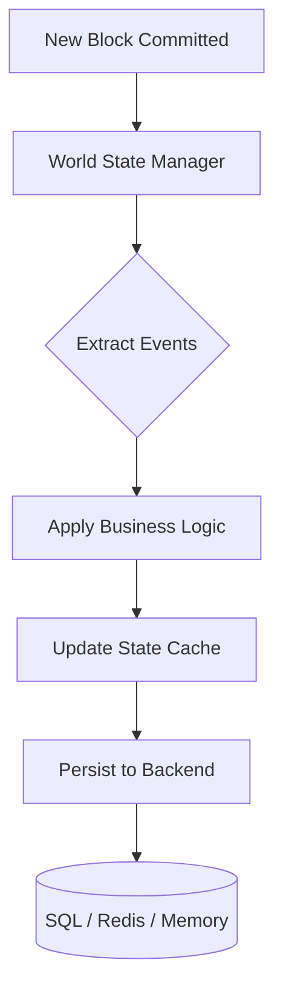

# Storage Module (`hierachain/adapters/database/*`)

## Overview

The storage module manages all HieraChain data, from block and event history to current entity state (World State). It has a pluggable design, so you can switch backends based on scale and performance needs without changing business logic.

---

## Multi-tier storage architecture

HieraChain splits storage into layers to balance durability and query speed:

*   :material-state-machine:{ .lg .middle } __World State Layer__

    ---

    __File__: `hierachain/state/world_state.py` (`WorldState.get_entity_state()`)

    * Holds current entity state derived from finalized blocks.
    * Updated when a block commits and supports caching. The codebase does not define implicit `creation/update/status_change` event types.

*   :material-database-sync:{ .lg .middle } __Persistence Layer (Adapters)__

    ---

    __File__: `hierachain/adapters/database/sqlite_adapter.py`, `postgres_adapter.py`, `redis_adapter.py`, `sqlite_schema.py`/`postgres_schema.py`

    * **SQLite/Postgres** via `SQLBase` + `init_database_schema()` (`chains`, `blocks`, `events`, `proofs`, `chain_state` tables; composite indexes).
    * **Redis Adapter**: `hierachain/adapters/database/redis_adapter.py` for entity indexing.
    * **Memory**: `HRC_STORAGE_BACKEND=memory` for tests. There is no built-in File Adapter. Parquet is for logs and journals (`core/parquet_log.py`, `error_mitigation/journal.py`), not for chain storage.

*   :material-cloud-sync:{ .lg .middle } __Off-chain Storage (IPFS)__

    ---

    __File__: `api/storage/ipfs_client.py`

    * Holds large payloads such as documents and detailed event data.
    * Stores only the CID on chain to save space.
    * Encrypts data with AES-256-GCM before upload.

---

## State update flow

---

## Core data models

There is no `models.py` or SQLAlchemy `BlockModel`/`EventModel`. Tables are created with raw SQL in `sqlite_schema.py`/`postgres_schema.py:init_database_schema()` with `chains`, `blocks`, `events`, `proofs`, `chain_state`. `Block` and `Blockchain` are plain Python classes in `hierachain/core/`.

---

## Backend configuration

| Environment Variable | Meaning | Available Values |
| :--- | :--- | :--- |
| `HRC_STORAGE_BACKEND` / `DATABASE_URL`+`HRC_DATABASE_URL` | Storage backend / DB URL | `sqlite`, `postgres` (auto-detected from `postgres://`), `redis`, `memory`, `parquet_only` (via `HRC_STORAGE_BACKEND`/`DATABASE_URL` handling in `config/settings.py:78`) |
| `HRC_LOG_SQL_DETAIL` / `HRC_LOG_FORMAT` | SQL detail / log format | `true/false`, `text/json` |

---

## Advanced features

### Integrity and idempotency

`SQLiteAdapter` and `PostgresAdapter` (via `SQLBase`) handle `save_block` with checks for duplicate `hash`/`block_hash` and verify `previous_hash` links (`consensus/ordering/storage.py:_verify_chain_links`). `SqlStorageBackend` does not exist in the current code.

### Indexing and queries

World State indexes every entity by `entity_id` and `timestamp`. With the Redis adapter, these indexes are stored as Sorted Sets, which makes history queries for an entity fast.

---

## Related

*   [Core Module (Block & Blockchain)](./core.md)
*   [ERP Integration](./integration.md)
*   [Performance Monitoring](./monitoring.md)
