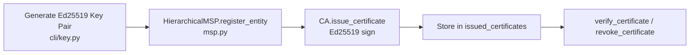

# Encryption & Keys

This security layer manages system secrets. That includes encryption keys, signing key pairs and identity certificates.

## Key manager and key providers

File: `hierachain/security/key_manager.py`, `key_provider.py`

This code creates and uses key pairs:

* Ed25519 support uses Ed25519 for fast and secure digital signatures.
* Pluggable providers support several key sources:

    * `LocalKeyProvider` keeps keys in local memory.
    * `FileVaultProvider` keeps encrypted data on disk with AES-256-GCM.

* API key lifecycle covers the full API key lifecycle from creation to revocation.

## Certificate and identity (MSP)

File: `hierachain/security/msp.py` (`Certificate`, `CertificateAuthority`, `HierarchicalMSP`)

This code manages lightweight internal identities, not X.509:

* Internal certificate is the `Certificate` dataclass with `cert_id`, `subject`, `public_key`, `signature` (Ed25519 via `_sign_certificate`) and `is_valid()` time check. There is no X.509 ASN.1 and no mTLS.
* CA operations are `CertificateAuthority.issue_certificate()`, `revoke_certificate()` and `verify_certificate()` with an in-memory `issued_certificates` set and `revoked_certificates` set. `HierarchicalMSP` uses this for org and entity registration.
* Limitation: revocation lives only in memory. There is no CRL distribution, no X.509 chain validation and no mutual TLS between components. TLS is expected at the reverse proxy per architecture rules.

## Key backup and recovery

Files: `hierachain/cli/key.py`, `hierachain/security/key_provider.py` (`FileVaultProvider`)

There is no dedicated `key_backup_manager.py`. The actual mechanism is minimal:

* Generation runs `python -m hierachain key generate --output validator_key.json` (CLI) to create an Ed25519 pair via `Ed25519PrivateKey.generate()` and write `{private_key, public_key}` hex JSON. The `show` and `verify` commands inspect the result.
* Encrypted vault (dev and test only) uses `FileVaultProvider` to encrypt the vault file with `PBKDF2HMAC(SHA256, 310_000 iter)` and `Fernet(AES-128-CBC+HMAC)`. This is suitable for dev and test and is documented as not for production. For production use HSM or KMS through the `KeyProvider` interface and `HRC_VAULT_*`.
* There is no multi-location backup, no SHA-512 integrity check and no auto distribution or cleanup. Operators must copy `validator_key.json` or `.vault` with external backup tooling.

---

## Key scope (actual)

* Validator and node key is a single Ed25519 `KeyPair` per node (via `LocalKeyProvider` or `FileVaultProvider`), referenced by `HRC_VALIDATOR_IDENTITY` and `HRC_MASTER_KEY_FILE`/`HRC_MASTER_KEY_SOURCE`.
* API keys are managed by `KeyManager` (create, revoke, permission, cached via `KeyStorage`/`KeyCacheManager`), not per-entity signing keys.
* There is no built-in hierarchy like Master to Domain to Entity. Domain isolation relies on Sub-Chain separation and MSP roles.

---

## Certificate initialization flow (actual)

---

## Related

*   [Authorization & Access Control](./authorization-access-control.md)
*   [Network Security](../modules/network.md)
