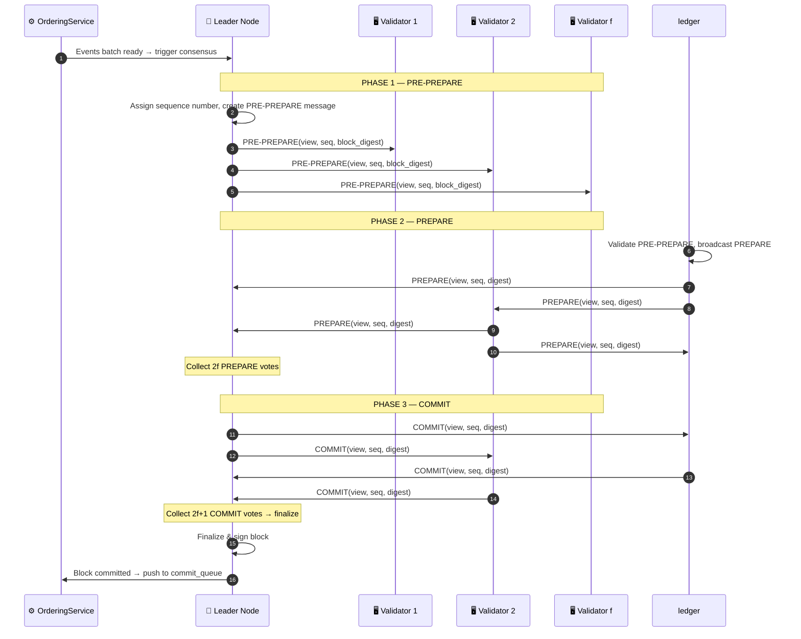
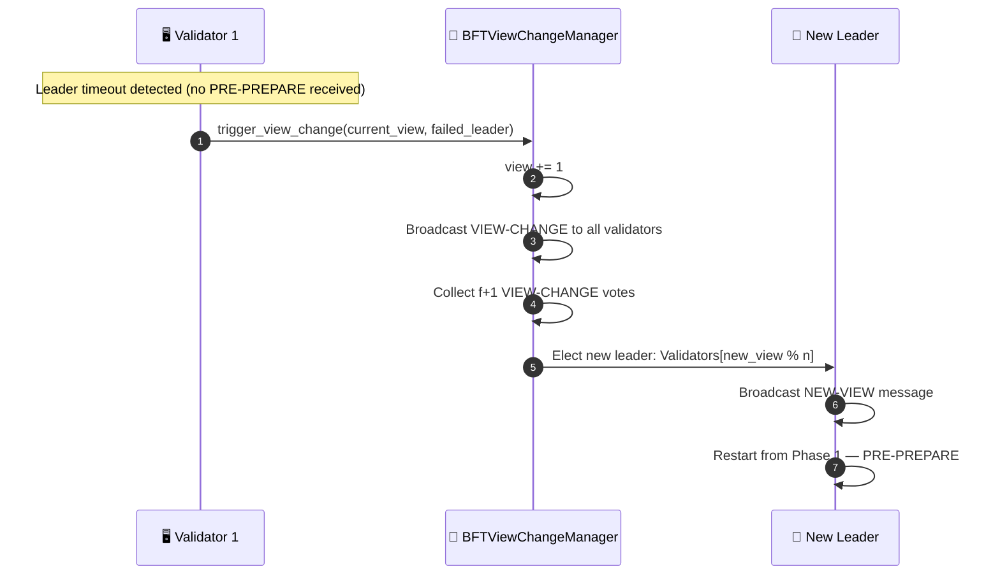

# BFT consensus

## Overview

The Byzantine Fault Tolerant consensus uses 3-phase PBFT to finalize blocks. It needs `n >= 3f + 1` nodes to tolerate `f` faulty or malicious nodes. In BFT mode this replaces the `finalize_block()` step from event submission.

For PoA and PoF flows, see [Consensus Mechanisms](./consensus_mechanisms.md).

You need at least 4 nodes to tolerate 1 Byzantine failure (n=4, f=1: 3×1+1=4).

---

## Flow diagram: 3-phase PBFT

---

## Flow diagram: view change (leader failure)

---

## Step-by-step breakdown

| Step | Description |
|:-----|:------------|
| **PRE-PREPARE** | Leader assigns sequence number and broadcasts block digest to all validators |
| **PREPARE** | Each validator validates the PRE-PREPARE, then broadcasts its own PREPARE vote. Leader collects 2f votes |
| **COMMIT** | Leader broadcasts COMMIT. Each node collects 2f+1 COMMIT votes, then finalizes locally |
| **View Change** | If leader silent > timeout: validators increment `view`, elect `Validators[view % n]` as new leader |

---

## Consensus comparison

| Algorithm | Mechanism | Fault Tolerance | Use Case |
|:----------|:----------|:----------------|:---------|
| **PoA** | Identity-based, authority signs | Validator reputation | Private / internal networks |
| **PoF** | Rotating leader, quorum `height % n` | Distributed trust | Consortium / multi-org |
| **BFT** | 3-phase PBFT | Up to `f` Byzantine nodes in `3f+1` | Critical / adversarial environments |

---

## Error handling

| Condition | Behavior |
|:----------|:---------|
| Leader timeout | View Change triggered, new leader elected (`Validators[new_view % n]`) |
| Validator sends invalid digest | Vote discarded, not counted toward quorum |
| Network partition < f nodes | Protocol continues if quorum (2f+1) still reachable |
| Network partition ≥ f+1 nodes | Protocol halts until partition heals (safety over liveness) |

---

## Key classes and methods

| Step | Class / Method | File |
|:-----|:--------------|:-----|
| 3-Phase PBFT | `BFTConsensus.run_consensus()` | `consensus/bft/consensus.py` |
| PRE-PREPARE | `BFTConsensus._send_pre_prepare()` | `consensus/bft/consensus.py` |
| PREPARE collect | `BFTConsensus._handle_prepare()` | `consensus/bft/consensus.py` |
| COMMIT finalize | `BFTConsensus._handle_commit()` | `consensus/bft/consensus.py` |
| View Change | `BFTViewChangeManager.trigger_view_change()` | `consensus/bft/consensus.py` |
| Transport | `ZmqTransport.send()` / `receive()` | `network/zmq_transport.py` |

---

## Related

- [Consensus Mechanisms](./consensus_mechanisms.md): PoA and PoF details
- [Event Submission](./event-submission.md): BFT replaces the `finalize_block()` step
- [Error Mitigation](./error-recovery.md): handles leader failure recovery at system level
