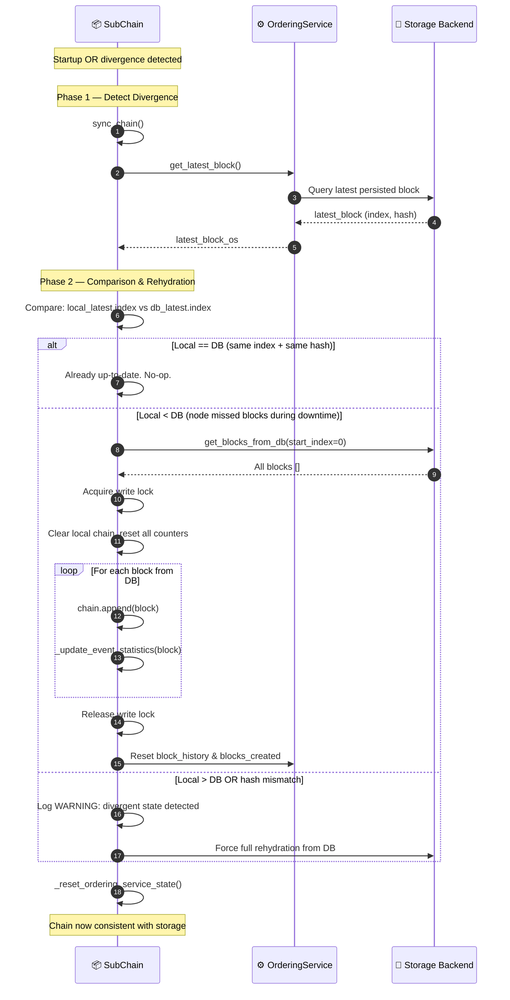

# Chain rehydration

## Overview

When a Sub-Chain node restarts or detects divergent state (local hash is different from the DB hash), it rehydrates the in-memory chain from persistent storage. This keeps the node consistent after crashes, restarts or network partitions.

The DB is the authoritative source of truth. If local state diverges, it is discarded and rebuilt from the DB.

---

## Flow diagram

---

## Divergence scenarios

| Scenario | Detection | Action |
|:---------|:----------|:-------|
| **Cold start** | `local.index == 0` | Load all blocks from DB |
| **Crash recovery** | `local.index < db.index` | Append missing blocks only |
| **Hash mismatch** | `local.hash != db.hash` (same index) | Full rehydration from DB |
| **Already in sync** | `local.index == db.index AND hash matches` | No-op |
| **Local ahead of DB** | `local.index > db.index` | WARNING: DB is authoritative; force rehydrate |

---

## Step-by-step breakdown

| Step | Description |
|:-----|:------------|
| **1. Trigger** | Node startup calls `sync_chain()`, or `auto_sync` timer fires |
| **2. DB query** | `OrderingService.get_latest_block()` fetches the latest persisted block from storage |
| **3. Comparison** | Compare local chain `(index, hash)` with DB `(index, hash)` |
| **4. Up-to-date** | If identical: skip. Normal operations resume immediately |
| **5. Partial sync** | If `local < db`: load only the delta blocks. Acquires write lock to prevent race conditions |
| **6. Full rehydration** | If hash mismatch or local ahead: discard local, rebuild entirely from DB |
| **7. Statistics reset** | `_update_event_statistics()` rebuilds `entity_event_index` from each block |
| **8. OrderingService reset** | Sync block counters between chain and ordering service |

---

## Error handling

| Condition | Behavior |
|:----------|:---------|
| DB read fails during rehydration | Exception logged, retry on next sync interval |
| Write lock held too long | Timeout after `lock_timeout` seconds; critical alert via Risk Alerts |
| `entity_event_index` inconsistent after rehydration | Full index rebuild triggered |
| Storage backend unreachable | Node enters read-only mode; new events queued but not persisted |

---

## Key classes and methods

| Step | Class / Method | File |
|:-----|:--------------|:-----|
| Entry point | `SubChain.sync_chain()` | `hierarchical/sub_chain.py` |
| Latest DB block | `OrderingService.get_latest_block()` | `consensus/ordering/service.py` |
| Load all blocks | `storage.get_blocks_from_db()` | `adapters/database/sqlite_adapter.py` |
| Rebuild index | `SubChain._update_event_statistics()` | `hierarchical/sub_chain.py` |
| Reset OS counters | `SubChain._reset_ordering_service_state()` | `hierarchical/sub_chain.py` |

---

## Related

- [Error Mitigation](./error-recovery.md): rollback triggers rehydration when snapshot fails
- [System Integrity Validation](./integrity-validation.md): validates chain consistency after rehydration
