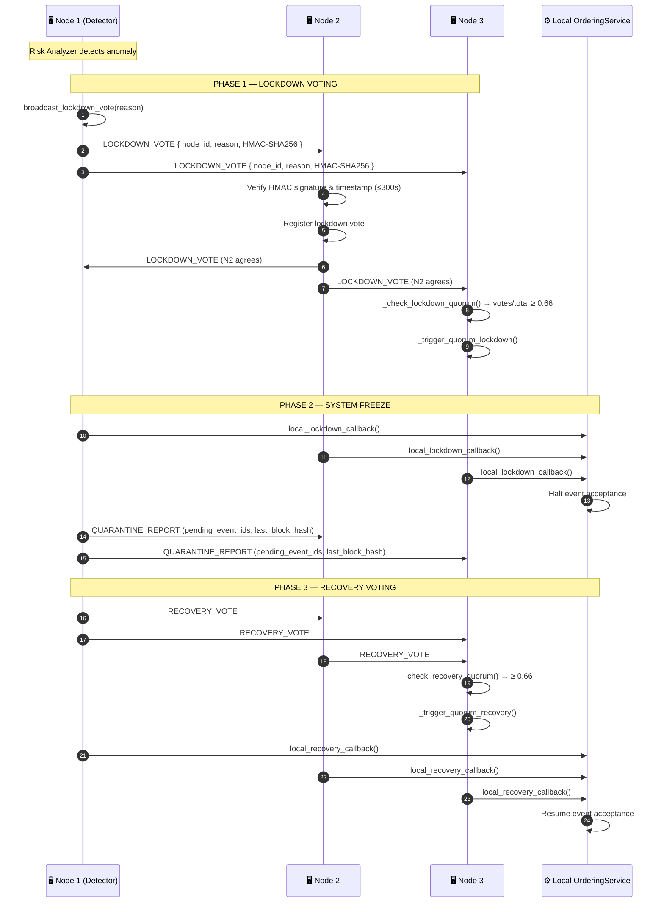
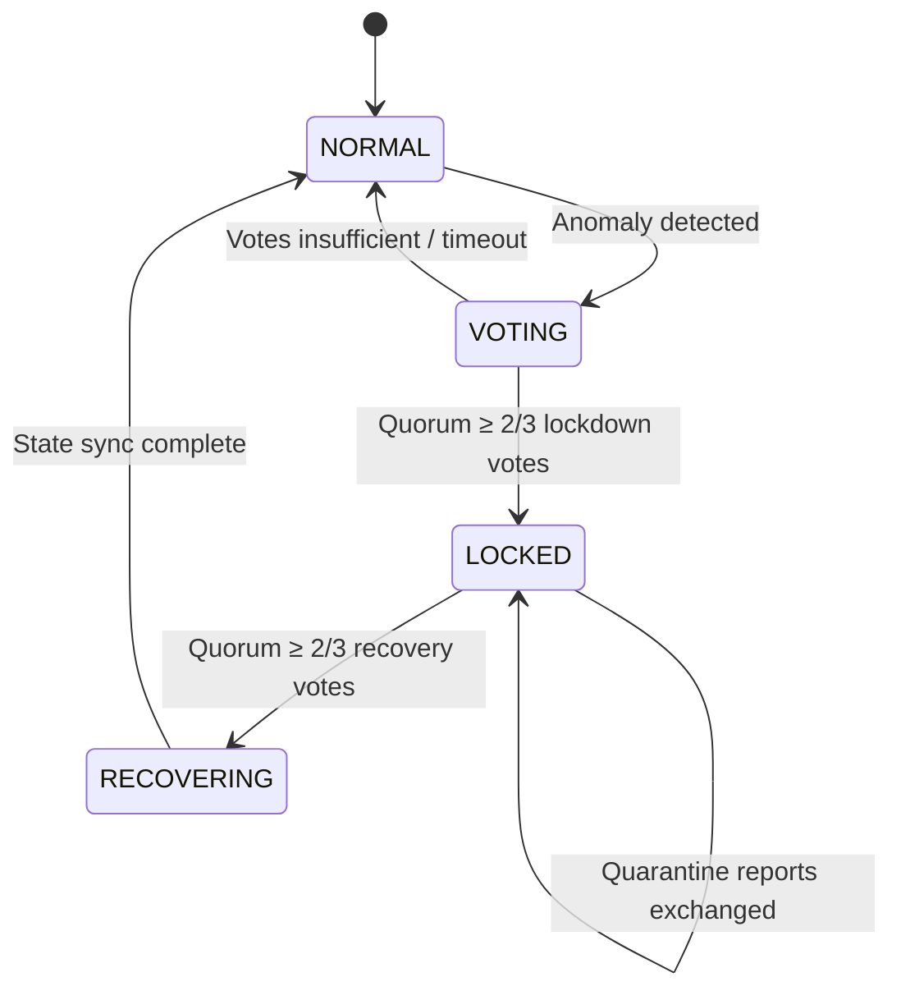

# Cluster lockdown and recovery

## Overview

This protocol freezes state across all nodes when a critical anomaly is detected. It uses gossip style P2P messaging over ZeroMQ and needs a 2/3 quorum of registered nodes to start both lockdown and recovery. All messages use HMAC-SHA256 so spoofed lockdown messages are rejected.

No single node can lock the cluster on its own. Quorum is required.

---

## Flow diagram

---

## State machine

---

## Step-by-step breakdown

| Step | Description |
|:-----|:------------|
| **1. Anomaly detection** | `RiskAnalyzer` or manual operator triggers `broadcast_lockdown_vote(reason)` |
| **2. Vote broadcast** | Gossip LOCKDOWN_VOTE to all peers, signed with HMAC-SHA256 + timestamp |
| **3. Vote verification** | Each receiver validates HMAC and rejects votes older than 300 seconds |
| **4. Quorum check** | `_check_lockdown_quorum()`: if `votes / total_nodes ≥ 0.66` → lockdown triggered |
| **5. System freeze** | Each node calls `local_lockdown_callback()` → `OrderingService` halts event acceptance |
| **6. Quarantine reports** | Nodes exchange pending event IDs and last block hashes to audit state divergence |
| **7. Recovery voting** | After investigation, operator or auto-trigger initiates `RECOVERY_VOTE` gossip |
| **8. Recovery quorum** | Same 2/3 threshold required. On quorum: `local_recovery_callback()` → resume |

---

## Error handling

| Condition | Behavior |
|:----------|:---------|
| HMAC verification fails | Vote discarded, warning logged |
| Vote timestamp > 300s old | Vote rejected (replay protection) |
| Lockdown quorum never reached | System continues operating normally, votes expire |
| Recovery quorum never reached | Cluster stays locked; escalation alert sent via Risk Alerts |
| Node joins during lockdown | New node receives LOCKED state via `StateSyncManager` |

---

## Key classes and methods

| Step | Class / Method | File |
|:-----|:--------------|:-----|
| Initiate lockdown | `ClusterLockdownManager.broadcast_lockdown_vote()` | `cluster/lockdown_protocol.py` |
| Verify vote | `_verify_lockdown_message()` | `cluster/lockdown_protocol.py` |
| Quorum check | `_check_lockdown_quorum()` | `cluster/lockdown_protocol.py` |
| System freeze | `local_lockdown_callback()` | `cluster/lockdown_protocol.py` |
| Recovery quorum | `_check_recovery_quorum()` | `cluster/lockdown_protocol.py` |
| State sync | `StateSyncManager.sync_state()` | `cluster/state_sync_manager.py` |
| Transport | `ZmqTransport.broadcast()` | `network/zmq_transport.py` |

---

## Related

- [Risk Analysis & Alerts](./risk-alerts.md): risk threshold breach triggers this workflow
- [Error Mitigation](./error-recovery.md): handles state rollback after recovery
- [Key Backup](./key-backup.md): lockdown may trigger key rotation → Key Backup & Restoration
