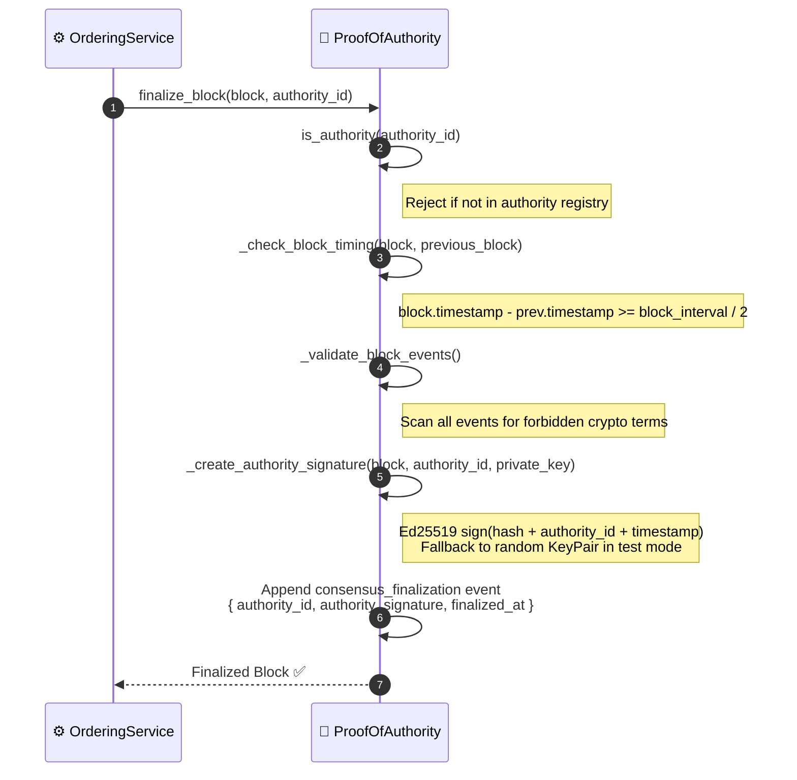
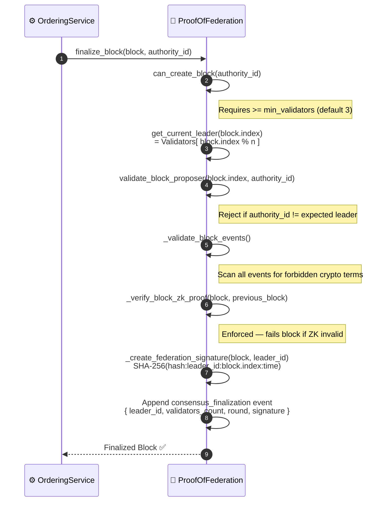

# Consensus mechanisms reference

**Related workflows**: [Event Submission](./event-submission.md) · [BFT Consensus](./bft-consensus.md)

HieraChain has pluggable consensus across layers. The MainChain (inter-organization alliance) is set by `HRC_MAINCHAIN_CONSENSUS` and defaults to `proof_of_federation`. SubChains that hold domain events use proof of authority by default for speed. The event submission flow in [Event Submission](./event-submission.md) is the same no matter which mechanism you pick. Only `finalize_block()` is different.

---

## Mechanism comparison

| Aspect | PoA | PoF | BFT |
|:-------|:----|:----|:----|
| **Config value** | `proof_of_authority` | `proof_of_federation` | `byzantine_fault_tolerant` |
| **Target Layer** | SubChain (Internal) / Single MainChain | MainChain Alliance (Inter-Org) | SubChain / MainChain BFT |
| **Who finalizes** | Any registered authority | Only rotating leader: `Validators[index % n]` | 2f+1 of n validators via PBFT |
| **Signature type** | Ed25519 (asymmetric) | SHA-256 federation signature | Aggregated PBFT votes |
| **Leader rotation** | Optional round-robin | Enforced, deterministic by block index | View-based, changes on failure |
| **ZK Proof check** | Optional | Enforced in `validate_block()` | N/A |
| **Min validators** | 1 authority sufficient | ≥ 3 (`min_validators` config) | n ≥ 3f + 1 |
| **Fault model** | Trust the authority identity | Distributed trust, tolerate absent validator | Tolerates up to f Byzantine nodes |
| **Use case** | Intra-org domain chains | Consortium / multi-org MainChain alliance | Critical / adversarial environments |

---

## Proof of authority (PoA)

> Default for SubChains, or when `HRC_MAINCHAIN_CONSENSUS=proof_of_authority` on MainChain.
> A single pre-registered authority signs the block with its Ed25519 private key.

### Key classes: PoA

| Step | Class / Method | File |
|:-----|:--------------|:-----|
| Authority check | `ProofOfAuthority.is_authority()` | `consensus/proof_of_authority.py` |
| Timing check | `_check_block_timing()` | `consensus/proof_of_authority.py` |
| Sign block | `_create_authority_signature()` | `consensus/proof_of_authority.py` |
| Finalize | `ProofOfAuthority.finalize_block()` | `consensus/proof_of_authority.py` |

---

## Proof of federation (PoF)

> Default for MainChains when `HRC_MAINCHAIN_CONSENSUS=proof_of_federation`.
> Leader is elected deterministically by block index. ZK proof is enforced.

### Key classes: PoF

| Step | Class / Method | File |
|:-----|:--------------|:-----|
| Leader election | `ProofOfFederation.get_current_leader()` | `consensus/proof_of_federation.py` |
| Proposer check | `validate_block_proposer()` | `consensus/proof_of_federation.py` |
| ZK verify | `_verify_block_zk_proof()` | `consensus/proof_of_federation.py` |
| Federation sign | `_create_federation_signature()` | `consensus/proof_of_federation.py` |
| Finalize | `ProofOfFederation.finalize_block()` | `consensus/proof_of_federation.py` |

---

## Byzantine fault tolerance (BFT / PBFT)

> Active when `HRC_MAINCHAIN_CONSENSUS=byzantine_fault_tolerant`.
> Full 3-phase PBFT. See [BFT Consensus](./bft-consensus.md) for the complete flow.

You need n >= 3f + 1 nodes to tolerate f faulty nodes.

View change: if the leader fails within the timeout, `view += 1`, new leader is `Validators[view % n]` and the protocol restarts from phase 1.

---

## Configuration reference

| Variable | Values | Description |
|:---------|:-------|:------------|
| `HRC_MAINCHAIN_CONSENSUS` | `proof_of_federation` (default), `proof_of_authority`, `byzantine_fault_tolerant` | MainChain inter-org consensus mechanism |
| `HRC_ENABLE_ZK_PROOFS` | `true` / `false` | Toggle ZK verification (required for PoF production) |
| `HRC_ZK_MODE` | `mock`, `production` | ZK implementation: SHA-256 simulation or ZoKrates circuits |
