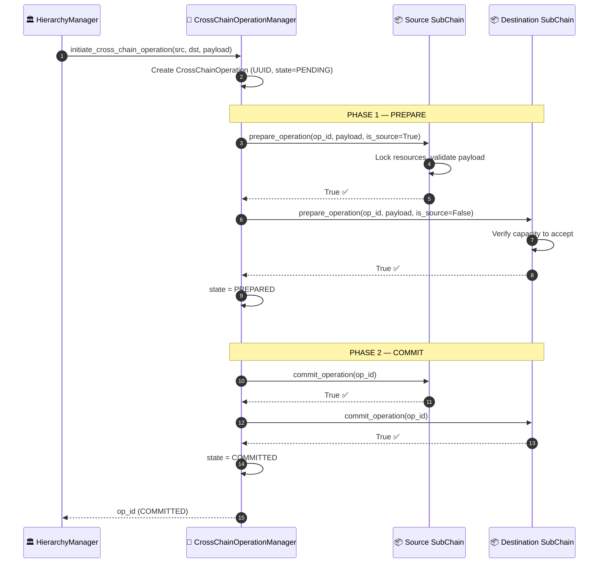
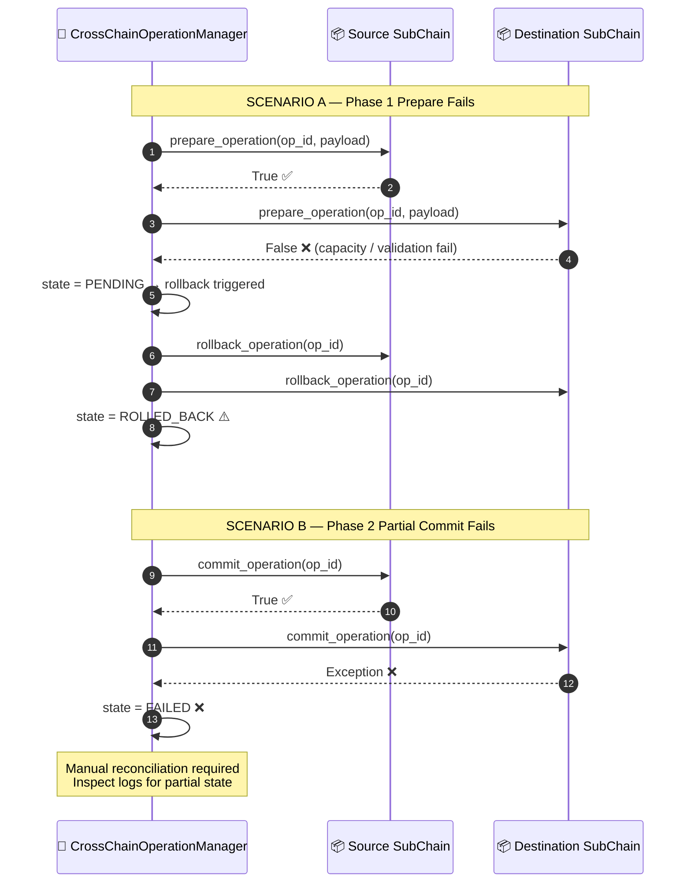
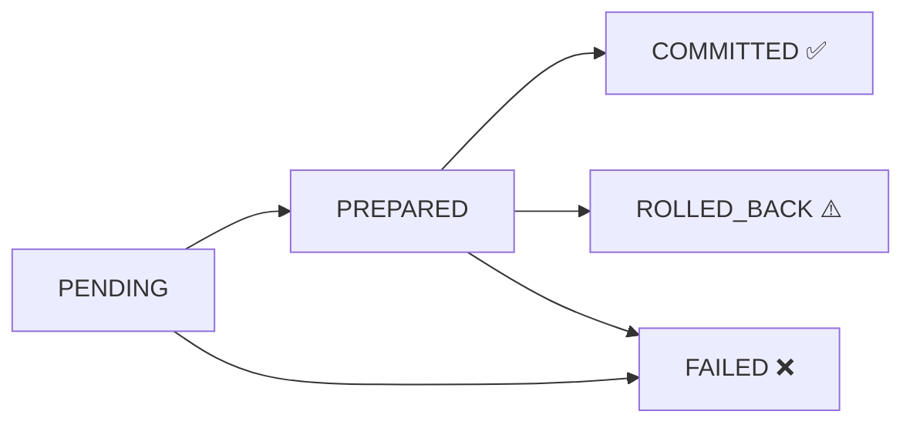

# Cross-chain operation (2PC)

## Overview

When a business operation must span two Sub-Chains atomically, for example when an asset moves from the `logistics` chain to the `finance` chain, HieraChain uses Two-Phase Commit. Either both chains commit or both roll back. No partial state is left behind.

A typical trigger is an inventory transfer between departments. The source chain records a `deduct` event and the destination chain records a `receive` event. Both have to succeed.

---

## Flow diagram: happy path

---

## Flow diagram: failure paths

---

## Operation state machine

---

## Step-by-step breakdown

| Step | Description |
|:-----|:------------|
| **1. Initiate** | `HierarchyManager` creates a `CrossChainTransaction` with UUID and `state=PENDING` |
| **2. Phase 1: Prepare SRC** | Source chain locks resources, validates payload schema |
| **3. Phase 1: Prepare DST** | Destination chain checks capacity and constraints |
| **4. Phase 1 result** | If both return `True`: state → `PREPARED`. If either fails: immediate rollback on both |
| **5. Phase 2: Commit SRC** | Source chain finalizes the operation (emits event via Event Submission) |
| **6. Phase 2: Commit DST** | Destination chain finalizes (emits event via Event Submission) |
| **7. Result** | State → `COMMITTED`. `tx_id` returned to caller |

---

## Error handling

| Condition | State | Recovery |
|:----------|:------|:---------|
| Phase 1 fails on SRC | `ROLLED_BACK` | Automatic rollback on DST |
| Phase 1 fails on DST | `ROLLED_BACK` | Automatic rollback on SRC |
| Phase 2 commit fails on either | `FAILED` | Manual reconciliation via audit log |
| Network timeout during Phase 2 | `FAILED` | Operator must inspect last committed state |

---

## Key classes and methods

| Step | Class / Method | File |
|:-----|:--------------|:-----|
| Initiate | `HierarchyManager.initiate_cross_chain_transaction()` | `hierarchical/hierarchy_manager.py` |
| Create transaction | `CrossChainTransactionManager.__init__()` | `domains/generic/chains/domain_chain.py` |
| Prepare | `DomainChain.prepare_transaction()` | `domains/generic/chains/domain_chain.py` |
| Commit | `DomainChain.commit_transaction()` | `domains/generic/chains/domain_chain.py` |
| Rollback | `DomainChain.rollback_transaction()` | `domains/generic/chains/domain_chain.py` |

---

## Related

- [Event Submission](./event-submission.md): each `commit_transaction()` internally calls `add_event()`
- [Error Mitigation](./error-recovery.md): handles state rollback at the system level
