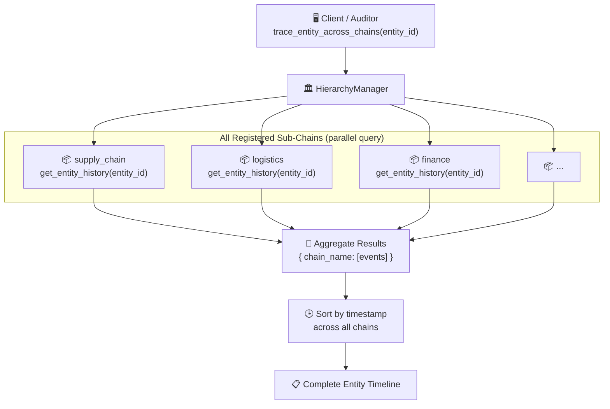

# Entity tracing

## Overview

The same physical entity (for example product `SKU-001` or contract `C-2024`) can produce events on several Sub-Chains during its lifecycle. HieraChain provides cross-chain tracing to rebuild a complete and immutable audit trail for any `entity_id`.

Each Sub-Chain keeps an in-memory `entity_event_index` keyed by `entity_id`, so lookup is O(1) without scanning the whole chain.

---

## Flow diagram



---

## Real-world example

```
Entity: product-SKU-001 (Industrial sensor batch)

Timeline reconstructed across chains:
────────────────────────────────────────────────────────
[supply_chain]  block 3   quality_check      → passed
[supply_chain]  block 7   packaging_complete → confirmed
[logistics]     block 2   shipment_dispatch  → warehouse A → B
[logistics]     block 9   customs_cleared    → port XYZ
[finance]       block 4   invoice_issued     → INV-2024-0471
[finance]       block 12  payment_confirmed  → ref: WIRE-9821
────────────────────────────────────────────────────────
```

---

## Entity index structure

Each Sub-Chain keeps an in-memory `entity_event_index`:

```python
entity_event_index = {
    "product-SKU-001": [
        {"block_index": 3, "event": {"event": "quality_check", "timestamp": 1714000000.0, ...}},
        {"block_index": 7, "event": {"event": "packaging_complete", "timestamp": 1714003600.0, ...}},
    ]
}
```

Events are indexed on write in `add_block()`, so reads are O(1) per chain. Aggregation across n chains is O(n).

---

## Step-by-step breakdown

| Step | Description |
|:-----|:------------|
| **1. Call** | Client calls `HierarchyManager.trace_entity_across_chains(entity_id)` |
| **2. Fan-out** | HierarchyManager queries all registered Sub-Chains in parallel |
| **3. Per-chain lookup** | Each Sub-Chain calls `get_entity_history(entity_id)` → O(1) index lookup |
| **4. Aggregate** | Results collected as `{ chain_name: [event_list] }` |
| **5. Sort** | Events sorted by `timestamp` across all chains to form chronological timeline |
| **6. Return** | Full timeline returned to caller |

---

## Error handling

| Condition | Behavior |
|:----------|:---------|
| Entity not found in any chain | Returns empty dict `{}` |
| Sub-Chain unavailable | That chain's result is `[]`; other chains still queried |
| Entity index not yet built (startup) | Falls back to full chain scan; logs warning |

---

## Key classes and methods

| Step | Class / Method | File |
|:-----|:--------------|:-----|
| Entry point | `HierarchyManager.trace_entity_across_chains()` | `hierarchical/hierarchy_manager.py` |
| Per-chain trace | `SubChain.get_entity_history()` | `hierarchical/sub_chain.py` |
| Advanced trace | `EntityTracer.trace_entity()` | `domains/generic/utils/entity_tracer.py` |
| Index update | `SubChain._update_event_statistics()` | `hierarchical/sub_chain.py` |
| REST API | `GET /ledger/entities/{entity_id}/trace` | `api/ledger/routes.py` |

---

## Related

- [System Integrity Validation](./integrity-validation.md): validates the chains being traced
- [ERP Integration Sync](./erp-integration.md): ERP events are what gets traced
