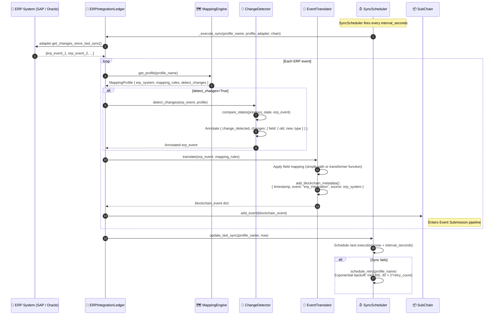
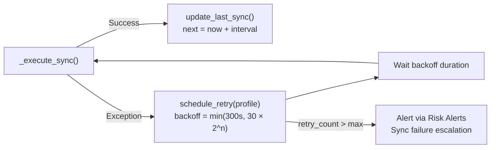

# ERP integration sync

## Overview

HieraChain connects to ERP systems (SAP, Oracle, Dynamics) through an adapter and mapping engine. `SyncScheduler` polls ERP adapters on a fixed interval, converts native ERP events into HieraChain event format with `EventTranslator`, detects changed fields, and submits the result as a business event. Failed syncs are retried with exponential backoff.

This workflow is the bridge between Web2 ERP systems and the HieraChain ledger.

---

## Flow diagram



---

## Flow diagram: retry on failure



---

## ERP event translation example

```python
# Raw SAP event (before translation)
erp_event = {
    "MBLNR": "5000012345",       # Material document number
    "BUDAT": "2024-04-23",       # Posting date
    "MATNR": "MAT-00789",        # Material number
    "MENGE": 150,                 # Quantity
    "WERKS": "PLANT-01"          # Plant
}

# After EventTranslator.translate() using SAP mapping profile
blockchain_event = {
    "entity_id": "MAT-00789",            # mapped from MATNR
    "event": "erp_integration",
    "timestamp": 1714000000.0,           # added by add_blockchain_metadata()
    "details": {
        "document_number": "5000012345", # mapped from MBLNR
        "posting_date": "2024-04-23",    # mapped from BUDAT
        "quantity": 150,                  # mapped from MENGE
        "plant": "PLANT-01",             # mapped from WERKS
        "source": "SAP",
        "changes": {                      # added by ChangeDetector if enabled
            "quantity": {"old": 100, "new": 150, "type": "numeric_change"}
        }
    }
}
```

---

## Supported ERP systems

| ERP | Adapter Class | Config Key |
|:----|:-------------|:-----------|
| SAP S/4HANA | `SAPAdapter` | `erp_system: "SAP"` |
| Oracle ERP Cloud | `OracleAdapter` | `erp_system: "Oracle"` |
| Microsoft Dynamics 365 | `DynamicsAdapter` | `erp_system: "Dynamics"` |
| Generic REST | `GenericERPAdapter` | `erp_system: "Generic"` |

---

## Step-by-step breakdown

| Step | Description |
|:-----|:------------|
| **1. Scheduler fires** | `SyncScheduler` calls `_execute_sync()` for each registered profile |
| **2. Fetch changes** | ERP adapter calls `get_changes_since_last_sync()` using last sync timestamp |
| **3. Change detection** | `ChangeDetector` compares new state vs previous, annotates changed fields |
| **4. Translation** | `EventTranslator` applies `mapping_rules` to produce a valid HieraChain event dict |
| **5. Metadata injection** | `add_blockchain_metadata()` adds `timestamp`, `source`, `event: "erp_integration"` |
| **6. Submit** | `SubChain.add_event(blockchain_event)`: enters Event Submission pipeline |
| **7. Update timestamp** | `last_sync` updated per profile; next run scheduled |
| **8. Failure retry** | Exception → exponential backoff up to 300s; after max retries → Risk Alerts alert |

---

## Error handling

| Condition | Behavior |
|:----------|:---------|
| ERP adapter connection fails | Retry with exponential backoff (30s, 60s, 120s, 240s, 300s max) |
| Field mapping key missing | Logged as warning; event submitted with partial data |
| `add_event()` validation fails (forbidden term) | Event discarded; logged with raw ERP data |
| Max retries exceeded | Risk Alerts alert triggered: `erp_sync_failure` |

---

## Key classes and methods

| Step | Class / Method | File |
|:-----|:--------------|:-----|
| Sync entry | `ERPIntegrationLedger.start_scheduled_sync()` | `integration/erp_ledger.py` |
| Execute sync | `ERPIntegrationLedger._execute_sync()` | `integration/erp_ledger.py` |
| Change detection | `ChangeDetector.detect_changes()` | `integration/erp_ledger.py` |
| Field translation | `EventTranslator.translate()` | `integration/erp_ledger.py` |
| Profile management | `MappingEngine.create_profile()` | `integration/erp_ledger.py` |
| Retry scheduling | `SyncScheduler.schedule_retry()` | `integration/erp_ledger.py` |

---

## Related

- [Event Submission](./event-submission.md): translated events enter here
- [Entity Tracing](./entity-tracing.md): ERP-originated events are traceable by `entity_id`
- [Risk Analysis & Alerts](./risk-alerts.md): sync failures escalated here
