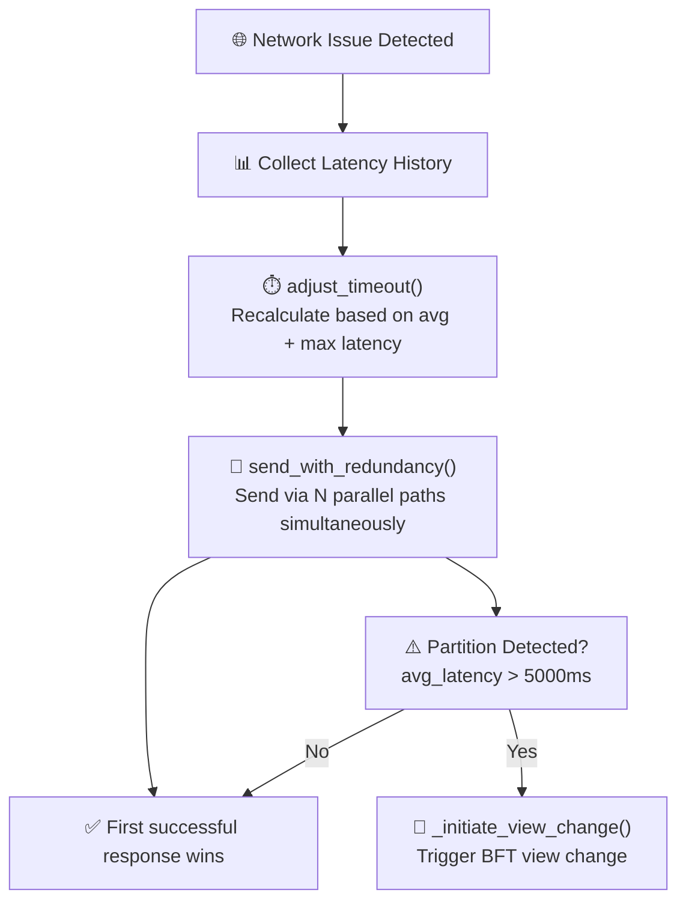
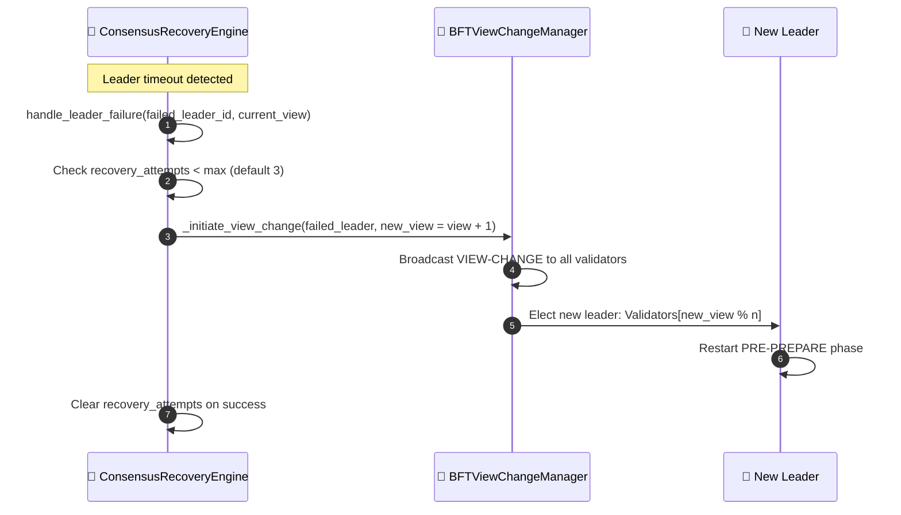
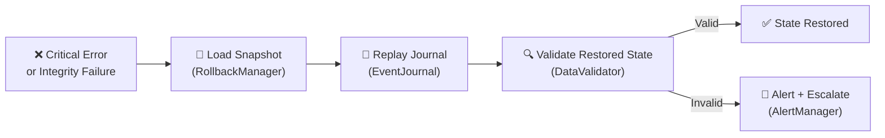

# Error mitigation and recovery

## Overview

HieraChain has layered recovery for three areas: network resilience, consensus leader recovery and state rollback. These run independently and can be active at the same time.

---

## 6A: Network recovery

`send_with_redundancy()` sends the same message over N parallel paths at once. The first successful response wins and the remaining in flight calls are cancelled. This hides intermittent path failures without explicit retries.

---

## 6B: Consensus recovery (leader failure)

---

## 6C: State rollback

Rollback does four things in order:

1. `RollbackManager.load_snapshot()` loads the most recent consistent snapshot
2. `EventJournal.replay()` replays committed journal entries since that snapshot
3. `DataValidator.validate()` checks the restored state against cryptographic checksums
4. If validation fails, an escalation alert is sent via Risk Alerts and manual intervention is needed

---

## Step-by-step breakdown

| Sub-flow | Trigger | Action |
|:---------|:--------|:-------|
| **6A Network** | `avg_latency > threshold` | Adaptive timeout + parallel redundant send |
| **6A Partition** | `avg_latency > 5000ms` | Trigger BFT View Change (BFT Consensus) |
| **6B Leader** | `leader_timeout` | `ConsensusRecoveryEngine.handle_leader_failure()` → View Change |
| **6B Max retries** | `recovery_attempts ≥ max` | Log critical error, alert, halt consensus |
| **6C Rollback** | Integrity failure or critical error | Snapshot → Journal replay → Validate |

---

## Error handling

| Condition | Behavior |
|:----------|:---------|
| All recovery paths exhausted (6B) | Critical alert sent, node halts consensus participation |
| Snapshot not found (6C) | Full rehydration from DB (Chain Rehydration) attempted |
| Journal replay produces invalid state (6C) | Alert escalated via Risk Alerts, manual intervention flagged |
| Network partition heals | Adaptive timeout reduces automatically, normal flow resumes |

---

## Key classes and methods

| Step | Class / Method | File |
|:-----|:--------------|:-----|
| Network adaptive timeout | `NetworkRecoveryManager.adjust_timeout()` | `error_mitigation/recovery_engine.py` |
| Redundant send | `send_with_redundancy()` | `error_mitigation/recovery_engine.py` |
| Leader failure | `ConsensusRecoveryEngine.handle_leader_failure()` | `error_mitigation/recovery_engine.py` |
| View change trigger | `BFTViewChangeManager._initiate_view_change()` | `consensus/bft/consensus.py` |
| Snapshot load | `RollbackManager.load_snapshot()` | `error_mitigation/rollback_manager.py` |
| Journal replay | `TransactionJournal.replay()` | `error_mitigation/journal.py` |
| State validate | `DataValidator.validate()` | `error_mitigation/validator.py` |

---

## Related

- [BFT Consensus](./bft-consensus.md): View Change detail
- [Cluster Lockdown](./cluster-lockdown.md): cluster-level recovery
- [Chain Rehydration](./chain-rehydration.md): full chain reload from DB
- [Risk Analysis & Alerts](./risk-alerts.md): escalation notifications
