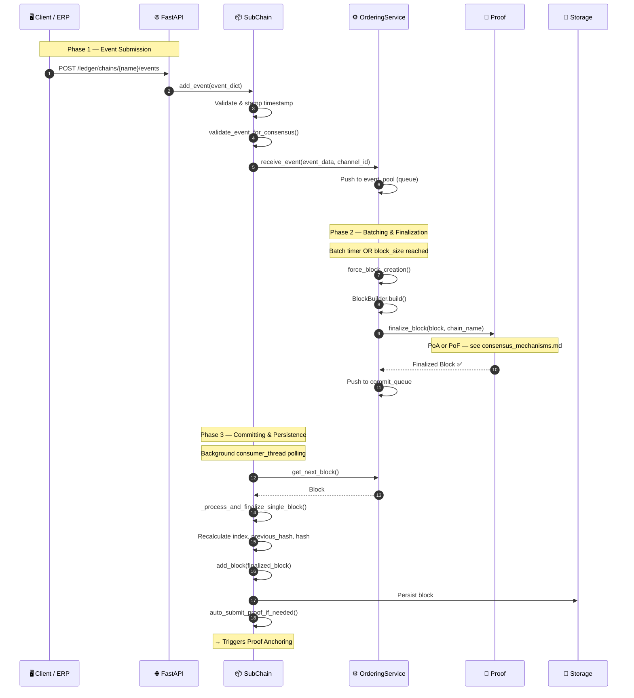

# Event submission

## Overview

Events enter HieraChain as business operations. They are validated, batched by `OrderingService` into blocks, finalized by the configured proof mechanism (PoA, PoF or BFT), and then appended to the Sub-Chain. The MainChain consensus is pluggable via `HRC_MAINCHAIN_CONSENSUS`, while SubChain uses PoA by default for fast intra-org processing. The flow is the same in all cases. Only the `finalize_block()` step changes.

For PoA and PoF diagrams, see [Consensus Mechanisms](./consensus_mechanisms.md).

---

## Flow diagram



---

## Step-by-step breakdown

| Step | Description |
|:-----|:------------|
| **1. API receive** | FastAPI validates request structure, extracts `event_dict` |
| **2. SC validate** | `SubChain.add_event()` stamps `timestamp`, calls `validate_event_for_consensus()`: scans for forbidden crypto terms |
| **3. OrderingService queue** | Event pushed to `event_pool` (in-memory queue). The `OrderingService` batches events by timer or `block_size` threshold |
| **4. Block build** | `BlockBuilder.build()` assembles the block: index, previous_hash, merkle root of events, metadata |
| **5. Finalize** | `Proof.finalize_block()`: PoA signs with Ed25519, PoF validates leader rotation + ZK proof, BFT runs 3-phase PBFT |
| **6. Commit** | Block pushed to `commit_queue`, background `consumer_thread` picks it up |
| **7. Hash chain** | `_process_and_finalize_single_block()` recalculates `previous_hash` and `hash` to ensure chain integrity |
| **8. Persist** | Block written to storage backend (`SQLiteAdapter`, `RedisStorageAdapter`, or `MemoryStorage`) |
| **9. Proof trigger** | `auto_submit_proof_if_needed()` triggers Proof Anchoring if chain length threshold met |

---

## Event structure

```python
event = {
    "entity_id": "product-SKU-001",    # Domain entity identifier
    "event": "quality_check",           # Event type (domain-specific)
    "timestamp": 1714000000.0,
    "details": {                        # Domain-specific payload
        "check_type": "visual",
        "check_result": "passed",
        "inspector": "station-7"
    }
}
```

> **Important**: Never use cryptocurrency terms (`transaction`, `sender`, `receiver`, `amount`, `wallet`, `fee`). The `validate_event_for_consensus()` scan will reject these.

---

## Error handling

| Condition | Behavior |
|:----------|:---------|
| Forbidden crypto term detected | `ValueError` raised, event rejected before queue |
| Block finalization fails (PoA: invalid authority) | Block discarded, error logged, event re-queued |
| Block finalization fails (PoF: wrong leader) | Block rejected, `validate_block_proposer()` raises |
| Storage write fails | `SQLAlchemy` session rolled back; block stays in commit_queue for retry |
| Consumer thread exception | Thread-level exception caught, logged, thread respawns |

---

## Key classes and methods

| Step | Class / Method | File |
|:-----|:--------------|:-----|
| Receive event | `SubChain.add_event()` | `hierarchical/sub_chain.py` |
| Forbidden term scan | `BaseConsensus.validate_event_for_consensus()` | `consensus/base_consensus.py` |
| Batch & order | `OrderingService.receive_event()` | `consensus/ordering/service.py` |
| Build block | `BlockBuilder.build()` | `consensus/ordering/block_builder.py` |
| PoA finalize | `ProofOfAuthority.finalize_block()` | `consensus/proof_of_authority.py` |
| PoF finalize | `ProofOfFederation.finalize_block()` | `consensus/proof_of_federation.py` |
| Commit & add | `SubChain._process_and_finalize_single_block()` | `hierarchical/sub_chain.py` |
| Persist | `SQLiteAdapter` / `RedisStorageAdapter` | `adapters/storage/` |

---

## Related

- [Consensus Mechanisms](./consensus_mechanisms.md): PoA and PoF sub-diagrams
- [Proof Anchoring](./proof-anchoring.md): triggered after block finalized
- [BFT Consensus](./bft-consensus.md): full 3-phase PBFT flow
- [Policy Enforcement](./policy-enforcement.md): gates access before `add_event()`
- [MSP Identity](./msp-identity.md): `authorize_action()` called before submission
