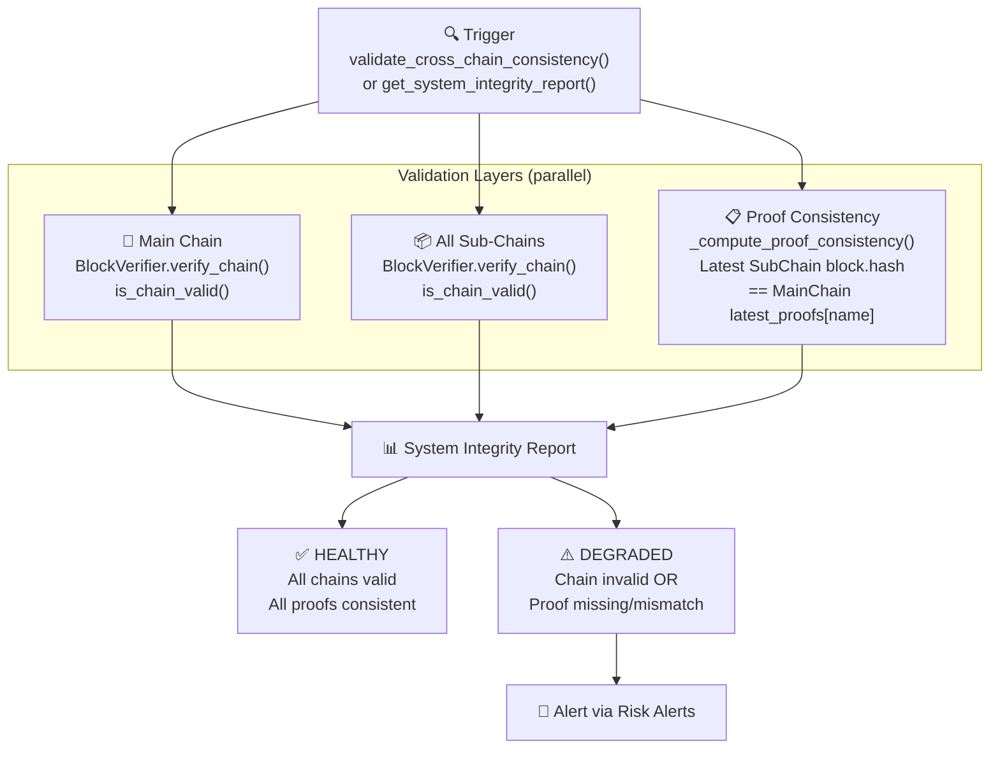
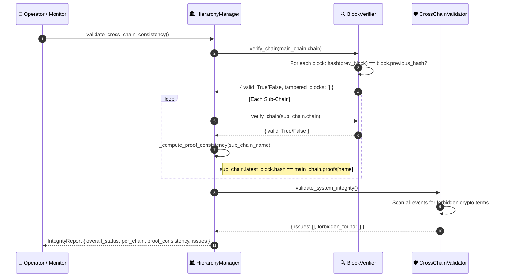

# System integrity validation

## Overview

This workflow checks cryptographic consistency across all chains. It verifies that every block links correctly and that proofs stored on the Main Chain match the latest blocks on each Sub-Chain. It is the main way the system detects tampering and stays audit ready.

The check runs three layers in parallel: Main Chain validity, Sub-Chain validity and proof consistency between the two tiers.

---

## Flow diagram



---

## Tamper detection flow



---

## Integrity report structure

```python
{
    "timestamp": 1714000000.0,
    "overall_status": "HEALTHY",          # or "DEGRADED"
    "system_overview": {
        "total_sub_chains": 3,
        "total_sub_chain_blocks": 142,
        "total_sub_chain_events": 3580,
        "system_uptime": 86400.0
    },
    "main_chain": {
        "valid": True,
        "height": 47
    },
    "sub_chains": {
        "supply_chain": {"valid": True, "height": 61},
        "logistics":    {"valid": True, "height": 48},
        "finance":      {"valid": True, "height": 33}
    },
    "proof_consistency": {
        "supply_chain": {
            "consistent": True,
            "latest_proof_hash": "a3f8b2...",
            "chain_height": 61
        }
    },
    "issues": []
}
```

---

## Step-by-step breakdown

| Step | Description |
|:-----|:------------|
| **1. Trigger** | Periodic timer, operator call, or Risk Alerts anomaly detection |
| **2. Main Chain verify** | `BlockVerifier.verify_chain()` recomputes every block hash and checks `previous_hash` linkage |
| **3. Sub-Chain verify** | Same verification applied to all registered Sub-Chains in parallel |
| **4. Proof consistency** | Compares `sub_chain.latest_block.hash` with `main_chain.proofs[chain_name]` |
| **5. Forbidden term scan** | `CrossChainValidator` scans all event payloads for cryptocurrency terminology |
| **6. Report assembly** | All results merged into `IntegrityReport` |
| **7. Alert on DEGRADED** | If any check fails, Risk Alerts alert triggered with issue details |

---

## Error handling

| Condition | Status | Action |
|:----------|:-------|:-------|
| Block hash mismatch in Main Chain | `DEGRADED` | Flag tampered block index; alert |
| Proof missing for Sub-Chain | `DEGRADED` | Log missing proof; alert |
| Sub-Chain proof hash ≠ Main Chain proof | `DEGRADED` | Tamper detected; immediate alert |
| Forbidden term found in event | `DEGRADED` | Flag event, log with full path |

---

## Key classes and methods

| Step | Class / Method | File |
|:-----|:--------------|:-----|
| Full report | `HierarchyManager.get_system_integrity_report()` | `hierarchical/hierarchy_manager.py` |
| Consistency check | `HierarchyManager.validate_cross_chain_consistency()` | `hierarchical/hierarchy_manager.py` |
| Chain verify | `BlockVerifier.verify_chain()` | `security/verify/block_verifier.py` |
| Per-block verify | `BlockVerifier.verify_block()` | `security/verify/block_verifier.py` |
| Forbidden scan | `CrossChainValidator.validate_system_integrity()` | `domains/generic/utils/cross_chain_validator.py` |
| REST API | `GET /ledger/system/integrity` | `api/ledger/routes.py` |

---

## Related

- [Proof Anchoring](./proof-anchoring.md): creates the proofs validated here
- [Chain Rehydration](./chain-rehydration.md): called if inconsistency triggers rehydration
- [Risk Analysis & Alerts](./risk-alerts.md): receives DEGRADED alerts from this workflow
