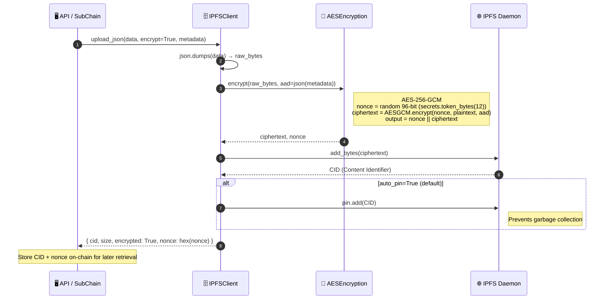
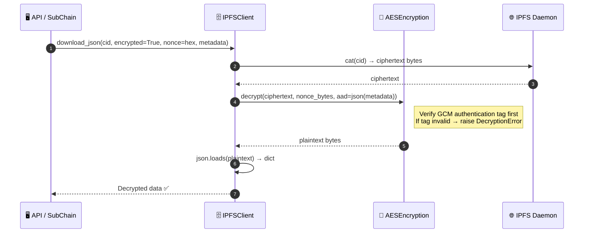
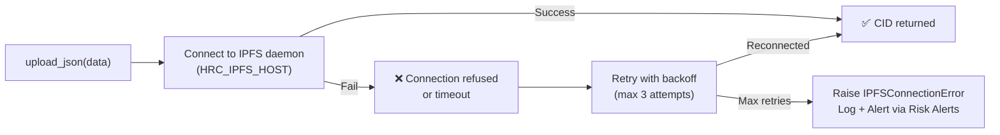

# IPFS encrypted storage

## Overview

Large or sensitive off-chain data such as document attachments, audit evidence or binary assets is kept on a private IPFS swarm with mandatory AES-256-GCM encryption. Only nodes that share the same encryption key can decrypt the data. IPFS returns a CID that is stored on-chain as a reference. Plaintext never leaves the encrypted boundary.

Even if IPFS storage is compromised, the data is unreadable without the AES-256-GCM key.

---

## Flow diagram: upload (encrypt, store, pin)

---

## Flow diagram: download (retrieve, decrypt)

---

## Error handling: IPFS unavailable

---

## Step-by-step breakdown

| Step | Description |
|:-----|:------------|
| **1. Serialize** | `json.dumps(data)` → raw bytes |
| **2. Encrypt** | AES-256-GCM with random 96-bit nonce. AAD (additional authenticated data) = JSON-serialized metadata |
| **3. Upload** | Raw ciphertext bytes sent to IPFS daemon via Kubo RPC API (`httpx`) |
| **4. Pin** | `pin.add(CID)` prevents garbage collection by IPFS GC daemon |
| **5. Return** | Caller receives `{ cid, nonce }`; both must be stored on-chain for retrieval |
| **6. Retrieve** | `cat(cid)` fetches ciphertext; `decrypt()` verifies GCM authentication tag before decrypting |

---

## Security properties

| Property | Mechanism |
|:---------|:----------|
| Confidentiality | AES-256-GCM encryption |
| Integrity | GCM authentication tag (authenticated encryption) |
| Replay protection | Unique random 96-bit nonce per upload |
| Key management | `HRC_IPFS_ENCRYPTION_KEY` env var; auto-generated if missing |
| Access control | Policy Engine (Policy Enforcement) gates upload/download API calls |

---

## Key classes and methods

| Step | Class / Method | File |
|:-----|:--------------|:-----|
| Upload entry | `IPFSClient.upload_json()` | `api/storage/ipfs_client.py` |
| Encrypt | `AESEncryption.encrypt()` | `api/storage/encryption.py` |
| Upload raw bytes | `IPFSClient.upload_bytes()` | `api/storage/ipfs_client.py` |
| Pin | `IPFSClient.pin()` | `api/storage/ipfs_client.py` |
| Download & decrypt | `IPFSClient.download_json()` | `api/storage/ipfs_client.py` |
| Factory | `create_ipfs_client_from_env()` | `api/storage/ipfs_client.py` |

---

## Related

- [Policy Enforcement](./policy-enforcement.md): gates upload/download authorization
- [Risk Analysis & Alerts](./risk-alerts.md): IPFS connection failure triggers alerts
- [Key Backup](./key-backup.md): same AES-256-GCM pattern used for key backup encryption
