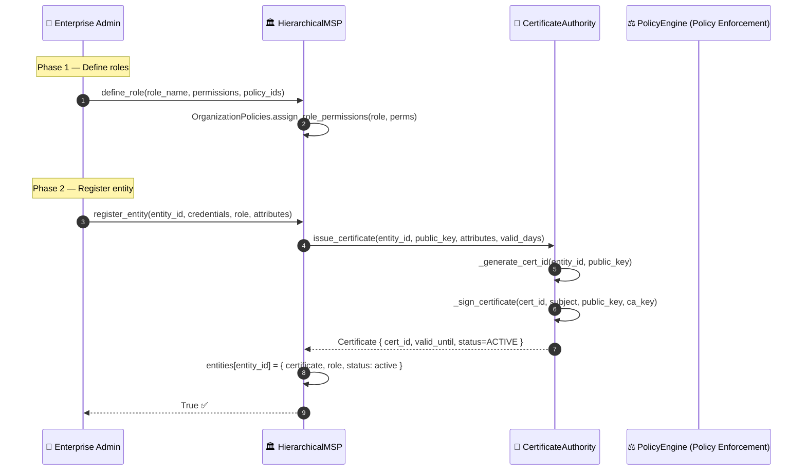
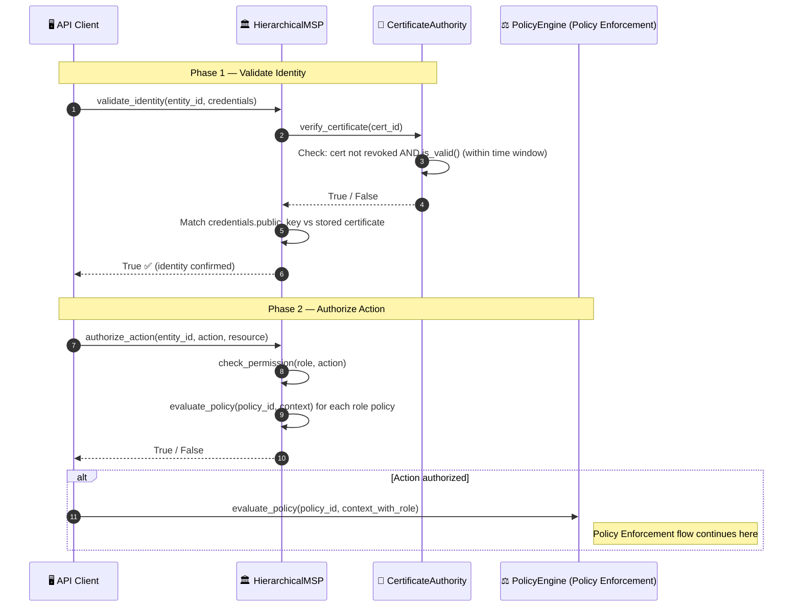
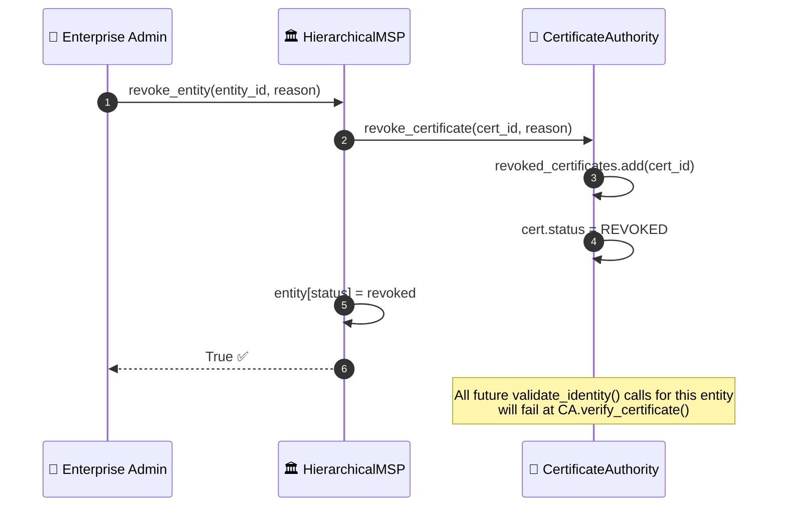

# MSP identity and authorization

## Overview

HieraChain uses two identity layers:

| Layer | Class | Use Case |
|:------|:------|:---------|
| **Simple RBAC** | `IdentityManager` | Single-org deployments; role-based permission checks |
| **Enterprise MSP** | `HierarchicalMSP` | Multi-org consortiums; X.509 certificate hierarchy with `CertificateAuthority` |

Every entity must be registered and have its identity validated before the system allows it to call `PolicyEngine` or submit events.

---

## Flow diagram: entity onboarding (enterprise MSP)

---

## Flow diagram: runtime authorization

---

## Flow diagram: certificate revocation

---

## Default roles

| Role | Permissions |
|:-----|:------------|
| `admin` | manage_entities, view_audit_log, define_policies, create_channels, manage_certificates, submit_events, view_channels, query_data |
| `operator` | submit_events, view_channels, query_data |
| `viewer` | view_data, query_data |

---

## Step-by-step breakdown

| Step | Description |
|:-----|:------------|
| **1. Define role** | Admin defines role + permission set + linked policy IDs |
| **2. Register entity** | MSP requests X.509 certificate from CA for the entity's public key |
| **3. CA issue** | CA generates `cert_id`, signs certificate, stores with `status=ACTIVE` |
| **4. Validate identity** | CA checks: cert not revoked AND current time within `[issued_at, valid_until]` |
| **5. Credential match** | MSP verifies `credentials.public_key == certificate.public_key` |
| **6. Authorize action** | `check_permission(role, action)` + evaluate all role-linked policies |
| **7. Policy gate** | If authorized, PolicyEngine (Policy Enforcement) evaluates further context-based rules |
| **8. Revoke** | Sets `cert.status = REVOKED`; all future `validate_identity()` calls fail at step 4 |

---

## Error handling

| Condition | Behavior |
|:----------|:---------|
| Entity not registered | `validate_identity()` returns `False` immediately |
| Certificate expired | `CA.is_valid()` returns `False`; identity rejected |
| Certificate revoked | `CA.verify_certificate()` fails; identity rejected |
| Public key mismatch | `validate_identity()` returns `False` |
| Role has no matching permission | `authorize_action()` returns `False` |

---

## Key classes and methods

| Step | Class / Method | File |
|:-----|:--------------|:-----|
| Simple RBAC register | `IdentityManager.register_user()` | `security/identity.py` |
| Simple RBAC validate | `IdentityManager.validate_identity()` | `security/identity.py` |
| Signature verify | `IdentityManager.verify_user_signature()` | `security/identity.py` |
| Enterprise register | `HierarchicalMSP.register_entity()` | `security/msp.py` |
| Issue certificate | `CertificateAuthority.issue_certificate()` | `security/msp.py` |
| Validate identity | `HierarchicalMSP.validate_identity()` | `security/msp.py` |
| Authorize action | `HierarchicalMSP.authorize_action()` | `security/msp.py` |
| Revoke entity | `HierarchicalMSP.revoke_entity()` | `security/msp.py` |

---

## Related

- [Policy Enforcement](./policy-enforcement.md): called after MSP authorization succeeds
- [Event Submission](./event-submission.md): `authorize_action()` gates access before `add_event()`
- [Key Backup](./key-backup.md): new certificate issuance triggers key backup
