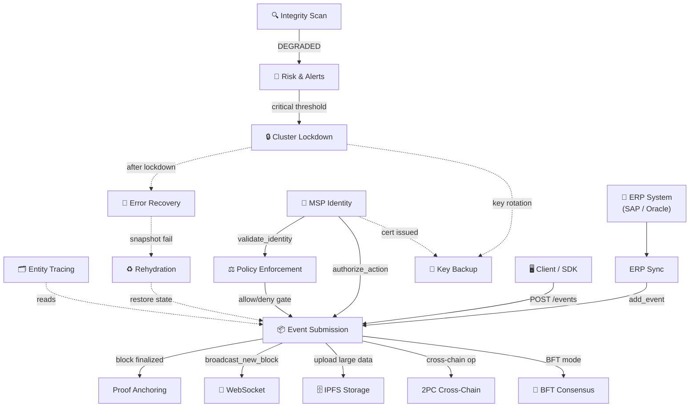

# Workflows overview and developer guide

HieraChain is a pure Python hierarchical ledger that works as a plugin layer for existing Web2 infrastructure. It does not replace the enterprise network stack, which already handles TLS/SSL, firewalls and WAF at the API gateway. HieraChain is focused on immutability, distributed trust, tamper evidence and non-repudiation.

This document is the central reference for 16 system workflows in 6 functional groups. It describes how they interact at runtime and how to read, maintain or add workflows.

---

## 1. Core development guardrails

When you work on HieraChain workflows, follow these guardrails:

* **Strict term censorship**: HieraChain tracks business process ledgers, not cryptocurrency. Do not use crypto terms in event payloads, variable names, database keys or comments.

    * Forbidden terms: `transaction`, `mining`, `coin`, `token`, `wallet`, `address`, `sender`, `receiver`, `amount`, `fee`.
    * Required terms: `event` for ledger entries, `node` for peers, `msp_id` for identity, `entity_id` for domain assets.
    * Note: `CrossChainValidator` scans commits and rejects code that contains forbidden terms.

* **Minimal latency constraint**: HieraChain keeps base latency at 10 to 20ms. Keep workflow code short and fast. Do not add transport level encryption or extra wrappers that add CPU overhead.
* **No direct storage access**: Do not query SQL or Redis directly. Use storage adapters under `adapters/database/` (for example `adapters/database/sqlite_adapter.py`).

---

## 2. All workflows: quick reference

This table lists all workflows for quick lookup:

| Workflow | Group | Trigger | Output | Key Module |
|:---------|:------|:--------|:-------|:-----------|
| [Event Submission](./event-submission.md) | A | `POST /api/ledger/chains/{name}/events` | Block appended to Sub-Chain | `hierarchical/sub_chain/base.py` (`SubChain.add_event`) |
| [Proof Anchoring](./proof-anchoring.md) | A | Block finalized on Sub-Chain | Proof hash on Main Chain | `hierarchical/main_chain/base.py` + `hierarchical/sub_chain/proof.py` |
| [Cross-Chain 2PC](./cross-chain-2pc.md) | A | `HierarchyManager.transaction_manager` | `COMMITTED` or `ROLLED_BACK` | `hierarchical/hierarchy_manager/base.py` + `hierarchical/transaction_manager.py` |
| [BFT Consensus](./bft-consensus.md) | B | `HRC_MAINCHAIN_CONSENSUS` / `HRC_CONSENSUS_TYPE` | Block committed by 2f+1 validators | `consensus/bft/consensus.py` |
| [Cluster Lockdown](./cluster-lockdown.md) | C | Anomaly exceeds risk threshold | All nodes frozen / resumed | `cluster/lockdown_types.py` + `cluster/lockdown_protocol.py` |
| [Error Mitigation](./error-recovery.md) | C | Network fail / leader timeout / integrity error | State restored from snapshot | `error_mitigation/rollback_manager.py` + `consensus_recovery.py` |
| [Entity Tracing](./entity-tracing.md) | D | `EntityTracer.trace_entity()` | Complete cross-chain audit trail | `domains/utils/entity_tracer.py` |
| [Chain Rehydration](./chain-rehydration.md) | D | Node restart or hash divergence | In-memory chain synced to DB | `hierarchical/sub_chain/base.py` + `hierarchical/sub_chain/ordering.py` |
| [Integrity Validation](./integrity-validation.md) | D | Periodic / manual / Risk Alerts anomaly | `IntegrityReport` (HEALTHY / DEGRADED) | `security/verify/block_verifier.py` |
| [Policy Enforcement](./policy-enforcement.md) | E | Any access-sensitive operation | `allow` or `deny` with decision path | `security/policy_engine.py` |
| [WebSocket Streaming](./websocket-streaming.md) | E | Client connects to `/ws/{chain_name}` | Real-time block/event push | `api/websocket/manager.py` |
| [IPFS Encrypted Storage](./ipfs-storage.md) | E | `IPFSClient.upload_json()` | CID returned; ciphertext on IPFS | `api/storage/ipfs_client.py` |
| [Risk Analysis & Alerts](./risk-alerts.md) | E | `PerformanceMonitor` schedule | Alerts dispatched; escalation on no-ack | `monitoring/alert_system.py` |
| [ERP Integration Sync](./erp-integration.md) | E | `SyncScheduler` timer | ERP events submitted to Sub-Chain | `integration/erp_ledger.py` |
| [MSP Identity & Auth](./msp-identity.md) | F | Entity registration / API auth | Identity confirmed + action authorized | `security/msp.py` |
| [Key Backup & Restoration](./key-backup.md) | F | Key generation (`cli/key.py`) | Key file / vault backed up; restored via CLI | `cli/key.py` + `security/key_provider.py` (no `key_backup_manager.py`) |

---

## 3. Functional groups and subsystems

Workflows are grouped into six areas. Use the dashboard to find the group that matches the subsystem you are debugging or changing:

<div class="grid cards" markdown>

* :material-sitemap:{ .lg .middle } __Group A: Core chain operations__

    ---

    Handles ingestion, cryptographic validation and persistence.

    * [Event Submission](./event-submission.md)
    * [Proof Anchoring](./proof-anchoring.md)
    * [Cross-Chain Operation (2PC)](./cross-chain-2pc.md)

* :material-shield-key:{ .lg .middle } __Group B: Consensus finalization__

    ---

    Block finalization. For PoA/PoF alternatives, see [Consensus Mechanisms](./consensus_mechanisms.md).

    * [BFT Consensus (3-Phase PBFT)](./bft-consensus.md)

* :material-server-security:{ .lg .middle } __Group C: Cluster management__

    ---

    Governance, lockdown triggers and recovery.

    * [Cluster Lockdown & Recovery](./cluster-lockdown.md)
    * [Error Mitigation & Recovery](./error-recovery.md)

* :material-shield-check:{ .lg .middle } __Group D: Integrity and traceability__

    ---

    Auditing, cold start rehydration and integrity verification.

    * [Entity Tracing](./entity-tracing.md)
    * [Chain Rehydration](./chain-rehydration.md)
    * [System Integrity Validation](./integrity-validation.md)

* :material-connection:{ .lg .middle } __Group E: Operational and integration__

    ---

    Policy gates, WebSocket push, encrypted IPFS offloading and ERP sync.

    * [Policy Enforcement](./policy-enforcement.md)
    * [WebSocket Real-Time Streaming](./websocket-streaming.md)
    * [IPFS Encrypted Storage](./ipfs-storage.md)
    * [Risk Analysis & Alert Lifecycle](./risk-alerts.md)
    * [ERP Integration Sync](./erp-integration.md)

* :material-key-chain:{ .lg .middle } __Group F: Identity and key management__

    ---

    Lightweight MSP enrolment (internal `Certificate` in `security/msp.py`), participant authorization and CLI-managed key backup (no X.509/mTLS).

    * [MSP Identity & Authorization](./msp-identity.md)
    * [Key Backup & Restoration](./key-backup.md)

</div>

---

## 4. How workflows interact

The diagram shows runtime relationships and triggers between workflows. Solid lines are synchronous or blocking operations. Dashed lines are asynchronous or event driven.



### Core developer integration paths

| Ingestion & Security Chain | Description |
|:---|:---|
| **ERP → ERP Sync → Event Submission → Proof Anchoring** | Ingestion pipeline: business change → local event → Sub-Chain block → proof hash anchored to root chain. |
| **MSP Identity → Policy Enforcement → Event Submission** | Security validation path: verify internal cert (`msp.py:verify_certificate`) → check ABAC policies → accept/reject event. |
| **Integrity Scan → Risk & Alerts → Cluster Lockdown → Error Recovery** | Anomaly detection path: `block_verifier`/`risk_analyzer` → alert dispatch → lockdown → `rollback_manager` restore. |
| **Cluster Lockdown → Key Backup** | No automatic coupling in code: key rotation/backup is manual via `cli/key.py` (not triggered by lockdown). |
| **Error Recovery → Rehydration** | State sync fallback: local snapshot validation fail triggers in-memory chain rebuild from DB journal. |

---

## 5. Developer guide: how to maintain workflows

Keep workflow documentation in sync with the code when you add features or fix behavior:

### Anatomy of a workflow document
Each workflow page (for example `event-submission.md`) has this layout. It must contain:

1. **Zensical front-matter**: YAML metadata with `title`, `description` and `icon`. No WF-number prefixes.
2. **Clean H1 header**: `# [Title]` that matches front-matter.
3. **Overview**: What the workflow does and when it is used.
4. **Flow diagram**: Mermaid sequence or flowchart that shows runtime interactions.
5. **Step-by-step breakdown**: Table that maps sequence numbers to developer actions.
6. **Error handling**: Table that maps failures (node offline, verification failure) to mitigations.
7. **Key classes and methods**: Pointers from workflow steps to code (for example `SubChain.add_event()`).
8. **Related**: Links to sibling or downstream workflows.

### Process for adding or modifying a workflow

1. **Write clean Markdown**: Save new flows under `docs/en/workflows/name.md` using the design system.
2. **Register in zensical.toml**: Add the workflow to the `Workflows` tree in [zensical.toml](../../zensical.toml) with a clean name.
3. **Run term scanner**: Check that no forbidden cryptocurrency vocabulary was added.
4. **Compile and verify**: Run the Zensical build in the HieraChain environment to check formatting and links:

    ```bash
    zensical build -f zensical.toml
    ```
