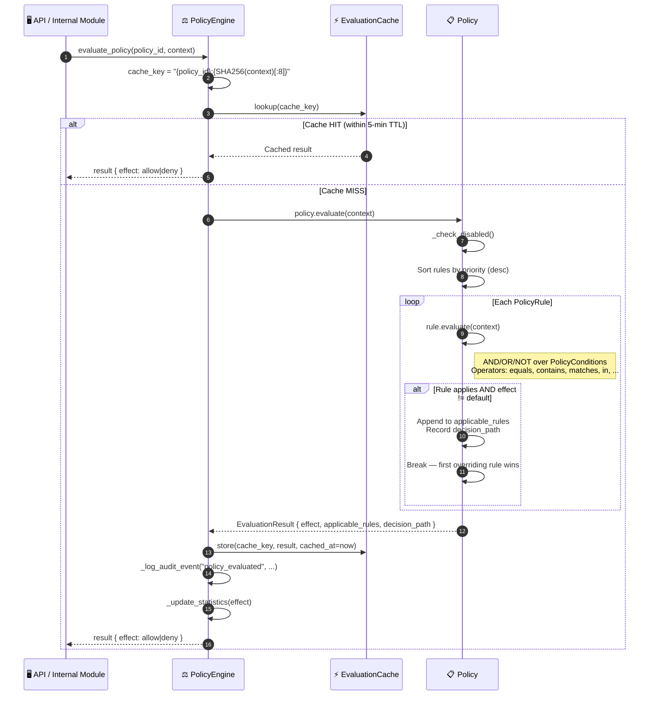

# Policy enforcement

## Overview

Every access sensitive operation goes through `PolicyEngine`. Policies are sets of typed `PolicyRule` objects ordered by priority. Results are cached with a 5 minute TTL and LRU eviction to keep latency low. All evaluations are written to an in-memory audit log.

`PolicyEngine` is the single authorization gateway. MSP calls it after identity is verified and before `SubChain.add_event()` runs.

---

## Flow diagram



---

## Policy rule structure

```python
# Example policy: restrict event submission to authorized operators only
policy = Policy(
    policy_id="event_submission_policy",
    name="Event Submission Access",
    effect=PolicyEffect.DENY,       # Default effect if no rule overrides
    rules=[
        PolicyRule(
            rule_id="allow_operators",
            priority=100,
            effect=PolicyEffect.ALLOW,
            conditions=[
                PolicyCondition(field="role", operator="in", value=["admin", "operator"])
            ],
            logic=RuleLogic.AND
        )
    ]
)
```

---

## Step-by-step breakdown

| Step | Description |
|:-----|:------------|
| **1. Cache check** | `cache_key = "{policy_id}:{SHA256(context)[:8]}"`. If cache HIT and TTL valid → return immediately |
| **2. Rule sort** | All rules sorted by `priority` descending (higher priority evaluated first) |
| **3. Rule evaluation** | Each rule checks its `PolicyCondition` list using AND/OR/NOT logic |
| **4. First override** | The first rule whose effect differs from the policy default wins; remaining rules skipped |
| **5. Cache store** | Result cached with `cached_at` timestamp for 5-minute TTL |
| **6. Audit log** | Every evaluation logged with `policy_id`, `context`, `effect`, and `decision_path` |

---

## Supported condition operators

| Operator | Description | Example |
|:---------|:------------|:--------|
| `equals` | Exact match | `role == "admin"` |
| `not_equals` | Negation | `status != "revoked"` |
| `contains` | String/list containment | `permissions contains "submit_events"` |
| `matches` | Regex match | `entity_id matches "^product-.*"` |
| `in` | Set membership | `role in ["admin", "operator"]` |
| `greater_than` | Numeric comparison | `risk_score > 0.8` |

---

## Error handling

| Condition | Behavior |
|:----------|:---------|
| Policy not found | Returns `DENY` (fail-closed) |
| Policy disabled | Returns default effect immediately (no rule eval) |
| Context missing required field | Condition evaluates to `False`; logged as partial match |
| Cache evicted (LRU) | Next request triggers fresh evaluation |

---

## Key classes and methods

| Step | Class / Method | File |
|:-----|:--------------|:-----|
| Entry point | `PolicyEngine.evaluate_policy()` | `security/policy_engine.py` |
| Multi-policy eval | `PolicyEngine.evaluate_policy_set()` | `security/policy_engine.py` |
| Rule evaluation | `PolicyRule.evaluate()` | `security/policy_engine.py` |
| Condition check | `PolicyCondition.evaluate()` | `security/policy_engine.py` |
| Cache lookup | `_get_cached_result()` | `security/policy_engine.py` |
| Cache store | `_cache_result()` | `security/policy_engine.py` |

---

## Related

- [MSP Identity](./msp-identity.md): MSP calls `evaluate_policy()` after identity verified
- [Event Submission](./event-submission.md): `add_event()` guarded by policy evaluation
