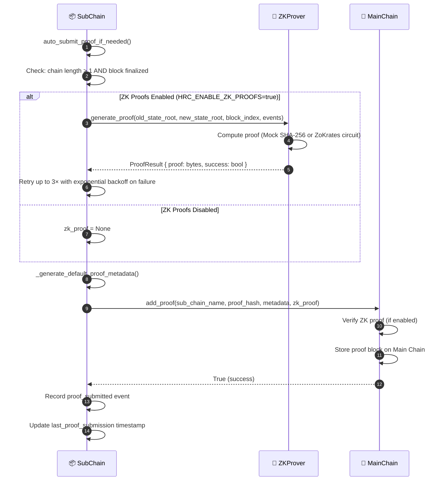

# Proof anchoring

## Overview

After a block is finalized on a Sub-Chain, the Sub-Chain submits a cryptographic proof (hash and optional ZK proof) to the Main Chain. The Main Chain stores only the proof, never raw event data. This keeps domain data off the root chain while still enforcing global immutability.

This is not a user initiated call. It is a post-block trigger that fires when `chain_length % proof_interval == 0`.

---

## Flow diagram

---

## Step-by-step breakdown

| Step | Description |
|:-----|:------------|
| **1. Trigger check** | `auto_submit_proof_if_needed()` checks `len(chain) > 1` and block has been finalized |
| **2. ZK generation** | If `HRC_ENABLE_ZK_PROOFS=true`: ZKProver computes over `(old_state_root, new_state_root, events)`. Retries 3× with backoff |
| **3. Proof metadata** | `_generate_default_proof_metadata()` builds `{ sub_chain_name, block_count, latest_hash, timestamp }` |
| **4. Main Chain write** | `MainChain.add_proof()` verifies ZK proof, appends a new proof block |
| **5. Record** | Sub-Chain logs a `proof_submitted` internal event and updates `last_proof_submission` |

---

## ZK proof modes

| Mode | Mechanism | Use Case |
|:-----|:----------|:---------|
| `mock` | SHA-256 hash simulation | Development / Testing |
| `production` | ZoKrates ZK-SNARKs circuits | Production deployment |

---

## Configuration

| Setting | Default | Description |
|:--------|:--------|:------------|
| `HRC_ENABLE_ZK_PROOFS` | `false` | Toggle ZK verification |
| `HRC_ZK_MODE` | `mock` | `mock` or `production` |
| `HRC_ZK_REQUIRED_MAINCHAIN` | `false` | Block proof submission if ZK fails |

---

## Error handling

| Condition | Behavior |
|:----------|:---------|
| ZK proof generation fails | Retry up to 3× with exponential backoff; if `HRC_ZK_REQUIRED_MAINCHAIN=true`, abort |
| Main Chain write fails | Exception logged, `last_proof_submission` not updated; retry on next block |
| Main Chain ZK verification fails | `add_proof()` raises, proof block not appended |

---

## Key classes and methods

| Step | Class / Method | File |
|:-----|:--------------|:-----|
| Trigger | `SubChain.auto_submit_proof_if_needed()` | `hierarchical/sub_chain/base.py` |
| ZK generate | `ZKProver.generate_proof()` | `security/zk_prover.py` |
| Proof metadata | `_generate_default_proof_metadata()` | `hierarchical/sub_chain/base.py` |
| Anchor on Main | `MainChain.add_proof()` | `hierarchical/main_chain/base.py` |
| ZK verify | `ZKVerifier.verify_proof()` | `security/verify/zk_verifier.py` |

---

## Related

- [Event Submission](./event-submission.md): triggers this workflow
- [System Integrity Validation](./integrity-validation.md): checks proof consistency between Sub-Chain and Main Chain
