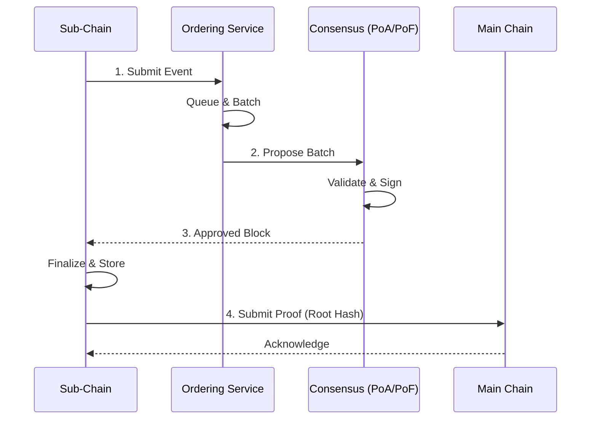

# Đồng thuận & Sắp xếp (Consensus & Ordering)

## Mục đích

Phần này mô tả cơ chế consensus và Ordering Service mà HieraChain dùng để giữ block và event được sắp xếp, toàn vẹn và có thể xác minh.

## Kiến trúc & khái niệm

* Base Consensus: `hierachain/consensus/base_consensus.py` định nghĩa interface và khung chung cho các thuật toán đồng thuận.
* Proof of Authority (PoA): `hierachain/consensus/proof_of_authority.py` xử lý đồng thuận trong một organization, một MainChain quản lý các Sub-Chain nội bộ.
* Proof of Federation (PoF): `hierachain/consensus/proof_of_federation.py` xử lý đồng thuận liên minh P2P giữa các MainChain độc lập, không cần RootChain trung tâm.
* BFT Consensus: `hierachain/consensus/bft/` bổ sung khả năng chịu lỗi Byzantine ở tầng phân cấp.
* Ordering Service: `hierachain/consensus/ordering/` sắp xếp event trước khi tạo block và gồm nhiều thành phần (Processor, Certifier, BlockBuilder).

### Luồng điển hình



1. Sub-Chain nhận event và đẩy vào hàng đợi của Ordering Service.
2. Ordering Service gom batch theo ngưỡng kích thước và thời gian rồi gửi cho cơ chế consensus đã chọn.
3. Cơ chế consensus (PoA, PoF hoặc BFT) xác nhận batch hoặc block, sau đó Sub-Chain đóng block.
4. Nếu bật neo lên Main Chain, Sub-Chain gửi proof (Merkle root hoặc hash) để Main Chain ghi nhận.

## Cấu hình

Các biến trong `hierachain/config/settings.py`:

* `CONSENSUS_TYPE`: `proof_of_authority` (mặc định) hoặc `proof_of_federation`.
* `BFT_ENABLED`: bật hoặc tắt lớp BFT cho các kịch bản cần chịu lỗi Byzantine.
* `VALIDATOR_TIMEOUT`: timeout giữa các validator.
* `CONSENSUS_FEDERATION_CONFIG`: tham số liên minh (ví dụ `min_validators` và `block_interval`).

Ví dụ môi trường:

```dotenv
HRC_CONSENSUS_TYPE=proof_of_authority
HRC_ZK_REQUIRED_MAINCHAIN=false
```

## Tính năng & hạn chế

* PoA triển khai đơn giản và độ trễ thấp, nhưng phụ thuộc vào validator tập trung để bảo đảm tin cậy.
* PoF cân bằng giữa tin cậy và phân tán, nhưng cần quản lý thành viên liên minh.
* BFT chịu lỗi Byzantine tốt, nhưng làm tăng độ phức tạp và chi phí thông điệp.
* Ordering giữ thứ tự event và việc gom batch ổn định trước khi đóng block.

## Liên quan

* Kiến trúc tổng quan: [Tổng quan](overview.md)
* Hierarchical module: [Hierarchical](../modules/hierarchical.md)
* Data Models: [Data Models](../reference/data-models.md)
* Config: [Config](../reference/config.md)
