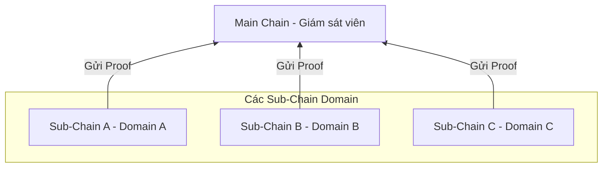
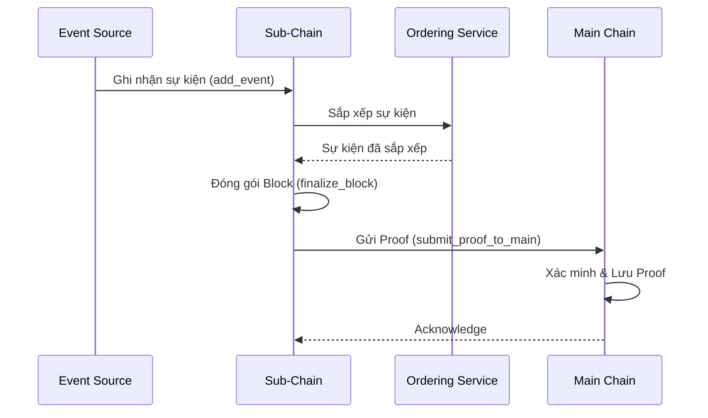

# Kiến trúc tổng quan

## Mục đích

HieraChain dùng kiến trúc phân cấp. Main Chain là gốc và chỉ giữ proof từ Sub-Chain. Sub-Chain xử lý dữ liệu nghiệp vụ (event) theo từng domain. Phần này mô tả từng thành phần làm gì và các luồng chính vận hành thế nào.

## Kiến trúc & khái niệm

* Sub-Chain ghi nhận event theo domain, sắp xếp thành block và giữ world state riêng.
* Main Chain không giữ dữ liệu domain chi tiết. Nó chỉ giữ proof mật mã để bảo đảm tính toàn vẹn toàn hệ thống.
* HierarchyManager lo việc tạo và đăng ký Sub-Chain, gửi proof và các tác vụ đa chuỗi khác.

### Thành phần chính

* `hierachain/hierarchical/main_chain/base.py` là Main Chain. Nó lưu và xác minh proof từ Sub-Chain và tổng hợp báo cáo toàn vẹn.
* `hierachain/hierarchical/sub_chain/base.py` là Sub-Chain. Nó ghi nhận event theo domain, sắp xếp thành block, tạo proof và gửi lên Main Chain.
* `hierachain/hierarchical/hierarchy_manager/base.py` là HierarchyManager. Nó điều phối hệ thống đa chuỗi, quản lý vòng đời Sub-Chain, gửi proof tự động và kiểm tra tính nhất quán liên chuỗi.
* `hierachain/api/storage/ipfs_client.py` là lưu trữ IPFS off-chain. Nó giữ dữ liệu nghiệp vụ lớn hoặc nhạy cảm ngoài chuỗi và chỉ neo CID trên blockchain.
* `hierachain/consensus/ordering/service.py` là Ordering Service. Nó sắp xếp event trước khi tạo block và được Sub-Chain khởi tạo.

### Luồng tiêu biểu

1. Ghi event và tạo block trên Sub-Chain. `SubChain.add_event()` nhận event và đưa qua khâu sắp xếp nội bộ. Event được gom thành block và `finalize_block()` chạy khi đủ điều kiện.
2. Gửi proof lên Main Chain. `SubChain.submit_proof_to_main()` tạo proof từ Merkle root hoặc block hash và gọi `MainChain.add_proof()` để neo lại.
3. Báo cáo toàn cục. Main Chain tổng hợp kết quả từ `get_main_chain_stats()` và thống kê theo từng Sub-Chain.
4. Điều phối hệ thống. `HierarchyManager` xử lý gửi proof định kỳ bằng `configure_auto_proof_submission`, đồng bộ và kiểm tra tính nhất quán liên chuỗi.

## Liên quan

* Bắt đầu nhanh: [Bắt đầu nhanh](../getting-started/quickstart.md)
* Thuật ngữ: [Thuật ngữ](../glossary.md)
* Mô-đun cốt lõi: [Core](../modules/core.md)
