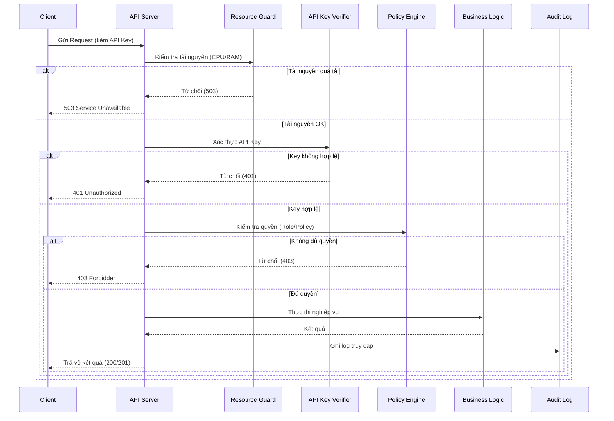

# Kiến trúc bảo mật

Cơ chế bảo mật ở tầng kiến trúc và cách chúng gắn vào HieraChain. Hệ thống dùng phòng thủ phân tầng bao phủ toàn bộ vòng đời ứng dụng.

## Các trụ cột bảo mật chính

Phòng thủ được chia thành sáu nhóm phối hợp với nhau:

* Authorization và kiểm soát truy cập:

    * `hierachain/security/{msp.py, identity.py}` quản lý Organization, User, Role và định danh PKI.
    * `hierachain/security/policy_engine.py` xử lý kiểm soát quyền (ABAC).
    * `hierachain/security/verify/api_key_verifier.py` xử lý xác thực API key.

* Lockdown và logging:

    * `hierachain/security/secure_logging.py` ghi log có khả năng phát hiện giả mạo và che PII.
    * `hierachain/cluster/lockdown_protocol.py` xử lý phong tỏa khẩn cấp theo quorum và chứa `ClusterLockdownManager`.

* Fault tolerance và tính toàn vẹn:

    * `hierachain/error_mitigation/{rollback_manager.py, consensus_validator.py, resource_validator.py}` và `hierachain/cluster/lockdown_types.py` cung cấp kiểm tra toàn vẹn, snapshot rollback và HMAC lockdown. Không có `security/resource_guard.py` hay `security/integrity.py`, các đường dẫn này đã bị xóa hoặc chưa từng tồn tại.

* Risk analyzer:

    * `hierachain/risk_management/risk_analyzer.py` xử lý chấm điểm rủi ro và dùng các validator trong `hierachain/error_mitigation/*`.
    * `hierachain/security/sanitization.py` giúp ngăn injection bằng cách trung hòa HTML/template và áp allowlist cho tên file.

* Encryption và khóa:

    * `hierachain/security/{key_manager.py, key_provider.py}` và `hierachain/security/msp.py` (`Certificate`/`CertificateAuthority`) cung cấp hỗ trợ Ed25519 và `FileVaultProvider` (Fernet/PBKDF2, chỉ dùng cho dev). Không có `key_backup_manager.py` hay `certificate.py` và không có mTLS.

* Zero-knowledge proof phi tập trung:

    * `hierachain/security/zk_prover.py` và `hierachain/security/verify/zk_verifier.py` triển khai zero-knowledge proof để xác minh dữ liệu Sub-Chain ẩn danh.

Cấu hình bảo mật hệ thống được bật tắt trong `hierachain/config/settings.py` (AUTH, CORS, HSTS, rate limit và các tùy chọn khác).

## Tích hợp vào hệ thống

* API Server (`hierachain/api/server.py`) thêm middleware (`add_payload_limit`, `add_rate_limit`, `add_cors_middleware` qua `CORSMiddleware`) và xác thực API key (`verify/api_key_verifier.py`) khi `HRC_AUTH_ENABLED=true`. Không có `ResourceGuardMiddleware`.
* Sub-Chain/Main Chain: mọi thao tác làm thay đổi trạng thái phải qua xác thực khi bật AUTH và được ghi lại để audit.
* Logging an toàn: `security/secure_logging.py` và `security/sanitization.py` giúp giảm rò rỉ dữ liệu nhạy cảm.

## Cấu hình liên quan (trích)

Các biến trong `settings.py` (đều dùng tiền tố `HRC_*`):

* `HRC_AUTH_ENABLED`, `HRC_API_KEY_LOCATION`, `HRC_API_KEY_NAME`
* `HRC_CORS_ALLOW_ALL`, `HRC_CORS_ORIGINS`
* `HRC_HSTS_ENABLED`, `HRC_HSTS_MAX_AGE`
* `HRC_RATE_LIMIT`, `HRC_RATE_LIMIT_RPM`, `HRC_RATE_LIMIT_BACKEND`, `HRC_TRUSTED_PROXIES` (không có `RATE_LIMIT_REQUESTS_PER_MINUTE`)

## Luồng tiêu biểu

1. Request tới API đi qua bước kiểm tra CPU/RAM tùy chọn của ResourceGuard, rồi xác thực API key, rồi kiểm tra policy/role, sau đó thực thi và ghi audit.
2. Event và giao dịch mang chữ ký hoặc ZK proof được `verify/*` xác minh trước khi chấp nhận.

## Liên quan

* Mô‑đun Security: [Security](../modules/security.md)
* Tham chiếu Config: [Config](../reference/config.md)
* API Ledger: [API Ledger](../reference/api-ledger.md)
