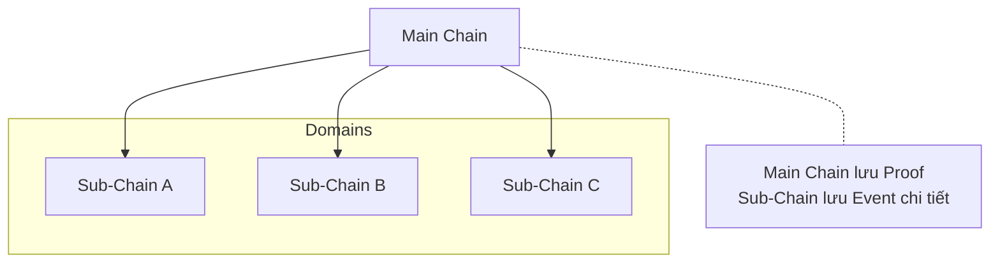
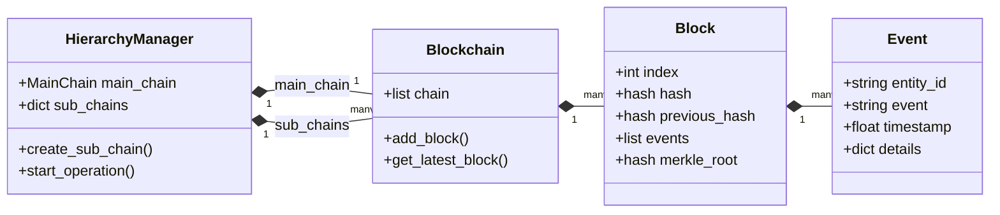

# Khái niệm cơ bản

Trang này tóm tắt các khái niệm nền tảng để đọc và sử dụng HieraChain hiệu quả. Khi gặp thuật ngữ mới, xem thêm trang [Thuật ngữ](../glossary.md).

## Các khái niệm chính

* Chain: Tập hợp các Block được liên kết bằng `previous_hash`. HieraChain có hai lớp chuỗi: `Main Chain` và các `Sub-Chain` theo domain.
* Block: Nhóm nhiều Event và siêu dữ liệu (header). Xem `hierachain/core/block.py`.
* Event: Hoạt động nghiệp vụ (không phải giao dịch tiền mã hóa). Được lưu dưới dạng bảng Arrow theo schema trong `hierachain/core/block.py:261`.
* Proof: Dấu vết mật mã (ví dụ Merkle root/hash) đại diện cho trạng thái Sub-Chain, được neo lên Main Chain.
* Hierarchy: Kiến trúc Main Chain giám sát nhiều Sub-Chain. Quản lý bởi `HierarchyManager`.

### Cấu trúc dữ liệu

## Dòng chảy cơ bản

1. Ghi Event ở Sub-Chain → gom thành Block theo điều kiện (kích thước/thời gian).
2. Sinh Proof từ Block (ví dụ: Merkle root) → gửi lên Main Chain để neo.
3. Truy vết/thống kê: API cho phép theo dõi thực thể, xem Block/Chain, và tổng hợp thông tin hệ thống.

## Tệp mã nguồn liên quan

* Core: `hierachain/core/block.py`, `hierachain/core/blockchain.py`
* Phân cấp: `hierachain/hierarchical/main_chain/base.py`, `hierachain/hierarchical/sub_chain/base.py`, `hierachain/hierarchical/hierarchy_manager/base.py`
* API: `hierachain/api/ledger/router.py`, `hierachain/api/ledger/schemas.py`
* Bảo mật: `hierachain/security/*`
* Cấu hình: `hierachain/config/settings.py`

## Liên quan

* Bắt đầu nhanh: [Bắt đầu nhanh](quickstart.md)
* Kiến trúc tổng quan: [Tổng quan](../architecture/overview.md)
* Thuật ngữ: [Thuật ngữ](../glossary.md)
