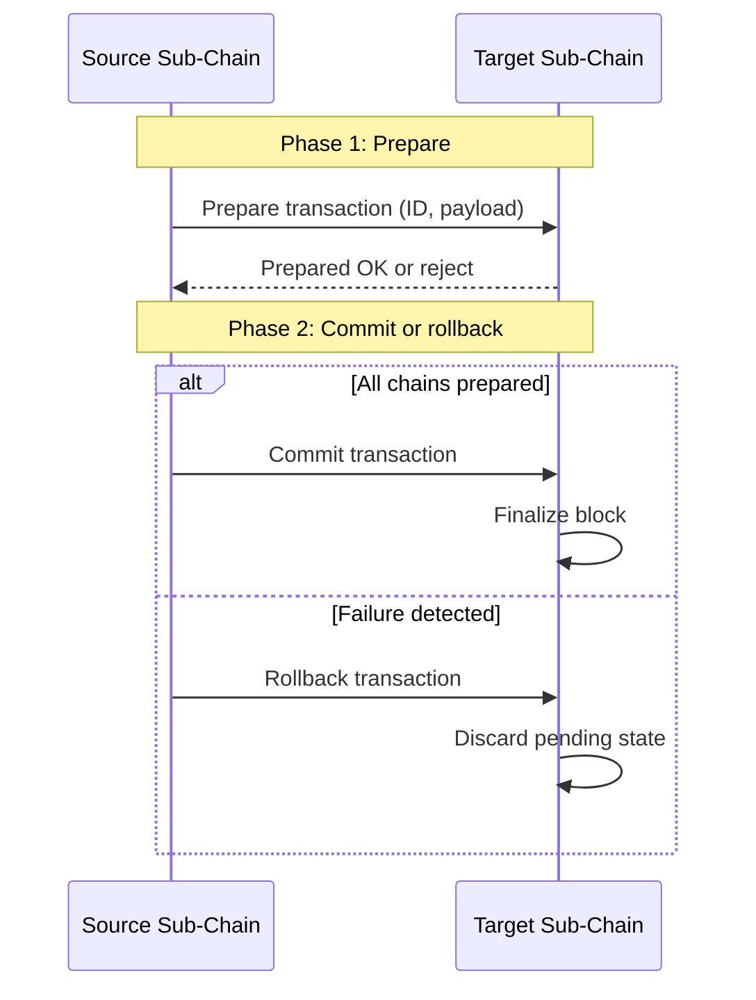

# Domains Module (`hierachain/domains/*`)

## 1. Tổng quan

Module `domains` kết nối hạ tầng chuỗi khối cốt lõi với logic nghiệp vụ doanh nghiệp. Module cung cấp các lớp cơ sở cho các Sub-Chain chuyên biệt, hàm tạo sự kiện chuẩn hóa, công cụ hỗ trợ vòng đời thực thể và tiện ích truy vết liên chuỗi.

## 2. Các thành phần cốt lõi

Các thành phần được tổ chức thành ba gói con dưới `hierachain/domains/`:

### 2.1 Chuỗi nghiệp vụ (`chains/base_chain.py`, `chains/domain_chain.py`)

* `BaseChain`: Lớp cơ sở trừu tượng quản lý trạng thái chuỗi, sổ đăng ký thực thể và quy trình xử lý sự kiện.
* `DomainChain`: Triển khai cụ thể hỗ trợ thao tác nghiệp vụ, kiểm tra tính hợp lệ của thao tác và trình quản lý giao dịch.
* `chains/metrics.py`: Theo dõi chỉ số vận hành như tỷ lệ thành công và độ trễ thực thi.

### 2.2 Sự kiện doanh nghiệp (`events/base_event.py`, `events/event_creators.py`)

* `BaseEvent`: Lớp cơ sở cho các sự kiện nghiệp vụ có cấu trúc kèm kiểm tra lược đồ.
* `event_creators.py`: Các hàm tiện ích tạo dữ liệu hợp lệ cho các thao tác: `create_quality_check`, `create_approval`, `create_resource_allocation` và `create_status_update`.

### 2.3 Tiện ích toàn vẹn (`utils/cross_chain_validator.py`, `utils/entity_tracer.py`)

* `CrossChainValidator`: Đánh giá tính nhất quán giữa các chuỗi con và kiểm tra thuật ngữ tiền mã hóa bị cấm.
* `EntityTracer`: Tái hiện đầy đủ lịch sử của thực thể xuyên suốt các chuỗi trong hệ thống.
* `utils/compliance_checker.py`: Kiểm tra tham số tuân thủ đối chiếu với quy định.

## 3. Quản lý nghiệp vụ và vòng đời thực thể

`DomainChain` cung cấp sẵn các bước chuyển vòng đời:

1. Đăng ký: Gắn định danh `entity_id` duy nhất với loại thực thể và thuộc tính metadata.
2. Cập nhật trạng thái: Theo dõi các trạng thái tuần tự (`in_progress`, `quality_approved`, `completed`).
3. Phân bổ tài nguyên: Ghi nhận thiết bị, nhân sự hoặc vị trí kho được phân công.
4. Chỉ số vận hành: `OperationMetricsTracker` tính toán các chỉ số thực thi theo từng loại thao tác.

## 4. Điều phối Two-Phase Commit (2PC)

Các thao tác phối hợp giữa nhiều Sub-Chain thực thi qua giao thức Two-Phase Commit:



## 5. Tuân thủ và truy vết liên chuỗi

### Lọc thuật ngữ tiền mã hóa

`CrossChainValidator` quét dữ liệu sự kiện để đảm bảo quy định về thuật ngữ doanh nghiệp. Nếu phát hiện các từ như `coin`, `token`, `mining` hoặc `wallet` trong dữ liệu nghiệp vụ, validator sẽ đánh dấu sự kiện vi phạm quy định.

### Truy vết thực thể liên chuỗi

`EntityTracer` tổng hợp các sự kiện của một thực thể trên toàn bộ Sub-Chain:

```python
from hierachain.domains.utils.entity_tracer import EntityTracer

tracer = EntityTracer(hierarchy_manager)
trace_results = tracer.trace_entity("ORDER-789")

print(f"Total events found: {trace_results['total_events']}")
for chain_name, summary in trace_results.get("chain_summaries", {}).items():
    print(f"Activity at {chain_name}: {summary['total_events']} events")
```

## 6. Các loại thao tác chuẩn hóa

| Loại thao tác | Vai trò nghiệp vụ | Các trường bắt buộc |
| :--- | :--- | :--- |
| `quality_check` | Kiểm tra chất lượng | `check_type`, `check_result` |
| `approval` | Phê duyệt quản lý | `approval_type`, `approver_id` |
| `resource_allocation` | Phân bổ tài nguyên | `resource_type`, `resource_id` |
| `compliance_check` | Kiểm tra tuân thủ | `compliance_type` |

## Liên quan

* [Hierarchical Module](./hierarchical.md)
* [Xây dựng Logic Miền Nghiệp vụ](../how-to/write-domain-contracts.md)
* [Tích hợp ERP](../workflows/erp-integration.md)
