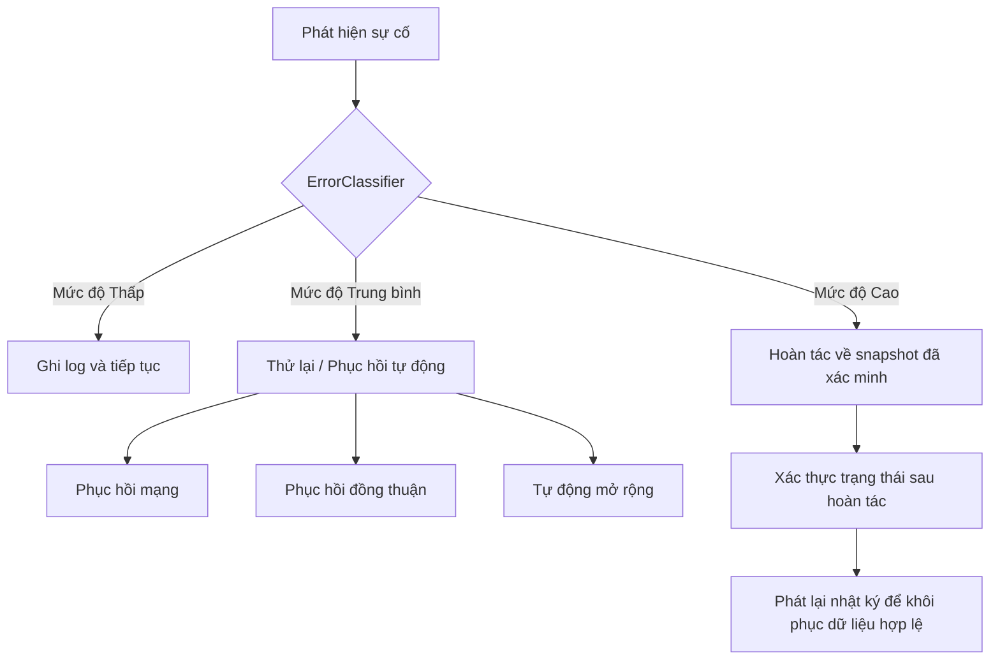

# Error Mitigation Module (`hierachain/error_mitigation/*`)

## 1. Tổng quan

Module `error_mitigation` xử lý khả năng chịu lỗi, xác thực trạng thái và phục hồi hệ thống. Module này cung cấp nhật ký sự kiện ghi tiếp (append-only), phân loại lỗi tự động, snapshot hoàn tác và các bộ máy phục hồi chuyên biệt cho các lỗi mạng, đồng thuận và trạng thái.

## 2. Các thành phần lõi

Các thành phần nằm trong thư mục `hierachain/error_mitigation/`.

### 2.1 Lớp xác thực (`validator.py`, `data_validator.py`)

* `Validator`: Xác thực cấu trúc block và sự kiện theo các quy tắc sổ cái.
* `DataValidator`: Kiểm tra tính nhất quán của payload sự kiện, sự tương thích với schema Arrow và các ràng buộc đầu vào.

### 2.2 Nhật ký bền vững (`journal.py`)

* Triển khai `TransactionJournal` sử dụng Apache Parquet và Arrow để ghi nhật ký sự kiện lưu trữ trên đĩa.
* Áp dụng lưu trữ chỉ ghi tiếp trước khi sự kiện được commit vào trạng thái blockchain.
* Cung cấp các generator phát lại để tái tạo các sự kiện chưa commit sau các lần tắt máy đột ngột.

### 2.3 Quản lý hoàn tác (`rollback_manager.py`)

* Tạo và xác minh snapshot trạng thái theo thời điểm (`FULL_SYSTEM`, `CHAIN_STATE`, `CONSENSUS_STATE`, `CONFIGURATION`).
* Xác thực mã băm SHA-256 của snapshot trước khi áp dụng hoàn tác.
* Tích hợp cơ chế cách ly cho các block trạng thái bị hỏng.

### 2.4 Các hệ thống con phục hồi

* `backup_recovery.py`: Quản lý lưu trữ sao lưu, khôi phục snapshot và chính sách lưu giữ.
* `consensus_recovery.py`: Xử lý đồng bộ hóa khi chuyển view, phục hồi khi leader gặp sự cố và khởi động lại vòng BFT.
* `network_recovery.py`: Phát hiện sự kiện phân đoạn mạng, kích hoạt giãn cách thời gian kết nối lại và quản lý cảnh báo nút mạng.
* `auto_scaler.py`: Theo dõi mức sử dụng bộ nhớ và CPU để điều chỉnh ngưỡng validator một cách linh hoạt.

## 3. Chiến lược phân loại lỗi

`ErrorClassifier` trong `error_classifier.py` phân loại lỗi theo mức độ nghiêm trọng và đề xuất hành động xử lý:

| Mức độ nghiêm trọng | Ý nghĩa | Hành động xử lý |
| :--- | :--- | :--- |
| INFO / WARNING | Bất thường vận hành nhỏ | Ghi log và tiếp tục |
| ERROR | Lỗi xác thực sự kiện hoặc lỗi xử lý tạm thời | Thử lại kèm giãn cách hoặc từ chối |
| CRITICAL | Hỏng trạng thái hoặc không khớp Merkle root | Hoàn tác và cách ly |
| FATAL | Lỗi phần cứng hoặc lỗi đồng thuận không thể phục hồi | Khóa hệ thống khẩn cấp |

## 4. Nhật ký sự kiện

`TransactionJournal` cung cấp khả năng lưu trữ ghi trước:

1. Ghi bền vững: Ghi các bản ghi vào tệp Parquet trên đĩa trước khi các block hoàn tất.
2. Thực thi schema: Đảm bảo mọi bản ghi nhật ký khớp với schema sự kiện bắt buộc.
3. Khả năng phát lại: Phát lại các sự kiện đã ghi từ đĩa vào hàng đợi sắp xếp khi nút khởi động lại.

```python
from hierachain.error_mitigation.journal import TransactionJournal

journal = TransactionJournal(storage_dir="data/journal")
journal.log_event(event_dict)
```

## 5. Quy trình phục hồi



## 6. Các loại snapshot

`RollbackManager` quản lý 4 phạm vi snapshot:

* `CONFIGURATION`: Cài đặt nút và các tham số môi trường.
* `CHAIN_STATE`: Mã băm block và sổ cái trạng thái thế giới trên Main Chain cùng các Sub-Chain.
* `CONSENSUS_STATE`: Số thứ tự view hiện tại, tập hợp validator và trạng thái leader.
* `FULL_SYSTEM`: Bản lưu trữ toàn diện kết hợp cấu hình, block chuỗi và trạng thái đồng thuận.

## Tài liệu liên quan

* [Module Adapters](./adapters.md)
* [Module Core](./core.md)
* [Khóa cụm khẩn cấp](./cluster.md)

