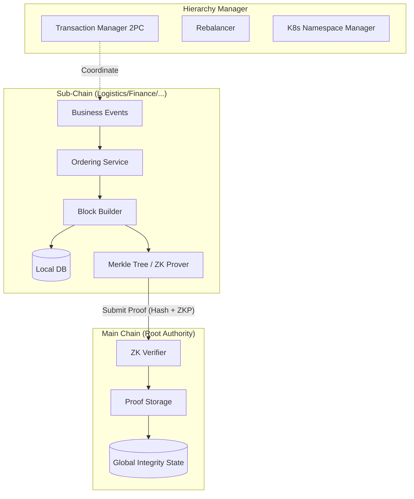

# Hierarchical Module (`hierachain/hierarchical/*`)

## 1. Tổng quan

Module `hierarchical` triển khai kiến trúc sổ cái hai tầng của HieraChain. Các chuỗi con (Sub-Chain) xử lý các sự kiện nghiệp vụ miền và lưu trữ trạng thái chi tiết tại cục bộ. Chuỗi chính (Main Chain) lưu trữ các bằng chứng mật mã và mã băm gốc do Sub-Chain gửi lên. Sự phân tách này duy trì tính riêng tư của dữ liệu nghiệp vụ, giảm tải xác thực cho Main Chain và mở rộng quy mô theo chiều ngang bằng cách phân chia tải giữa các chuỗi.

## 2. Các thành phần nền tảng

Các thành phần được tổ chức trong các gói chuyên biệt dưới `hierachain/hierarchical/`.

### 2.1 Chuỗi chính Main Chain (`main_chain/base.py`)

* Lưu trữ các bằng chứng khối mật mã thay vì dữ liệu sự kiện thô.
* Xác thực các bước chuyển trạng thái bằng zero-knowledge proof khi được kích hoạt.
* Kiểm tra tính hợp lệ của các điểm neo liên chuỗi theo cơ chế đồng thuận thẩm quyền hoặc liên minh.

### 2.2 Chuỗi con Sub-Chain (`sub_chain/base.py`)

* Vận hành quy trình nghiệp vụ chuyên biệt cho từng miền hoặc phòng ban.
* Đóng gói sự kiện nghiệp vụ vào các khối và tính toán Merkle root.
* Tạo bằng chứng trạng thái định kỳ để gửi lên Main Chain.

### 2.3 Quản lý phân cấp Hierarchy Manager (`hierarchy_manager/base.py`)

* Điều phối vòng đời chuỗi, xác thực liên chuỗi và cấu hình đa tổ chức.
* Quản lý các kênh trao đổi (channel), bộ sưu tập dữ liệu riêng tư và giao dịch Two-Phase Commit (2PC).
* Tổng hợp báo cáo tính toàn vẹn hệ thống trên toàn bộ các chuỗi đã đăng ký.

### 2.4 Đa tổ chức, kênh và dữ liệu riêng tư

* `multi_org.py`: Quản lý các tổ chức thành viên, chứng chỉ và định danh MSP.
* `channel/manager.py`: Phân vùng giao tiếp giữa các nhóm tổ chức cụ thể.
* `private_data.py`: Lưu trữ dữ liệu nhạy cảm ngoài chuỗi (off-chain) và neo mã băm mật mã lên chuỗi.

## 3. Luồng dữ liệu

Dữ liệu chi tiết được lưu trữ tại Sub-Chain. Chỉ có Merkle root và bằng chứng mật mã được neo lên Main Chain:



## 4. Khả năng mở rộng và quản lý hạ tầng

### Bộ tái cân bằng chuỗi con (`rebalancer/rebalancer.py`)

Bộ tái cân bằng theo dõi lưu lượng và tách các Sub-Chain chịu tải cao khi số sự kiện mỗi giây (EPS) vượt ngưỡng vận hành:

* Chiến lược: Phân vùng dựa trên mã băm, thời gian hoặc khối lượng dữ liệu.
* Di chuyển dữ liệu: Chuyển giao trạng thái thực thể sang các chuỗi nhánh mà không làm gián đoạn dịch vụ.

### Phân lập namespace Kubernetes (`k8s_namespace_manager/operations.py`)

Ánh xạ từng Sub-Chain vào một namespace Kubernetes riêng biệt, áp dụng hạn mức tài nguyên và chính sách mạng độc lập cho từng miền.

## 5. Thao tác liên chuỗi (2PC)

`CrossChainTransactionManager` trong `hierachain/hierarchical/transaction_manager.py` triển khai giao thức Two-Phase Commit để duy trì tính nguyên tử qua các Sub-Chain:

```python
from hierachain.hierarchical.hierarchy_manager import HierarchyManager

manager = HierarchyManager()
tx_id = manager.initiate_cross_chain_transaction(
    source_chain_name="supply_chain",
    dest_chain_name="finance_chain",
    payload={"asset_id": "INV-100", "action": "settle_payment"}
)
```

## 6. Tính riêng tư và xác thực zero-knowledge

* Xác thực Main Chain: Sub-Chain có thể nộp zero-knowledge proof để chứng minh bước chuyển trạng thái hợp lệ theo quy tắc đồng thuận mà không để lộ nội dung sự kiện thô.
* Bộ sưu tập dữ liệu riêng tư: Dữ liệu nhạy cảm được giới hạn trong các node thành viên được cấp quyền, chỉ có mã băm được phát tán trên sổ cái chung.

## Liên quan

* [Consensus Module](./consensus.md)
* [Domains Module](./domains.md)
* [Hướng dẫn Two-Phase Commit](../how-to/cross-chain-transactions.md)
