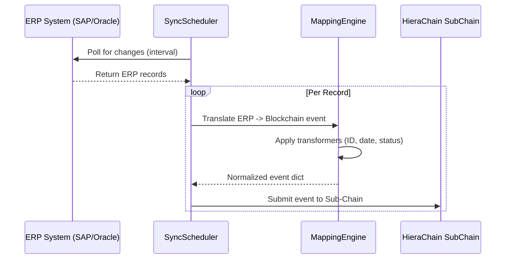

# Integration Module (`hierachain/integration/*`)

## 1. Tổng quan

Module `integration` kết nối HieraChain với các hệ thống phần mềm doanh nghiệp như SAP, Oracle và Microsoft Dynamics. Hệ thống trích xuất bản ghi từ ERP bên ngoài, chuẩn hóa dữ liệu thông qua công cụ ánh xạ và ghi nhận các sự kiện trạng thái có thể kiểm chứng lên các chuỗi con nghiệp vụ.

## 2. Các thành phần cốt lõi

Toàn bộ thành phần tích hợp nằm tại `hierachain/integration/`.

### 2.1 ERP Integration Ledger (`erp_ledger.py`, `erp/base.py`)

* Điều phối các đường ống đồng bộ dữ liệu.
* Tích hợp `MappingEngine` để chuyển đổi các trường dữ liệu.
* Quản lý `SyncScheduler` để định kỳ thăm dò API bên ngoài theo khoảng thời gian cấu hình.

### 2.2 Enterprise Adapters (`enterprise.py`)

* Các bộ kết nối cho SAP, Oracle và Microsoft Dynamics.
* Đọc URL và thông tin đăng nhập từ biến môi trường (`HRC_SAP_*`, `HRC_ORACLE_*`, `HRC_DYNAMICS_*`).
* Xử lý bắt tay xác thực và vòng đời phiên HTTP.

### 2.3 Bộ phát hiện thay đổi (`erp/change_detector.py`)

* So sánh dữ liệu ERP mới nhận với ảnh chụp trạng thái trước đó.
* Tách biệt các thay đổi (delta) nhằm tránh ghi nhận sự kiện dư thừa lên chuỗi.

## 3. Công cụ ánh xạ dữ liệu (Mapping Engine)

`MappingEngine` chuyển đổi các trường dữ liệu doanh nghiệp thành thuộc tính sự kiện chuẩn hóa:

| Transformer | Chức năng | Ví dụ chuyển đổi |
| :--- | :--- | :--- |
| `date` | Chuẩn hóa định dạng thời gian | `12/04/2024` -> `ISO-8601` |
| `amount` | Chuẩn hóa số và tiền tệ | `5000` -> `5000.0` (float) |
| `status` | Ánh xạ mã trạng thái nghiệp vụ | `REQ` -> `REQUESTED` |
| `id` | Thêm tiền tố định danh | `123` -> `ERP_123` |
| `boolean` | Chuẩn hóa giá trị logic | `1/Yes/On` -> `True` |

## 4. Luồng đồng bộ dữ liệu

`SyncScheduler` quản lý việc thăm dò và thử lại với các nguồn dữ liệu bên ngoài:



## 5. Ví dụ sử dụng

### Cấu hình ánh xạ và lập lịch đồng bộ

```python
from hierachain.integration.erp_ledger import ERPIntegrationLedger

sap_mapping = {
    "entity_id": "material.document_number",
    "event": {
        "source_path": "material.event_type",
        "transformer": "status",
        "params": {"mapping": {"GR": "GOODS_RECEIPT"}}
    },
    "details.quantity": {
        "source_path": "material.qty",
        "transformer": "amount"
    }
}

ledger = ERPIntegrationLedger()
# Start syncing with a domain sub-chain
ledger.start_scheduled_sync(
    profile_name="SAP_Logistics",
    interval_seconds=60,
    chain=sub_chain_instance
)
```

## 6. Tính bền vững và bảo mật

* Xử lý đa luồng: Sử dụng `ThreadPoolExecutor` để xử lý đồng thời nhiều hồ sơ đồng bộ mà không chặn xử lý sự kiện chính.
* Phân lập thông tin bí mật: Mật khẩu và thông tin xác thực sử dụng biến môi trường, không lưu trữ trong mã nguồn.
* Tự động thử lại: Các worker đồng bộ áp dụng cơ chế exponential backoff khi gặp sự cố mạng tạm thời.

## Liên quan

* [Hệ thống Phân cấp (Hierarchical)](./hierarchical.md)
* [Cấu trúc Sổ cái Cốt lõi (Core)](./core.md)
* [Xử lý lỗi và Giảm thiểu rủi ro](./error-mitigation.md)
