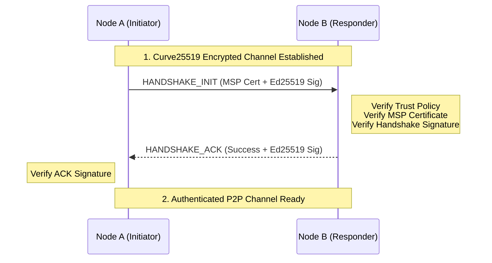

# Network Module (`hierachain/network/*`)

## Tổng quan

Module **Network** là lớp xương sống cho phép các nút (Nodes) trong mạng lưới HieraChain giao tiếp với nhau. Được thiết kế với triết lý "Bảo mật đa tầng" (Defense-in-Depth), module này kết hợp sức mạnh truyền tải của **ZeroMQ** với các thuật toán mật mã hiện đại để đảm bảo mọi thông điệp đều được mã hóa, xác thực và chống giả mạo.

---

## Kiến trúc Bảo mật Đa tầng (Layered Security)

HieraChain không chỉ dựa vào một lớp bảo mật duy nhất mà kết hợp ba lớp bảo vệ độc lập:

<div class="grid cards" markdown>

*   :material-lock-check:{ .lg .middle } __Lớp 1: CurveZMQ (Transport)__

    ---

    __Công nghệ__: Curve25519

    * Mã hóa toàn bộ đường truyền giữa các Socket ZeroMQ.
    * Đảm bảo tính riêng tư (Privacy) và chống nghe lén trên mạng Web2.
    * Sử dụng khóa ephemeral để đảm bảo Forward Secrecy.

*   :material-account-check:{ .lg .middle } __Lớp 2: MSP Handshake (Identity)__

    ---

    __Công nghệ__: Ed25519 + Certificates

    * Xác thực danh tính nút thông qua chứng chỉ MSP (Membership Service Provider).
    * Chỉ cho phép các nút thuộc tổ chức (Organization) hợp lệ tham gia mạng lưới.
    * Quy trình Handshake 2 bước: `INIT` và `ACK`.

*   :material-shield-sync:{ .lg .middle } __Lớp 3: Integrity & Replay Protection__

    ---

    __Công nghệ__: Ed25519 + Nonce + Timestamp

    * Mọi thông điệp P2P đều được ký số (Digital Signature).
    * Chống tấn công lặp lại (Replay Attacks) bằng cách kiểm tra Nonce duy nhất và Timestamp trong cửa sổ cho phép (60s).

</div>

---

## Các thành phần cốt lõi

### 1. ZMQ Transport (`zmq_transport.py`)
Hiện thực hóa mô hình P2P không đồng bộ sử dụng Socket **ROUTER** (để nhận) và **DEALER** (để gửi). 

*   **Hiệu năng**: Xử lý hàng nghìn thông điệp mỗi giây với độ trễ cực thấp.
*   **Identity Management**: Quản lý định danh các nút ở mức socket để định tuyến chính xác.

### 2. Secure Connection Manager (`secure_connection.py`)
Điều phối quy trình thiết lập kết nối an toàn:

1.  Thiết lập kênh mã hóa Curve25519.
2.  Thực hiện Handshake để trao đổi và xác thực chứng chỉ MSP.
3.  Quản lý danh sách các Peer đã được xác thực (`authenticated_peers`).

### 3. Peer Trust Manager (`peer_trust_manager.py`)
Quản lý độ tin cậy của các nút lân cận:

*   **Policy Enforcement**: Áp dụng các chính sách `strict` (chỉ cho phép allowlist) hoặc `discovery` (cho phép tự động khám phá).
*   **Reputation**: Đánh dấu và ngắt kết nối với các Peer có hành vi xấu (sai chữ ký, gửi thông điệp rác).

---

## Quy trình Thiết lập Kết nối An toàn (Secure Handshake)



---

## Ví dụ sử dụng

### 1. Khởi tạo Node Bảo mật
```python
from hierachain.network.secure_connection import SecureConnectionManager

# Khởi tạo manager tích hợp MSP
secure_node = SecureConnectionManager(
    node_id="node_001",
    port=5001,
    msp=msp_instance,
    identity_mgr=identity_instance
)

await secure_node.start()
```

### 2. Gửi thông điệp có ký số
```python
# Tự động ký và gửi qua kênh đã mã hóa
payload = {"event": "block_proposal", "data": {...}}
await secure_node.send_secure("peer_002", payload)
```

---

## Cấu hình P2P (Environment Variables)

| Biến môi trường | Chức năng | Giá trị khuyến nghị (Prod) |
| :--- | :--- | :--- |
| `HRC_P2P_TRUST_POLICY` | Chính sách tin cậy | `strict` |
| `HRC_P2P_REQUIRE_SIGNATURES` | Bắt buộc chữ ký Ed25519 | `true` |
| `HRC_P2P_PEER_ALLOWLIST` | Danh sách Peer ID tin cậy | (Danh sách ID cụ thể) |

---

## Liên quan

*   [Bảo mật và MSP (Security)](./security.md)
*   [Đồng thuận BFT (Consensus)](../consensus/bft_consensus.md)
*   [Giám sát mạng (Monitoring)](./monitoring.md)
