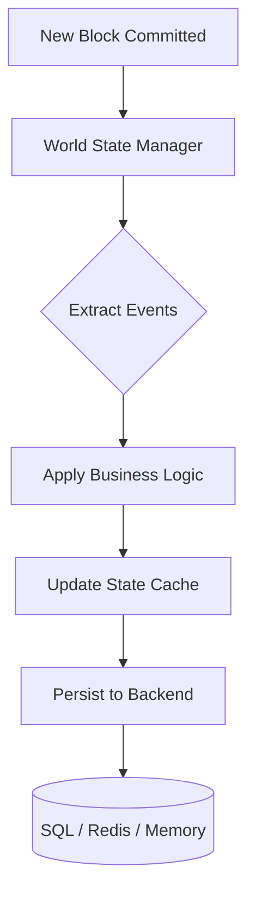

# Storage Module (`hierachain/adapters/database/*`)

## Tổng quan

Module storage quản lý toàn bộ dữ liệu HieraChain, từ lịch sử block và event tới trạng thái hiện tại của entity (World State). Thiết kế có thể cắm rút backend, nên bạn có thể đổi backend theo nhu cầu scale và hiệu năng mà không cần sửa logic nghiệp vụ.

---

## Kiến trúc lưu trữ đa tầng

HieraChain chia storage thành các lớp để cân bằng giữa độ bền và tốc độ truy vấn:

*   :material-state-machine:{ .lg .middle } __World State Layer__

    ---

    __File__: `hierachain/state/world_state.py` (`WorldState.get_entity_state()`)

    * Lưu trạng thái hiện tại của entity suy ra từ block đã finalize.
    * Cập nhật khi block được commit và có hỗ trợ cache. Codebase không định nghĩa sẵn các loại event `creation/update/status_change`.

*   :material-database-sync:{ .lg .middle } __Persistence Layer (Adapters)__

    ---

    __File__: `hierachain/adapters/database/sqlite_adapter.py`, `postgres_adapter.py`, `redis_adapter.py`, `sqlite_schema.py`/`postgres_schema.py`

    * **SQLite/Postgres** qua `SQLBase` + `init_database_schema()` (các bảng `chains`, `blocks`, `events`, `proofs`, `chain_state`; index composite).
    * **Redis Adapter**: `hierachain/adapters/database/redis_adapter.py` cho index theo entity.
    * **Memory**: `HRC_STORAGE_BACKEND=memory` cho test. Không có File Adapter tích hợp sẵn. Parquet dùng cho log và journal (`core/parquet_log.py`, `error_mitigation/journal.py`), không dùng để lưu chain.

*   :material-cloud-sync:{ .lg .middle } __Off-chain Storage (IPFS)__

    ---

    __File__: `api/storage/ipfs_client.py`

    * Lưu payload lớn như tài liệu và chi tiết event.
    * Chỉ lưu CID trên chain để tiết kiệm chỗ.
    * Mã hóa bằng AES-256-GCM trước khi upload.

---

## Luồng cập nhật trạng thái

---

## Mô hình dữ liệu cốt lõi

Không có `models.py` hay `BlockModel`/`EventModel` kiểu SQLAlchemy. Bảng được tạo bằng SQL thuần trong `sqlite_schema.py`/`postgres_schema.py:init_database_schema()` với `chains`, `blocks`, `events`, `proofs`, `chain_state`. `Block` và `Blockchain` là class Python thuần trong `hierachain/core/`.

---

## Cấu hình backend

| Environment Variable | Meaning | Available Values |
| :--- | :--- | :--- |
| `HRC_STORAGE_BACKEND` / `DATABASE_URL`+`HRC_DATABASE_URL` | Storage backend / DB URL | `sqlite`, `postgres` (auto-detected from `postgres://`), `redis`, `memory`, `parquet_only` (via `HRC_STORAGE_BACKEND`/`DATABASE_URL` handling in `config/settings.py:78`) |
| `HRC_LOG_SQL_DETAIL` / `HRC_LOG_FORMAT` | SQL detail / log format | `true/false`, `text/json` |

---

## Tính năng nâng cao

### Tính toàn vẹn và idempotency

`SQLiteAdapter` và `PostgresAdapter` (qua `SQLBase`) xử lý `save_block` có kiểm tra trùng `hash`/`block_hash` và xác thực liên kết `previous_hash` (`consensus/ordering/storage.py:_verify_chain_links`). `SqlStorageBackend` không tồn tại trong code hiện tại.

### Index và truy vấn

World State index mọi entity theo `entity_id` và `timestamp`. Với Redis adapter, các index này được lưu dạng Sorted Set, nên truy vấn lịch sử của một entity chạy nhanh.

---

## Liên quan

*   [Core Module (Block & Blockchain)](./core.md)
*   [ERP Integration](./integration.md)
*   [Performance Monitoring](./monitoring.md)
