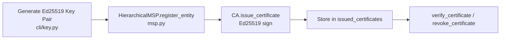

# Encryption & Keys

Lớp bảo mật này quản lý secret của hệ thống. Bao gồm khóa mã hóa, cặp khóa ký và chứng chỉ định danh.

## Key manager và key provider

File: `hierachain/security/key_manager.py`, `key_provider.py`

Đoạn code này tạo và sử dụng cặp khóa:

* Hỗ trợ Ed25519 dùng Ed25519 cho chữ ký số nhanh và an toàn.
* Provider có thể thay thế hỗ trợ nhiều nguồn khóa:

    * `LocalKeyProvider` giữ khóa trong bộ nhớ cục bộ.
    * `FileVaultProvider` giữ dữ liệu mã hóa trên đĩa với AES-256-GCM.

* Vòng đời API key bao phủ toàn bộ vòng đời API key từ lúc tạo đến khi thu hồi.

## Chứng chỉ và định danh (MSP)

File: `hierachain/security/msp.py` (`Certificate`, `CertificateAuthority`, `HierarchicalMSP`)

Đoạn code này quản lý định danh nội bộ nhẹ, không phải X.509:

* Chứng chỉ nội bộ là dataclass `Certificate` với `cert_id`, `subject`, `public_key`, `signature` (ký Ed25519 qua `_sign_certificate`) và kiểm tra thời hạn `is_valid()`. Không có ASN.1 X.509 và không có mTLS.
* Vận hành CA gồm `CertificateAuthority.issue_certificate()`, `revoke_certificate()` và `verify_certificate()` với tập `issued_certificates` và `revoked_certificates` lưu trong bộ nhớ. `HierarchicalMSP` dùng cơ chế này để đăng ký org và entity.
* Hạn chế: thu hồi chỉ tồn tại trong bộ nhớ. Không có phân phối CRL, không có xác thực chuỗi X.509 và không có mutual TLS giữa các component. TLS được đặt ở reverse proxy theo quy tắc kiến trúc.

## Sao lưu và khôi phục khóa

File: `hierachain/cli/key.py`, `hierachain/security/key_provider.py` (`FileVaultProvider`)

Không có `key_backup_manager.py` riêng. Cơ chế thực tế tối giản:

* Tạo khóa chạy `python -m hierachain key generate --output validator_key.json` (CLI) để tạo cặp Ed25519 qua `Ed25519PrivateKey.generate()` và ghi JSON `{private_key, public_key}` dạng hex. Lệnh `show` và `verify` dùng để kiểm tra kết quả.
* Vault mã hóa (chỉ cho dev và test) dùng `FileVaultProvider` để mã hóa file vault bằng `PBKDF2HMAC(SHA256, 310_000 iter)` và `Fernet`. Phần này phù hợp cho dev và test và được ghi rõ không dùng cho production. Với production hãy dùng HSM hoặc KMS qua interface `KeyProvider` và `HRC_VAULT_*`.
* Không có sao lưu đa vị trí, không có kiểm tra toàn vẹn SHA-512 và không có tự động phân phối hay dọn dẹp. Operator phải tự sao chép `validator_key.json` hoặc `.vault` bằng công cụ sao lưu ngoài.

---

## Phạm vi khóa (thực tế)

* Khóa validator và node là một `KeyPair` Ed25519 cho mỗi node (qua `LocalKeyProvider` hoặc `FileVaultProvider`), được tham chiếu bởi `HRC_VALIDATOR_IDENTITY` và `HRC_MASTER_KEY_FILE`/`HRC_MASTER_KEY_SOURCE`.
* API key được quản lý bởi `KeyManager` (tạo, thu hồi, phân quyền, cache qua `KeyStorage`/`KeyCacheManager`), không phải khóa ký cho từng entity.
* Không có phân cấp sẵn như Master tới Domain tới Entity. Cách ly domain dựa trên việc tách Sub-Chain và role của MSP.

---

## Luồng khởi tạo chứng chỉ (thực tế)

---

## Liên quan

*   [Authorization & Access Control](./authorization-access-control.md)
*   [Network Security](../modules/network.md)
