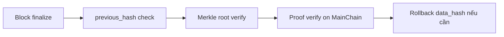

# Fault-tolerance & Integrity

Trang này trước đây mô tả `security/resource_guard.py` và `security/integrity.py`, các file này không tồn tại trong `hierachain/`. Khả năng chịu lỗi trong codebase được phân tán ở nhiều nơi khác.

## Bảo vệ tài nguyên (thực tế)

* Giới hạn rate và payload nằm trong `hierachain/api/middleware.py` (`add_rate_limit`, `add_payload_limit` với `HRC_RATE_LIMIT`, `HRC_RATE_LIMIT_RPM`, `HRC_RATE_LIMIT_BACKEND`, `HRC_TRUSTED_PROXIES`; payload được kiểm tra qua `request.stream()` với giới hạn 1MB).
* Guard cho event pool và RAM là `HRC_EVENT_POOL_MAX_SIZE` (10k) và `HRC_RAM_CRITICAL_THRESHOLD` (95%), được kiểm tra trong các đường dẫn ordering và storage.
* Không có `ResourceGuardMiddleware`. Bảng ngưỡng 70%/90% và việc shed tải trong `monitoring/performance_monitor.py` mô tả trước đây là bịa. Hãy dùng middleware của app kết hợp với giới hạn ở reverse proxy.

## Kiểm tra toàn vẹn (thực tế)

Không có quét chữ ký lúc khởi động trong `security/integrity.py`. Cơ chế toàn vẹn thực tế là:

* Merkle và chain link trong `hierachain/core/block.py` và `core/merkle_tree.py` (tiền tố phân tách domain `0x01`) và `consensus/ordering/storage.py:_verify_chain_links()` (chuỗi `previous_hash`).
* Xác minh proof trong `hierachain/hierarchical/main_chain/proofs.py:_verify_proof_in_main_chain` (quét fallback) và `security/verify/block_verifier.py`.
* Tính toàn vẹn rollback trong `hierachain/error_mitigation/rollback_manager.py:_verify_rollback_integrity` (kiểm tra `data_hash`) kèm guard chống path traversal.

---

## Liên quan

*   [Xử lý lỗi](../modules/error-mitigation.md)
*   [Giám sát](../modules/monitoring.md)
*   [Cluster Lockdown](./lockdown-logging.md)
