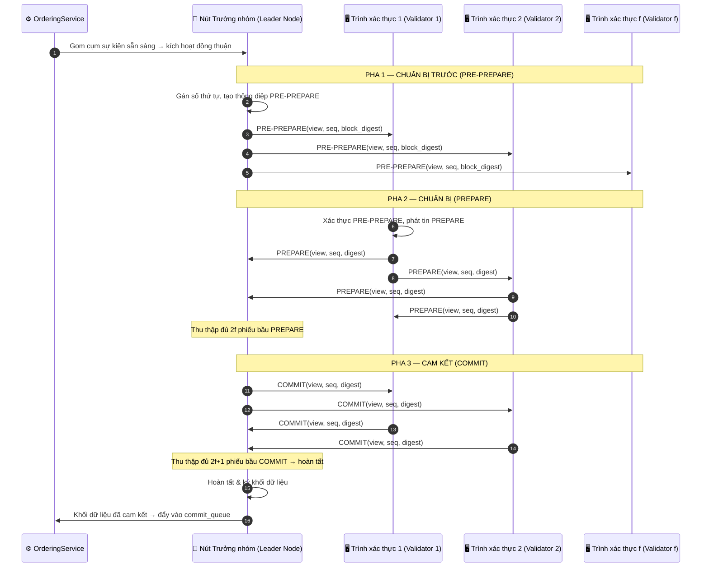
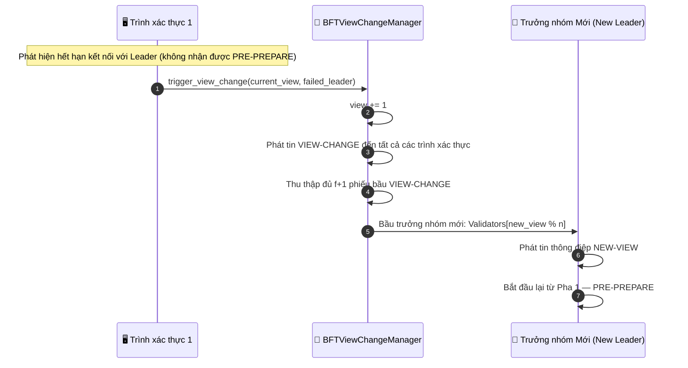

# Đồng thuận BFT

## Tổng quan

Đồng thuận BFT chạy PBFT 3 pha khi hoàn tất khối. Nó yêu cầu `n >= 3f + 1` để chịu được `f` node lỗi hoặc gian lận. Cơ chế này thay thế bước `finalize_block()` trong luồng Gửi Sự kiện khi hệ thống chạy ở chế độ BFT.

Với chi tiết PoA và PoF, xem [Cơ chế Đồng thuận](./consensus_mechanisms.md).

Yêu cầu hệ thống: tối thiểu 4 node để chịu 1 lỗi Byzantine (n=4, f=1: 3x1+1=4).

---

## Biểu đồ luồng: PBFT 3 pha

---

## Biểu đồ luồng: Thay đổi phiên (View Change)

---

## Các bước chi tiết

| Bước | Mô tả |
|:-----|:------|
| **PRE-PREPARE** | Leader gán số thứ tự và phát thông điệp chứa digest của khối tới mọi validator. |
| **PREPARE** | Mỗi validator kiểm tra PRE-PREPARE, rồi phát phiếu PREPARE của mình. Leader thu đủ 2f phiếu hợp lệ. |
| **COMMIT** | Leader phát COMMIT. Mỗi node thu đủ 2f+1 phiếu COMMIT trước khi xác nhận khối tại chỗ. |
| **View Change** | Nếu leader không phản hồi trong timeout: validator tăng `view` lên 1, bầu `Validators[view % n]` làm leader mới. |

---

## So sánh thuật toán đồng thuận

| Thuật toán | Cơ chế | Khả năng chịu lỗi | Trường hợp dùng |
|:-----------|:-------|:------------------|:-------------------|
| **PoA** | Dựa trên danh tính, node có thẩm quyền ký khối | Danh tiếng validator | Mạng riêng / nội bộ |
| **PoF** | Luân phiên leader, đồng thuận đa số `height % n` | Phân tán niềm tin | Mạng liên doanh / đa tổ chức |
| **BFT** | PBFT 3 pha | Chịu tới `f` node Byzantine trong `3f+1` | Môi trường quan trọng / đối kháng |

---

## Xử lý lỗi

| Tình huống | Hành vi |
|:-----------|:--------|
| Leader không phản hồi | Kích hoạt View Change, bầu leader mới (`Validators[new_view % n]`) |
| Validator gửi digest không hợp lệ | Phiếu bị loại, không tính vào quorum |
| Chia mạng < f node | Giao thức tiếp tục nếu vẫn đủ quorum 2f+1 |
| Chia mạng >= f+1 node | Giao thức tạm dừng tới khi mạng nối lại (ưu tiên an toàn hơn sẵn sàng) |

---

## Lớp và phương thức chính

| Bước | Lớp / Phương thức | Tệp |
|:-----|:--------------|:-----|
| PBFT 3 pha | `BFTConsensus.run_consensus()` | `consensus/bft/consensus.py` |
| PRE-PREPARE | `BFTConsensus._send_pre_prepare()` | `consensus/bft/consensus.py` |
| Thu thập PREPARE | `BFTConsensus._handle_prepare()` | `consensus/bft/consensus.py` |
| Hoàn tất COMMIT | `BFTConsensus._handle_commit()` | `consensus/bft/consensus.py` |
| Thay đổi phiên | `BFTViewChangeManager.trigger_view_change()` | `consensus/bft/consensus.py` |
| Giao thức mạng | `ZmqTransport.send()` / `receive()` | `network/zmq_transport.py` |

---

## Liên quan

- [Cơ chế Đồng thuận](./consensus_mechanisms.md): chi tiết PoA và PoF
- [Gửi Sự kiện](./event-submission.md): BFT thay thế bước `finalize_block()`
- [Giảm thiểu Lỗi & Phục hồi](./error-recovery.md): khôi phục sau lỗi leader ở cấp hệ thống
