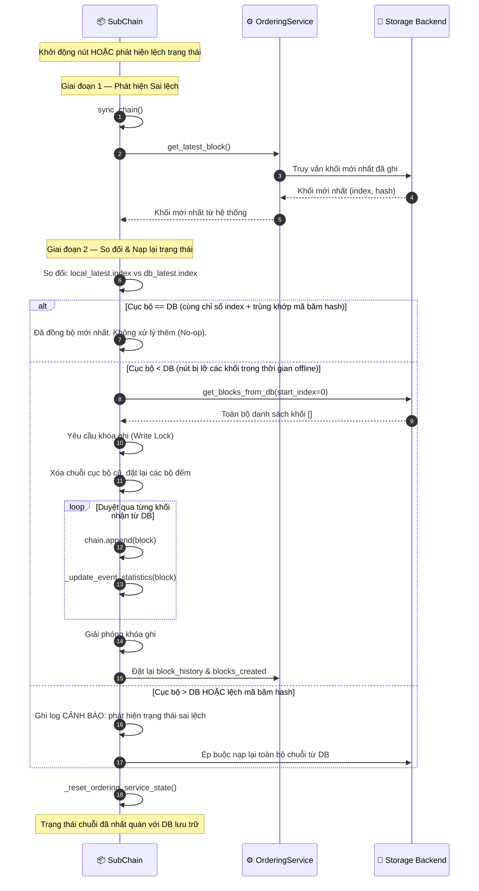

# Nạp lại trạng thái chuỗi

## Tổng quan

Khi node Sub-Chain khởi động lại hoặc phát hiện lệch trạng thái (hash cục bộ không khớp hash trong DB), node nạp lại chuỗi trong bộ nhớ từ backend lưu trữ. Cơ chế này giữ sổ cái nhất quán sau crash, restart hoặc chia mạng.

DB là nguồn chân lý có thẩm quyền. Nếu trạng thái cục bộ lệch, nó bị bỏ và dựng lại hoàn toàn từ DB.

---

## Biểu đồ luồng

---

## Các kịch bản lệch trạng thái

| Kịch bản | Cách phát hiện | Hành động khắc phục |
|:---------|:-------------------|:--------------------|
| **Khởi động lạnh** | `local.index == 0` | Nạp toàn bộ danh sách khối từ DB |
| **Phục hồi sau crash** | `local.index < db.index` | Chỉ lấy và ghép thêm khối thiếu |
| **Lệch hash** | `local.hash != db.hash` (cùng index) | Buộc nạp lại toàn bộ từ DB |
| **Đã đồng bộ** | Cùng index và hash khớp | Không làm gì (No-op) |
| **Cục bộ chạy trước DB** | `local.index > db.index` | Cảnh báo: DB là chuẩn; buộc nạp lại từ DB |

---

## Các bước chi tiết

| Bước | Mô tả |
|:-----|:------|
| **1. Kích hoạt** | Node khởi động gọi `sync_chain()`, hoặc timer `auto_sync` tự kích hoạt. |
| **2. Truy vấn DB** | `OrderingService.get_latest_block()` lấy khối mới nhất từ DB. |
| **3. So sánh**| So sánh cặp `(index, hash)` của chuỗi cục bộ với DB. |
| **4. Đã đồng bộ**| Nếu khớp hoàn toàn: bỏ qua và tiếp tục hoạt động bình thường. |
| **5. Đồng bộ một phần**| Nếu `local < db`: chỉ tải khối thiếu. Lấy khóa ghi để tránh xung đột luồng. |
| **6. Nạp lại toàn bộ** | Nếu lệch hash hoặc local lớn hơn DB: xóa bộ nhớ cục bộ, dựng lại toàn bộ từ DB. |
| **7. Đặt lại chỉ mục** | `_update_event_statistics()` dựng lại `entity_event_index` từ khối vừa nạp. |
| **8. Đồng bộ bộ đếm** | Đồng bộ lại bộ đếm khối giữa chuỗi và ordering service. |

---

## Xử lý lỗi

| Tình huống | Hành vi |
|:-----------|:--------|
| Lỗi đọc DB khi nạp lại | Ghi log exception, thử lại ở chu kỳ đồng bộ tiếp theo |
| Khóa ghi giữ quá lâu | Tự hết hạn sau `lock_timeout` giây; gửi cảnh báo qua Risk Alerts |
| `entity_event_index` không nhất quán sau nạp | Kích hoạt dựng lại chỉ mục toàn phần |
| DB không kết nối được | Node chuyển sang chỉ đọc; sự kiện mới vào hàng đợi nhưng không ghi xuống đĩa |

---

## Lớp và phương thức chính

| Bước | Lớp / Phương thức | Tệp |
|:-----|:--------------|:-----|
| Hàm khởi tạo | `SubChain.sync_chain()` | `hierarchical/sub_chain/base.py` |
| Đọc khối mới nhất từ DB | `OrderingService.get_latest_block()` | `consensus/ordering/service.py` |
| Tải toàn bộ khối | `storage.get_blocks_from_db()` | `adapters/database/sqlite_adapter.py` |
| Cập nhật chỉ mục | `SubChain._update_event_statistics()` | `hierarchical/sub_chain/base.py` |
| Đặt lại bộ đếm OS | `SubChain._reset_ordering_service_state()` | `hierarchical/sub_chain/base.py` |

---

## Liên quan

- [Giảm thiểu Lỗi & Phục hồi](./error-recovery.md): khôi phục snapshot lỗi kích hoạt nạp lại chuỗi
- [Xác thực Tính toàn vẹn](./integrity-validation.md): kiểm tra nhất quán chuỗi sau khi nạp lại
