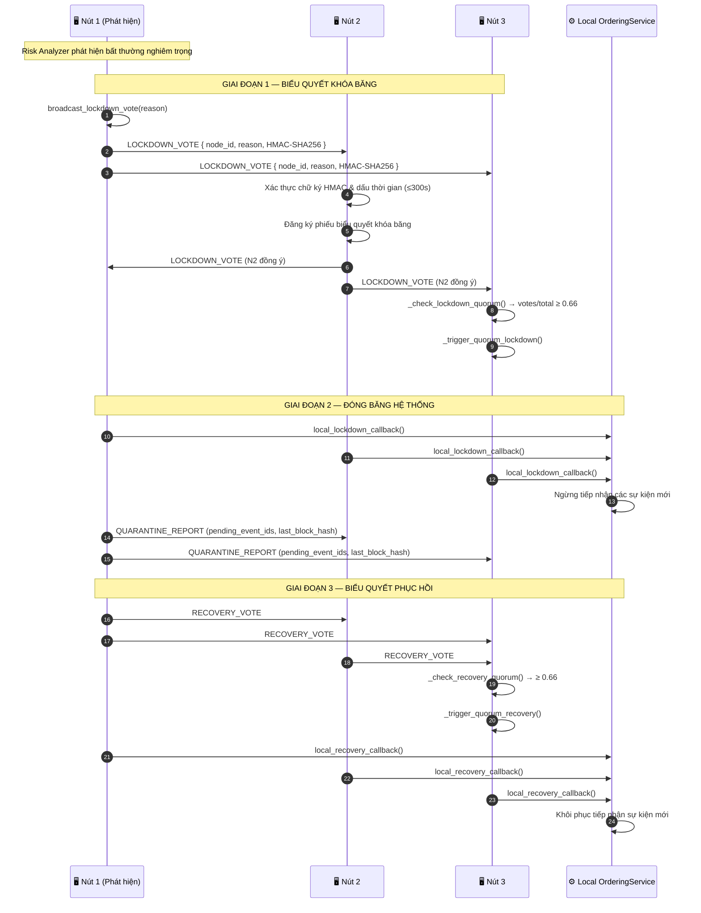
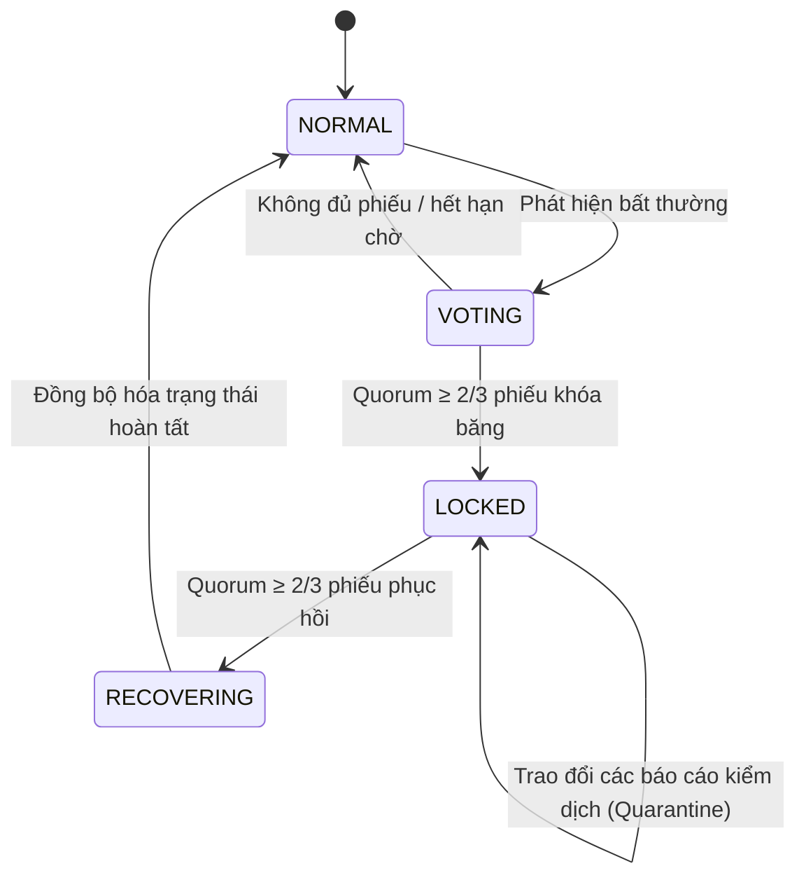

# Khóa băng cụm

## Tổng quan

Giao thức khóa băng cụm đóng băng trạng thái toàn hệ thống trên mọi node khi phát hiện bất thường nghiêm trọng. Nó dùng gossip P2P qua ZeroMQ và yêu cầu quorum tối thiểu 2/3 node đã đăng ký để kích hoạt cả khóa băng lẫn khôi phục. Mọi thông điệp được xác thực bằng HMAC-SHA256 để ngăn giả mạo yêu cầu khóa băng.

Điểm chính: không một node đơn lẻ nào có thể tự khóa toàn cụm; phải đạt quorum.

---

## Biểu đồ luồng

---

## Máy trạng thái

---

## Các bước chi tiết

| Bước | Mô tả |
|:-----|:------|
| **1. Phát hiện** | `RiskAnalyzer` hoặc người vận hành gọi `broadcast_lockdown_vote(reason)`. |
| **2. Phát phiếu** | Lan truyền LOCKDOWN_VOTE dạng gossip tới mọi peer, kèm HMAC-SHA256 và timestamp. |
| **3. Xác thực** | Mỗi node kiểm tra chữ ký HMAC và loại phiếu có độ trễ trên 300 giây. |
| **4. Kiểm tra quorum** | `_check_lockdown_quorum()`: nếu `votes / total_nodes >= 0.66` thì kích hoạt khóa băng. |
| **5. Đóng băng** | Mỗi node gọi `local_lockdown_callback()` và `OrderingService` dừng nhận sự kiện. |
| **6. Báo cáo kiểm dịch** | Node trao đổi danh sách ID sự kiện chờ xử lý và hash khối cuối để đối chiếu lệch trạng thái. |
| **7. Biểu quyết khôi phục** | Sau khi phân tích lỗi, người vận hành hoặc trigger tự động phát `RECOVERY_VOTE` dạng gossip. |
| **8. Quorum khôi phục** | Ngưỡng tương tự (2/3). Khi đạt quorum: gọi `local_recovery_callback()` và trở lại hoạt động bình thường. |

---

## Xử lý lỗi

| Tình huống | Hành vi |
|:-----------|:--------|
| Xác thực HMAC lỗi | Loại phiếu, ghi log cảnh báo |
| Timestamp phiếu > 300 giây | Từ chối phiếu (chống replay) |
| Không đủ quorum khóa băng | Hệ thống tiếp tục bình thường, phiếu tự hết hạn |
| Không đủ quorum khôi phục | Cụm vẫn bị khóa; gửi cảnh báo leo thang qua Risk Alerts |
| Node mới tham gia khi đang khóa | Node mới nhận trạng thái LOCKED qua `StateSyncManager` |

---

## Lớp và phương thức chính

| Bước | Lớp / Phương thức | Tệp |
|:-----|:--------------|:-----|
| Khởi tạo khóa băng | `ClusterLockdownManager.broadcast_lockdown_vote()` | `cluster/lockdown_protocol.py` |
| Xác thực tin nhắn | `_verify_lockdown_message()` | `cluster/lockdown_protocol.py` |
| Kiểm tra quorum | `_check_lockdown_quorum()` | `cluster/lockdown_protocol.py` |
| Đóng băng | `local_lockdown_callback()` | `cluster/lockdown_protocol.py` |
| Quorum khôi phục | `_check_recovery_quorum()` | `cluster/lockdown_protocol.py` |
| Đồng bộ trạng thái | `StateSyncManager.sync_state()` | `cluster/state_sync_manager.py` |
| Giao thức mạng | `ZmqTransport.broadcast()` | `network/zmq_transport.py` |

---

## Liên quan

- [Cảnh báo Rủi ro](./risk-alerts.md): vượt ngưỡng rủi ro kích hoạt quy trình này
- [Giảm thiểu Lỗi & Phục hồi](./error-recovery.md): xử lý rollback sau khi khôi phục
- [Sao lưu & Khôi phục Khóa](./key-backup.md): khóa băng không tự kích hoạt xoay vòng khóa
