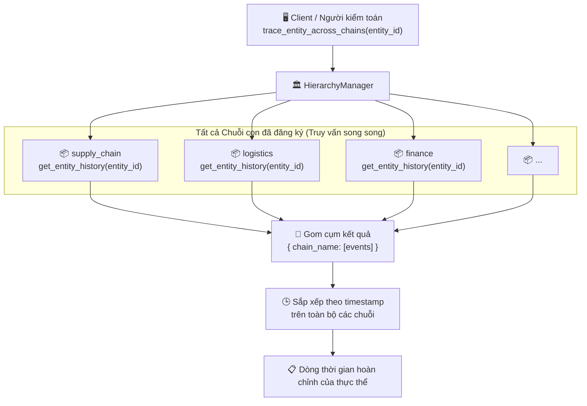

# Truy vết thực thể

## Tổng quan

Cùng một thực thể vật lý (ví dụ mã hàng `SKU-001`, hợp đồng `C-2024`) có thể phát sinh sự kiện trên nhiều Sub-Chain khác nhau trong vòng đời. HieraChain có cơ chế truy vết liên chuỗi để dựng lại lịch sử kiểm toán đầy đủ và bất biến cho bất kỳ `entity_id` nào.

Mỗi Sub-Chain giữ chỉ mục trong bộ nhớ `entity_event_index` theo `entity_id`, cho phép truy vấn O(1) mà không cần quét toàn bộ chuỗi.

---

## Biểu đồ luồng



---

## Ví dụ thực tế

```
Thực thể: product-SKU-001 (lô cảm biến công nghiệp)

Dòng thời gian liên chuỗi:
────────────────────────────────────────────────────────
[supply_chain]  block 3   quality_check      → passed
[supply_chain]  block 7   packaging_complete → confirmed
[logistics]     block 2   shipment_dispatch  → warehouse A → B
[logistics]     block 9   customs_cleared    → port XYZ
[finance]       block 4   invoice_issued     → INV-2024-0471
[finance]       block 12  payment_confirmed  → ref: WIRE-9821
────────────────────────────────────────────────────────
```

---

## Cấu trúc chỉ mục thực thể

Mỗi Sub-Chain giữ `entity_event_index` trong bộ nhớ:

```python
entity_event_index = {
    "product-SKU-001": [
        {"block_index": 3, "event": {"event": "quality_check", "timestamp": 1714000000.0, ...}},
        {"block_index": 7, "event": {"event": "packaging_complete", "timestamp": 1714003600.0, ...}},
    ]
}
```

Sự kiện được đánh chỉ mục khi ghi khối (`add_block()`), nên tốc độ đọc trên mỗi chuỗi là O(1). Tổng hợp trên n chuỗi có độ phức tạp O(n).

---

## Các bước chi tiết

| Bước | Mô tả |
|:-----|:------|
| **1. Gọi truy vết** | Client gọi `HierarchyManager.trace_entity_across_chains(entity_id)`. |
| **2. Truy vấn song song** | `HierarchyManager` truy vấn đồng thời tới mọi Sub-Chain đã đăng ký. |
| **3. Đọc trên một chuỗi**| Mỗi Sub-Chain gọi `get_entity_history(entity_id)` và đọc O(1) từ chỉ mục. |
| **4. Gom cụm** | Kết quả gom về dạng `{ chain_name: [event_list] }`. |
| **5. Sắp xếp** | Sự kiện được sắp xếp theo `timestamp` để tạo dòng lịch sử chính xác. |
| **6. Trả về** | Trả lại lịch sử vòng đời đã sắp xếp cho bên gọi. |

---

## Xử lý lỗi

| Tình huống | Hành vi |
|:-----------|:--------|
| Không tìm thấy thực thể ở chuỗi nào | Trả về `{}` rỗng |
| Sub-Chain offline hoặc lỗi | Kết quả của chuỗi đó là `[]`; tiếp tục đọc các chuỗi còn lại |
| Chỉ mục chưa dựng xong khi khởi động| Chuyển sang quét toàn bộ chuỗi (full scan); ghi log cảnh báo |

---

## Lớp và phương thức chính

| Bước | Lớp / Phương thức | Tệp |
|:-----|:--------------|:-----|
| Điểm gọi chính | `HierarchyManager.trace_entity_across_chains()` | `hierarchical/hierarchy_manager/base.py` |
| Truy vết trên một chuỗi | `SubChain.get_entity_history()` | `hierarchical/sub_chain/base.py` |
| Bộ truy vết nâng cao | `EntityTracer.trace_entity()` | `domains/utils/entity_tracer.py` |
| Cập nhật chỉ mục | `SubChain._update_event_statistics()` | `hierarchical/sub_chain/base.py` |
| REST API | `GET /ledger/entities/{entity_id}/trace` | `api/ledger/routes.py` |

---

## Liên quan

- [Xác thực Tính toàn vẹn](./integrity-validation.md): xác thực độ tin cậy của chuỗi đang truy vết
- [Đồng bộ Tích hợp ERP](./erp-integration.md): sự kiện ERP là dữ liệu chính được theo dõi qua cơ chế này
