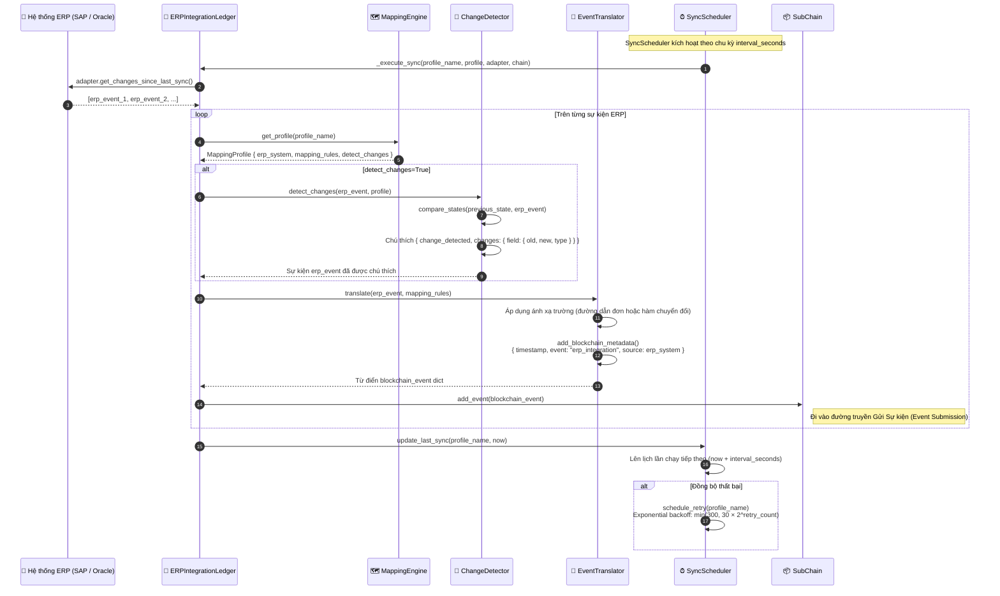
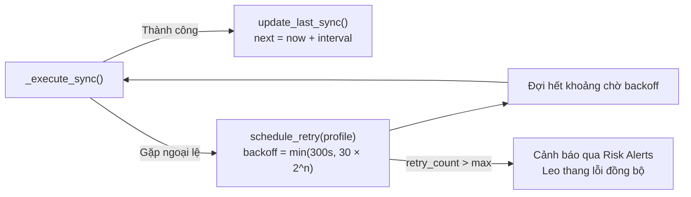

# Đồng bộ tích hợp ERP

## Tổng quan

HieraChain tích hợp với ERP doanh nghiệp (SAP, Oracle, Dynamics) qua adapter và mapping engine. `SyncScheduler` thăm dò adapter ERP theo interval đã cấu hình, dịch sự kiện ERP gốc thành định dạng sự kiện HieraChain qua `EventTranslator`, phát hiện thay đổi có ý nghĩa và gửi như sự kiện nghiệp vụ. Lượt đồng bộ lỗi được thử lại với backoff theo hàm mũ.

Quy trình này là cầu nối tiếp nhận giữa hệ thống ERP Web2 truyền thống và sổ cái HieraChain.

---

## Biểu đồ luồng



---

## Biểu đồ luồng: thử lại khi lỗi



---

## Ví dụ chuyển đổi sự kiện ERP

```python
# Sự kiện thô từ SAP (trước khi chuyển đổi)
erp_event = {
    "MBLNR": "5000012345",       # Số chứng từ vật tư
    "BUDAT": "2024-04-23",       # Ngày ghi sổ
    "MATNR": "MAT-00789",        # Mã vật tư
    "MENGE": 150,                 # Số lượng
    "WERKS": "PLANT-01"          # Nhà máy
}

# Sau khi qua EventTranslator.translate() với profile SAP
blockchain_event = {
    "entity_id": "MAT-00789",            # ánh xạ từ MATNR
    "event": "erp_integration",
    "timestamp": 1714000000.0,           # thêm bởi add_blockchain_metadata()
    "details": {
        "document_number": "5000012345", # ánh xạ từ MBLNR
        "posting_date": "2024-04-23",    # ánh xạ từ BUDAT
        "quantity": 150,                  # ánh xạ từ MENGE
        "plant": "PLANT-01",             # ánh xạ từ WERKS
        "source": "SAP",
        "changes": {                      # thêm bởi ChangeDetector nếu bật
            "quantity": {"old": 100, "new": 150, "type": "numeric_change"}
        }
    }
}
```

---

## Hệ thống ERP hỗ trợ

| Hệ thống ERP | Lớp Adapter | Khóa cấu hình |
|:-------------|:----------------------|:--------------|
| SAP S/4HANA | `SAPAdapter` | `erp_system: "SAP"` |
| Oracle ERP Cloud | `OracleAdapter` | `erp_system: "Oracle"` |
| Microsoft Dynamics 365 | `DynamicsAdapter` | `erp_system: "Dynamics"` |
| Generic REST | `GenericERPAdapter` | `erp_system: "Generic"` |

---

## Các bước chi tiết

| Bước | Mô tả |
|:-----|:------|
| **1. Kích hoạt lịch**| `SyncScheduler` gọi `_execute_sync()` cho từng profile đã đăng ký. |
| **2. Đọc thay đổi** | Adapter ERP gọi `get_changes_since_last_sync()` dùng timestamp lần đồng bộ trước. |
| **3. Phát hiện thay đổi**| `ChangeDetector` so sánh trạng thái mới với trạng thái trước, chú thích trường thay đổi. |
| **4. Ánh xạ**| `EventTranslator` áp dụng `mapping_rules` để tạo sự kiện HieraChain hợp lệ. |
| **5. Chèn metadata** | `add_blockchain_metadata()` thêm `timestamp`, `source`, `event: "erp_integration"`. |
| **6. Gửi lên chuỗi** | Gọi `SubChain.add_event(blockchain_event)`: sự kiện vào luồng Gửi Sự kiện. |
| **7. Lưu mốc thời gian**| Cập nhật `last_sync` cho profile; lên lịch lần chạy tiếp theo. |
| **8. Thử lại** | Nếu lỗi thì thử lại với backoff tối đa 300 giây; vượt max thì gửi cảnh báo rủi ro. |

---

## Xử lý lỗi

| Tình huống | Hành vi |
|:-----------|:--------|
| Lỗi kết nối tới ERP adapter | Thử lại với backoff (30s, 60s, 120s, 240s, tối đa 300s) |
| Thiếu khóa ánh xạ trường | Ghi log cảnh báo; tiếp tục gửi sự kiện với dữ liệu có sẵn |
| Gọi `add_event()` lỗi (từ cấm) | Loại sự kiện; ghi log kèm dữ liệu ERP thô để đối chiếu |
| Vượt max lần thử lại | Kích hoạt cảnh báo qua Risk Alerts với `erp_sync_failure` |

---

## Lớp và phương thức chính

| Bước | Lớp / Phương thức | Tệp |
|:-----|:--------------|:-----|
| Điểm đồng bộ chính | `ERPIntegrationLedger.start_scheduled_sync()` | `integration/erp_ledger.py` |
| Thực thi đồng bộ | `ERPIntegrationLedger._execute_sync()` | `integration/erp_ledger.py` |
| Phát hiện thay đổi | `ChangeDetector.detect_changes()` | `integration/erp_ledger.py` |
| Ánh xạ | `EventTranslator.translate()` | `integration/erp_ledger.py` |
| Quản lý profile | `MappingEngine.create_profile()` | `integration/erp_ledger.py` |
| Lên lịch thử lại | `SyncScheduler.schedule_retry()` | `integration/erp_ledger.py` |

---

## Liên quan

- [Gửi Sự kiện](./event-submission.md): sự kiện sau dịch đi vào luồng này
- [Truy vết Thực thể](./entity-tracing.md): sự kiện gốc ERP có thể truy vết qua `entity_id`
- [Cảnh báo Rủi ro](./risk-alerts.md): lỗi đồng bộ được chuyển tới đây để leo thang
