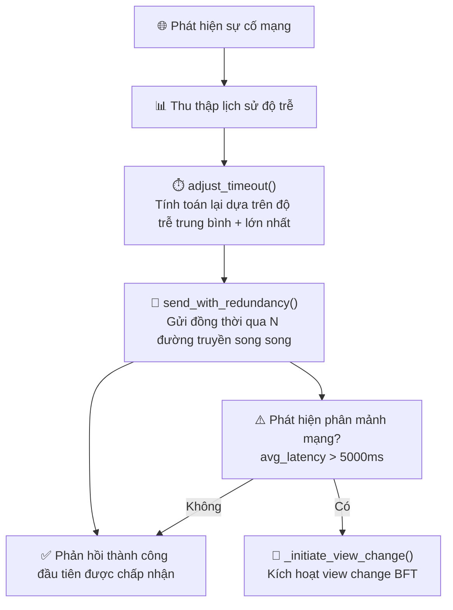
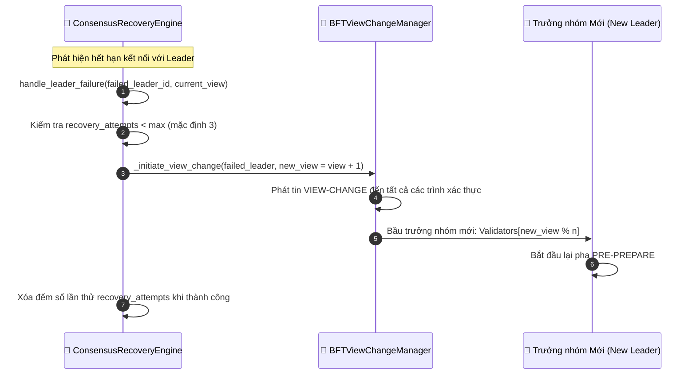
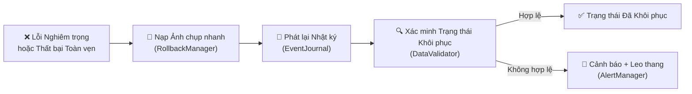

# Giảm thiểu lỗi và phục hồi

## Tổng quan

HieraChain có cơ chế khôi phục tự động theo ba lớp: khả năng phục hồi mạng, khôi phục leader đồng thuận và rollback trạng thái. Các cơ chế này hoạt động độc lập và có thể chạy song song.

---

## 6A: Khôi phục mạng

Chiến lược: `send_with_redundancy()` gửi cùng thông điệp qua N đường truyền song song. Phản hồi thành công đầu tiên được chấp nhận, các cuộc gọi còn lại bị hủy. Cách này xử lý lỗi đường truyền chập chờn mà không cần logic retry phức tạp.

---

## 6B: Khôi phục đồng thuận (lỗi leader)

---

## 6C: Rollback trạng thái

Các bước rollback:
1. `RollbackManager.load_snapshot()`: nạp snapshot nhất quán gần nhất
2. `EventJournal.replay()`: phát lại các mục nhật ký đã commit kể từ snapshot
3. `DataValidator.validate()`: xác thực trạng thái khôi phục so với checksum mật mã
4. Nếu xác thực lỗi: gửi cảnh báo leo thang qua Risk Alerts; cần can thiệp thủ công.

---

## Các bước chi tiết

| Luồng phụ | Kích hoạt | Hành động |
|:----------|:----------|:----------|
| **6A Mạng** | `avg_latency > ngưỡng` | Timeout thích ứng và gửi song song dự phòng |
| **6A Phân mảnh** | `avg_latency > 5000ms` | Kích hoạt View Change BFT |
| **6B Leader** | `leader_timeout` | Gọi `ConsensusRecoveryEngine.handle_leader_failure()` và View Change |
| **6B Thử lại tối đa**| `recovery_attempts >= max` | Ghi lỗi nghiêm trọng, gửi cảnh báo rủi ro, tạm dừng đồng thuận |
| **6C Rollback** | Lỗi toàn vẹn hoặc lỗi nghiêm trọng | Nạp snapshot và phát lại nhật ký rồi xác thực |

---

## Xử lý lỗi

| Tình huống | Hành vi |
|:-----------|:--------|
| Hết lượt khôi phục (6B) | Gửi cảnh báo mức cao nhất, node dừng tham gia đồng thuận |
| Không tìm thấy snapshot (6C) | Chuyển sang nạp lại toàn bộ chuỗi từ DB (Chain Rehydration) |
| Phát lại nhật ký cho trạng thái không hợp lệ | Cảnh báo leo thang qua Risk Alerts, đánh dấu cần can thiệp thủ công |
| Phân mảnh mạng được khắc phục | Timeout thích ứng tự giảm, hoạt động trở lại bình thường |

---

## Lớp và phương thức chính

| Bước | Lớp / Phương thức | Tệp |
|:-----|:--------------|:-----|
| Cấu hình timeout mạng | `NetworkRecoveryManager.adjust_timeout()` | `error_mitigation/recovery_engine.py` |
| Gửi dự phòng | `send_with_redundancy()` | `error_mitigation/recovery_engine.py` |
| Xử lý lỗi leader | `ConsensusRecoveryEngine.handle_leader_failure()` | `error_mitigation/recovery_engine.py` |
| Kích hoạt View Change | `BFTViewChangeManager._initiate_view_change()` | `consensus/bft/consensus.py` |
| Nạp snapshot | `RollbackManager.load_snapshot()` | `error_mitigation/rollback_manager.py` |
| Phát lại nhật ký | `TransactionJournal.replay()` | `error_mitigation/journal.py` |
| Xác thực trạng thái | `DataValidator.validate()` | `error_mitigation/validator.py` |

---

## Liên quan

- [Đồng thuận BFT](./bft-consensus.md): chi tiết View Change
- [Khóa băng Cụm](./cluster-lockdown.md): khôi phục ở cấp cụm
- [Nạp lại Trạng thái Chuỗi](./chain-rehydration.md): tải lại toàn bộ chuỗi từ DB
- [Cảnh báo Rủi ro](./risk-alerts.md): thông báo leo thang
