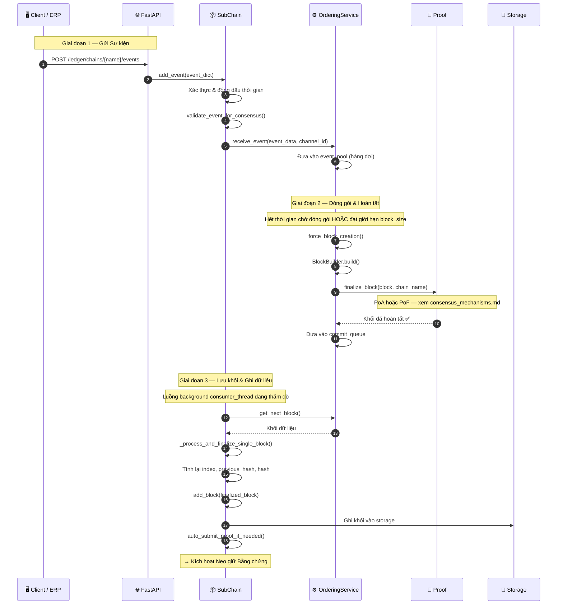

# Gửi sự kiện

## Tổng quan

Sự kiện vào HieraChain là thao tác nghiệp vụ. Sự kiện được xác thực, gom nhóm bởi `OrderingService` thành khối, hoàn thiện bằng cơ chế proof đã cấu hình (PoA, PoF hoặc BFT), rồi nối vào Sub-Chain. Đồng thuận MainChain có thể cắm qua `HRC_MAINCHAIN_CONSENSUS`, còn SubChain mặc định dùng PoA để xử lý nhanh trong tổ chức. Luồng là như nhau trong mọi trường hợp. Chỉ bước `finalize_block()` thay đổi.

Với sơ đồ PoA và PoF, xem [Cơ chế Đồng thuận](./consensus_mechanisms.md).

---

## Biểu đồ luồng



---

## Các bước chi tiết

| Bước | Mô tả |
|:-----|:------|
| **1. Nhận qua API** | FastAPI xác thực cấu trúc request, trích xuất `event_dict`. |
| **2. Xác thực SC** | `SubChain.add_event()` đóng dấu `timestamp`, gọi `validate_event_for_consensus()`: quét từ cấm liên quan tiền mã hóa. |
| **3. Đưa vào hàng đợi OS** | Sự kiện được đẩy vào `event_pool` (hàng đợi trong bộ nhớ). `OrderingService` gom nhóm theo timer hoặc ngưỡng `block_size`. |
| **4. Dựng khối** | `BlockBuilder.build()` tạo khối: index, previous_hash, Merkle root của sự kiện, metadata. |
| **5. Hoàn tất** | `Proof.finalize_block()`: PoA ký bằng Ed25519, PoF xác thực luân phiên leader và proof ZK, BFT chạy PBFT 3 pha. |
| **6. Commit** | Khối được đẩy vào `commit_queue`, luồng nền `consumer_thread` nhận xử lý. |
| **7. Chuỗi băm** | `_process_and_finalize_single_block()` tính lại `previous_hash` và `hash` để giữ toàn vẹn chuỗi. |
| **8. Lưu trữ** | Khối được ghi vào backend lưu trữ (`SQLiteAdapter`, `RedisStorageAdapter` hoặc `MemoryStorage`). |
| **9. Kích hoạt proof** | `auto_submit_proof_if_needed()` kích hoạt Neo giữ Bằng chứng nếu đạt ngưỡng độ dài chuỗi. |

---

## Cấu trúc sự kiện

```python
event = {
    "entity_id": "product-SKU-001",    # Định danh thực thể nghiệp vụ
    "event": "quality_check",           # Loại sự kiện
    "timestamp": 1714000000.0,
    "details": {                        # Payload nghiệp vụ
        "check_type": "visual",
        "check_result": "passed",
        "inspector": "station-7"
    }
}
```

> **Lưu ý**: không dùng thuật ngữ tiền mã hóa (`transaction`, `sender`, `receiver`, `amount`, `wallet`, `fee`). Hàm `validate_event_for_consensus()` sẽ từ chối các từ này.

---

## Xử lý lỗi

| Tình huống | Hành vi |
|:-----------|:--------|
| Phát hiện từ cấm liên quan tiền mã hóa | Ném `ValueError`, từ chối sự kiện trước khi vào hàng đợi |
| Hoàn tất khối lỗi (PoA: authority không hợp lệ) | Hủy khối, ghi log lỗi, đưa sự kiện lại vào hàng đợi |
| Hoàn tất khối lỗi (PoF: sai leader) | Từ chối khối, `validate_block_proposer()` ném lỗi |
| Ghi storage lỗi | Session `SQLAlchemy` rollback; khối ở lại `commit_queue` để thử lại |
| Lỗi luồng consumer | Bắt exception ở cấp luồng, ghi log, luồng tự khởi động lại |

---

## Lớp và phương thức chính

| Bước | Lớp / Phương thức | Tệp |
|:-----|:--------------|:-----|
| Nhận sự kiện | `SubChain.add_event()` | `hierarchical/sub_chain/base.py` |
| Quét từ cấm | `BaseConsensus.validate_event_for_consensus()` | `consensus/base_consensus.py` |
| Gom nhóm và sắp xếp | `OrderingService.receive_event()` | `consensus/ordering/service.py` |
| Dựng khối | `BlockBuilder.build()` | `consensus/ordering/block_builder.py` |
| Hoàn tất PoA | `ProofOfAuthority.finalize_block()` | `consensus/proof_of_authority.py` |
| Hoàn tất PoF | `ProofOfFederation.finalize_block()` | `consensus/proof_of_federation.py` |
| Liên kết và thêm khối | `SubChain._process_and_finalize_single_block()` | `hierarchical/sub_chain/base.py` |
| Ghi dữ liệu | `SQLiteAdapter` / `RedisStorageAdapter` | `adapters/database/` |

---

## Liên quan

- [Cơ chế Đồng thuận](./consensus_mechanisms.md): sơ đồ phụ PoA và PoF
- [Neo giữ Bằng chứng](./proof-anchoring.md): kích hoạt sau khi khối hoàn tất
- [Đồng thuận BFT](./bft-consensus.md): luồng PBFT 3 pha đầy đủ
- [Thực thi Chính sách](./policy-enforcement.md): cổng kiểm soát trước `add_event()`
- [Danh tính MSP](./msp-identity.md): gọi `authorize_action()` trước khi gửi
