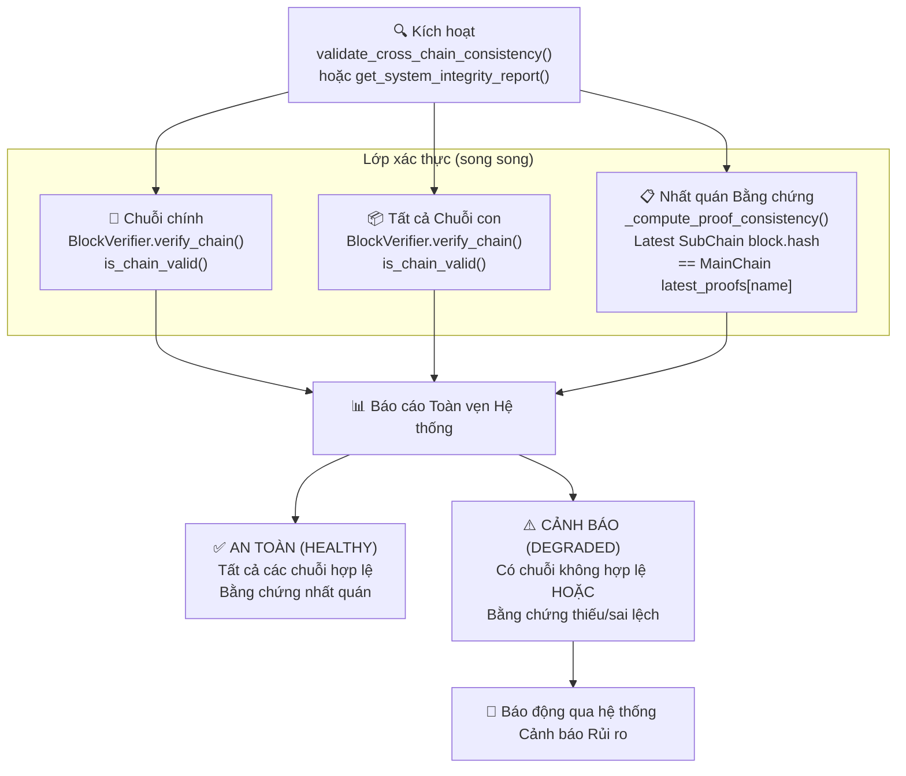
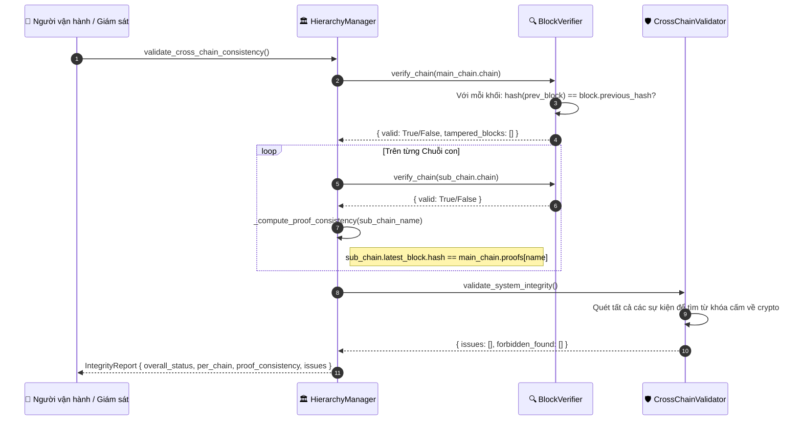

# Xác thực tính toàn vẹn hệ thống

## Tổng quan

Quy trình xác thực kiểm tra tính nhất quán mật mã của mọi chuỗi và xác minh proof lưu trên Main Chain khớp với khối mới nhất trên từng Sub-Chain. Đây là cơ chế chính để phát hiện can thiệp và đáp ứng kiểm toán.

Quy trình chạy ba lớp kiểm tra song song: tính hợp lệ mật mã của Main Chain, tính hợp lệ của Sub-Chain, và tính nhất quán proof giữa hai cấp.

---

## Biểu đồ luồng



---

## Luồng phát hiện can thiệp



---

## Cấu trúc báo cáo toàn vẹn

```python
{
    "timestamp": 1714000000.0,
    "overall_status": "HEALTHY",          # hoặc "DEGRADED"
    "system_overview": {
        "total_sub_chains": 3,
        "total_sub_chain_blocks": 142,
        "total_sub_chain_events": 3580,
        "system_uptime": 86400.0
    },
    "main_chain": {
        "valid": True,
        "height": 47
    },
    "sub_chains": {
        "supply_chain": {"valid": True, "height": 61},
        "logistics":    {"valid": True, "height": 48},
        "finance":      {"valid": True, "height": 33}
    },
    "proof_consistency": {
        "supply_chain": {
            "consistent": True,
            "latest_proof_hash": "a3f8b2...",
            "chain_height": 61
        }
    },
    "issues": []
}
```

---

## Các bước chi tiết

| Bước | Mô tả |
|:-----|:------|
| **1. Kích hoạt** | Timer định kỳ, lệnh vận hành, hoặc phát hiện bất thường từ Risk Alerts. |
| **2. Xác thực Main Chain** | `BlockVerifier.verify_chain()` tính lại hash mọi khối và kiểm tra liên kết `previous_hash`. |
| **3. Xác thực Sub-Chain** | Chạy xác thực tương tự song song trên mọi Sub-Chain đã đăng ký. |
| **4. Nhất quán proof** | So sánh `sub_chain.latest_block.hash` với proof lưu trên Main Chain `main_chain.proofs[chain_name]`. |
| **5. Quét từ cấm** | `CrossChainValidator` quét payload sự kiện để tìm thuật ngữ tiền mã hóa. |
| **6. Tổng hợp báo cáo** | Ghép kết quả thành một `IntegrityReport` duy nhất. |
| **7. Cảnh báo khi DEGRADED** | Nếu có kiểm tra lỗi, Risk Alerts gửi thông báo chi tiết ngay. |

---

## Xử lý lỗi

| Tình huống | Trạng thái | Hành động |
|:-----------|:-----------|:----------|
| Lệch hash trên Main Chain | `DEGRADED` | Đánh dấu chỉ số khối bị can thiệp; phát cảnh báo khẩn |
| Sub-Chain thiếu proof | `DEGRADED` | Ghi log thiếu proof; gửi cảnh báo |
| Hash Sub-Chain khác proof trên Main Chain | `DEGRADED` | Phát hiện can thiệp; phát cảnh báo mức cao |
| Tìm thấy từ cấm trong sự kiện | `DEGRADED` | Đánh dấu sự kiện, ghi log kèm đường dẫn chi tiết |

---

## Lớp và phương thức chính

| Bước | Lớp / Phương thức | Tệp |
|:-----|:--------------|:-----|
| Báo cáo toàn phần | `HierarchyManager.get_system_integrity_report()` | `hierarchical/hierarchy_manager/base.py` |
| Kiểm tra nhất quán | `HierarchyManager.validate_cross_chain_consistency()` | `hierarchical/hierarchy_manager/base.py` |
| Xác thực chuỗi | `BlockVerifier.verify_chain()` | `security/verify/block_verifier.py` |
| Xác thực đơn khối | `BlockVerifier.verify_block()` | `security/verify/block_verifier.py` |
| Quét từ cấm | `CrossChainValidator.validate_system_integrity()` | `domains/utils/cross_chain_validator.py` |
| REST API | `GET /ledger/system/integrity` | `api/ledger/routes.py` |

---

## Liên quan

- [Neo giữ Bằng chứng](./proof-anchoring.md): tạo proof được kiểm tra ở đây
- [Nạp lại Trạng thái Chuỗi](./chain-rehydration.md): gọi nếu phát hiện không nhất quán và cần nạp lại từ DB
- [Cảnh báo Rủi ro](./risk-alerts.md): nhận cảnh báo DEGRADED từ quy trình này
