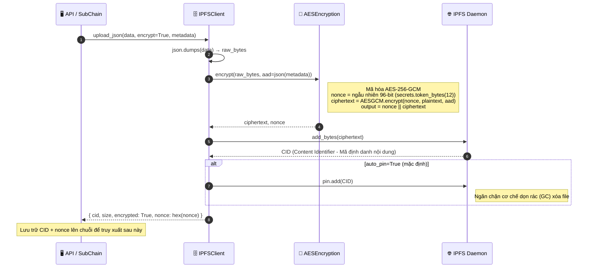
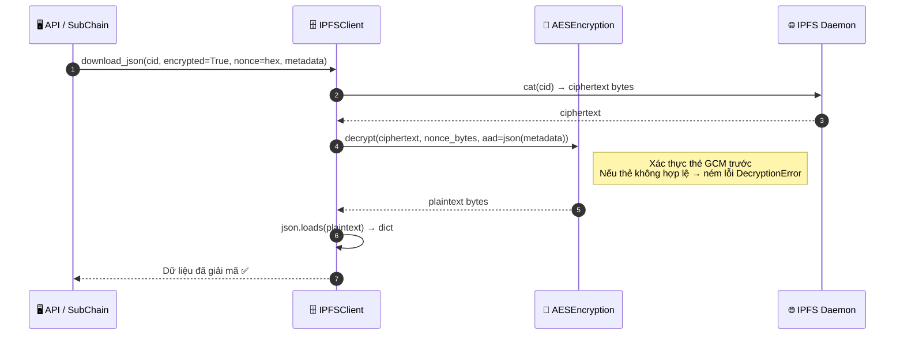
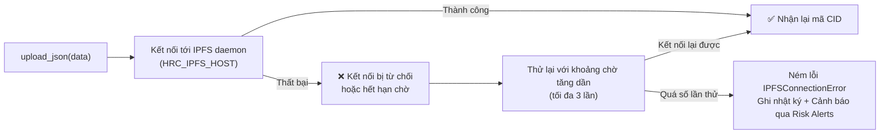

# Lưu trữ mã hóa IPFS

## Tổng quan

Dữ liệu lớn hoặc nhạy cảm ngoài chuỗi (ví dụ tệp đính kèm, bằng chứng kiểm toán, tài sản nhị phân) được lưu trên swarm IPFS riêng với mã hóa bắt buộc AES-256-GCM. Chỉ node có chung khóa mới giải mã được. CID do IPFS trả về được lưu trên chuỗi làm tham chiếu; plaintext không rời khỏi ranh giới mã hóa.

Điểm an toàn cốt lõi: ngay cả khi storage IPFS bị lộ vật lý, dữ liệu vẫn không đọc được nếu không có khóa AES-256-GCM.

---

## Biểu đồ luồng: tải lên (mã hóa và ghim)

---

## Biểu đồ luồng: tải về (truy xuất và giải mã)

---

## Xử lý lỗi: IPFS ngoại tuyến

---

## Các bước chi tiết

| Bước | Mô tả |
|:-----|:------|
| **1. Tuần tự hóa** | `json.dumps(data)` thành bytes thô. |
| **2. Mã hóa** | AES-256-GCM với nonce ngẫu nhiên 96-bit. AAD được tạo từ metadata JSON. |
| **3. Tải lên** | Bytes mã hóa được gửi tới IPFS daemon qua Kubo RPC API (`httpx`). |
| **4. Ghim** | `pin.add(CID)` giữ dữ liệu trên đĩa, tránh GC của IPFS xóa. |
| **5. Trả kết quả** | Bên gọi nhận `{ cid, nonce }`; cả hai phải lưu trên chuỗi để truy xuất sau. |
| **6. Truy xuất** | `cat(cid)` tải bytes mã hóa; `decrypt()` kiểm tra thẻ GCM trước khi giải mã. |

---

## Thuộc tính an toàn

| Thuộc tính | Cơ chế |
|:-----------|:-------|
| **Bảo mật** | AES-256-GCM |
| **Toàn vẹn** | Xác thực thẻ GCM (authenticated encryption) |
| **Chống replay** | Mỗi lần tải lên dùng nonce 96-bit ngẫu nhiên riêng |
| **Quản lý khóa** | Cấu hình qua `HRC_IPFS_ENCRYPTION_KEY`; tự sinh nếu thiếu |
| **Kiểm soát quyền** | Policy engine kiểm soát quyền gọi API upload/download |

---

## Lớp và phương thức chính

| Bước | Lớp / Phương thức | Tệp |
|:-----|:--------------|:-----|
| Điểm tải lên | `IPFSClient.upload_json()` | `api/storage/ipfs_client.py` |
| Mã hóa | `AESEncryption.encrypt()` | `api/storage/encryption.py` |
| Tải bytes thô | `IPFSClient.upload_bytes()` | `api/storage/ipfs_client.py` |
| Ghim | `IPFSClient.pin()` | `api/storage/ipfs_client.py` |
| Tải về và giải mã | `IPFSClient.download_json()` | `api/storage/ipfs_client.py` |
| Tạo client | `create_ipfs_client_from_env()` | `api/storage/ipfs_client.py` |

---

## Liên quan

- [Thực thi Chính sách](./policy-enforcement.md): kiểm soát quyền upload/download
- [Cảnh báo Rủi ro](./risk-alerts.md): lỗi kết nối IPFS kích hoạt cảnh báo
- [Sao lưu & Khôi phục Khóa](./key-backup.md): cùng mô hình mã hóa AES-256-GCM cho bản sao lưu khóa
