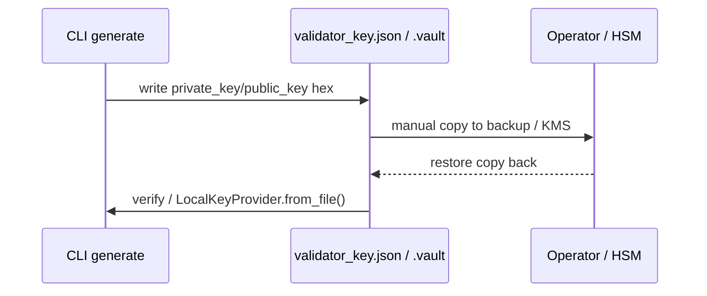

# Key Backup & Restoration

## Overview

HieraChain does **not** have a `security/key_backup_manager.py` or `MasterKeyProvider`. Key backup is operator-managed via two real paths: plain JSON key files produced by the CLI and the optional encrypted `FileVaultProvider` vault. No automatic AES-256-GCM multi-vault distribution or SHA-512 integrity chain exists in code.

---

## Actual Paths

### 1. CLI Plain Backup (default)

**File**: `hierachain/cli/key.py`

```bash
python -m hierachain key generate --output validator_key.json  # Ed25519 hex JSON
python -m hierachain key show --input validator_key.json
python -m hierachain key verify --input validator_key.json
```

* Output is `{private_key, public_key}` hex. Backup = copy `validator_key.json` to secure external storage. Restore = copy back and set `HRC_VALIDATOR_IDENTITY=validator_key.json`.
* No encryption, no hash, no auto-rotation. Operator handles rotation by re-running `generate`.

### 2. Encrypted Vault (dev/test)

**File**: `hierachain/security/key_provider.py` (`FileVaultProvider`)

* Creates a `.vault` file encrypted with `PBKDF2HMAC(SHA256, 310k iter)` → `Fernet` (AES-128-CBC+HMAC, not AES-256-GCM). Password is `HRC_VAULT_*` / constructor arg.
* Explicitly documented as *dev/test only*, production should implement `KeyProvider` via HSM/KMS.
* No distribution to multiple vaults, no `metadata.json`, no `retention_period`, no `auto_restore_threshold`.



---

## What Is NOT Implemented

| Documented claim (removed) | Reality |
|---|---|
| `KeyBackupManager.backup_keys()` / `_encrypt_backup_data()` / `SHA-512` / `_distribute_to_locations()` | No such class/methods exist |
| AES-256-GCM + nonce\|\|ciphertext + 3-vault failover | Vault uses `Fernet`; multi-location is manual copy |
| `MasterKeyProvider.get_master_key()` | No such provider; master key is `HRC_MASTER_KEY_FILE`/`HRC_MASTER_KEY_SOURCE` + `HRC_VAULT_TOKEN`/`HRC_VAULT_PATH` envs |
| Auto backup on MSP cert issue or consensus rotation | No hook; certs in `security/msp.py` are in-memory only |

---

## Operator Checklist

1. Generate: `python -m hierachain key generate -o validator_key.json`
2. Backup: `cp validator_key.json /secure/backup/` (+ encrypt externally if needed)
3. Restore: `cp /secure/backup/validator_key.json ./ && python -m hierachain key verify`
4. For encrypted vault: `FileVaultProvider.create_vault(vault_path, password)` then store password in vault/KMS at `HRC_VAULT_TOKEN`.

---

## Related

- [MSP Identity](./msp-identity.md): `security/msp.py` issues in-memory certs; no trigger to key backup
- [Cluster Lockdown](./cluster-lockdown.md): no automatic key rotation
- [Encryption & Keys](../security/encryption-keys.md): corrected description of `msp.py`/`key_provider.py`
