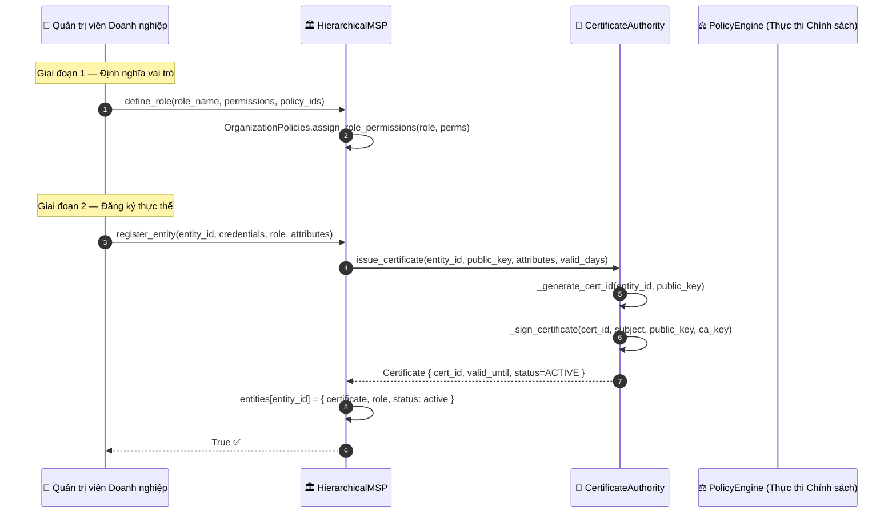
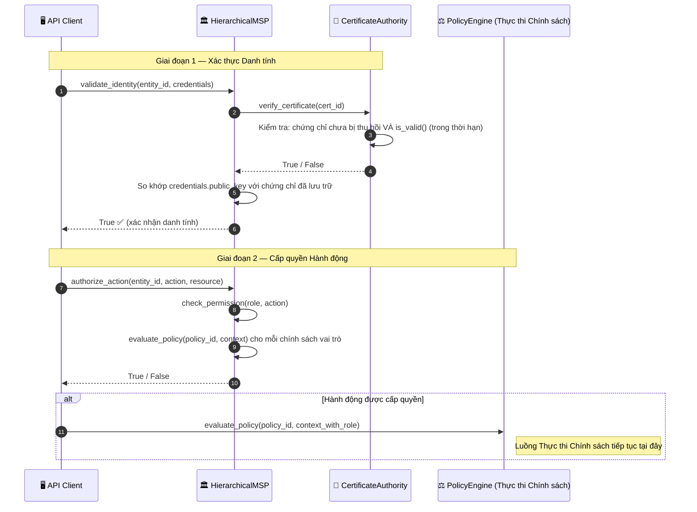
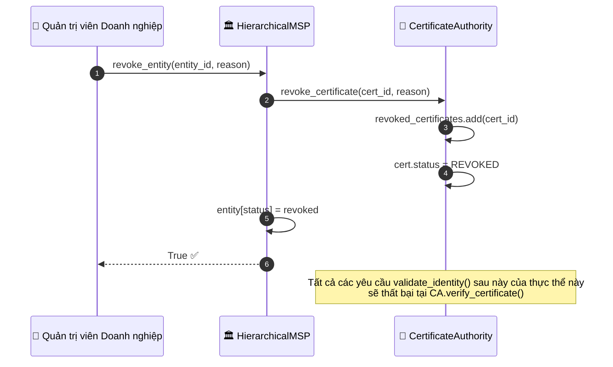

# Danh tính và ủy quyền MSP

## Tổng quan

HieraChain có hai lớp danh tính:

| Lớp | Lớp (Class) | Trường hợp dùng |
|:------|:------|:---------|
| **RBAC đơn giản** | `IdentityManager` | Triển khai một tổ chức; kiểm tra quyền theo vai trò |
| **Doanh nghiệp MSP** | `HierarchicalMSP` | Liên minh đa tổ chức; phân cấp chứng chỉ X.509 với `CertificateAuthority` |

Mỗi thực thể phải đăng ký và xác thực danh tính trước khi được gọi `PolicyEngine` hoặc gửi sự kiện.

---

## Sơ đồ luồng: đăng ký thực thể (doanh nghiệp MSP)

---

## Sơ đồ luồng: xác thực quyền lúc chạy

---

## Sơ đồ luồng: thu hồi chứng chỉ

---

## Vai trò mặc định

| Vai trò | Quyền hạn |
|:-----|:------------|
| `admin` | manage_entities, view_audit_log, define_policies, create_channels, manage_certificates, submit_events, view_channels, query_data |
| `operator` | submit_events, view_channels, query_data |
| `viewer` | view_data, query_data |

---

## Các bước chi tiết

| Bước | Mô tả |
|:-----|:------------|
| **1. Định nghĩa vai trò** | Quản trị viên định nghĩa vai trò, tập quyền và ID chính sách liên kết. |
| **2. Đăng ký thực thể** | MSP yêu cầu chứng chỉ X.509 từ CA cho public key của thực thể. |
| **3. CA phát hành** | CA tạo `cert_id`, ký chứng chỉ và lưu với `status=ACTIVE`. |
| **4. Xác thực danh tính** | CA kiểm tra: chứng chỉ chưa thu hồi và thời gian hiện tại trong `[issued_at, valid_until]`. |
| **5. So khớp** | MSP kiểm tra `credentials.public_key == certificate.public_key`. |
| **6. Cấp quyền** | `check_permission(role, action)` và đánh giá mọi chính sách liên kết với vai trò. |
| **7. Cổng chính sách** | Nếu được cấp quyền, PolicyEngine đánh giá thêm quy tắc theo ngữ cảnh. |
| **8. Thu hồi** | Đặt `cert.status = REVOKED`; mọi `validate_identity()` sau đó lỗi tại bước 4. |

---

## Xử lý lỗi

| Điều kiện | Hành vi |
|:----------|:---------|
| Thực thể chưa đăng ký | `validate_identity()` trả về `False` ngay |
| Chứng chỉ hết hạn | `CA.is_valid()` trả về `False`; từ chối danh tính |
| Chứng chỉ bị thu hồi | `CA.verify_certificate()` lỗi; từ chối danh tính |
| Không khớp public key | `validate_identity()` trả về `False` |
| Vai trò không có quyền | `authorize_action()` trả về `False` |

---

## Lớp và phương thức chính

| Bước | Lớp / Phương thức | Tệp |
|:-----|:--------------|:-----|
| Đăng ký RBAC đơn giản | `IdentityManager.register_user()` | `security/identity.py` |
| Xác thực RBAC đơn giản | `IdentityManager.validate_identity()` | `security/identity.py` |
| Xác minh chữ ký | `IdentityManager.verify_user_signature()` | `security/identity.py` |
| Đăng ký doanh nghiệp | `HierarchicalMSP.register_entity()` | `security/msp.py` |
| Phát hành chứng chỉ | `CertificateAuthority.issue_certificate()` | `security/msp.py` |
| Xác thực danh tính | `HierarchicalMSP.validate_identity()` | `security/msp.py` |
| Ủy quyền thao tác | `HierarchicalMSP.authorize_action()` | `security/msp.py` |
| Thu hồi thực thể | `HierarchicalMSP.revoke_entity()` | `security/msp.py` |

---

## Liên quan

- [Thực thi Chính sách](./policy-enforcement.md): gọi sau khi ủy quyền MSP thành công
- [Gửi Sự kiện](./event-submission.md): `authorize_action()` là rào chắn trước `add_event()`
- [Sao lưu Khóa](./key-backup.md): phát hành chứng chỉ mới không tự kích hoạt sao lưu khóa
