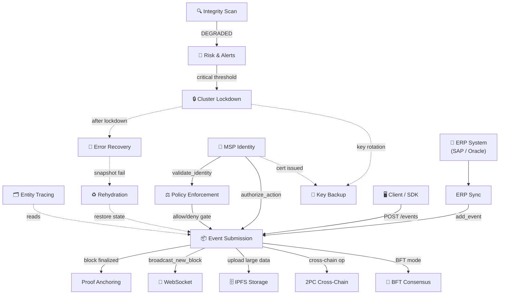

# Tổng quan và hướng dẫn luồng công việc

HieraChain là sổ cái phân cấp thuần Python, hoạt động như plugin layer cho hạ tầng Web2 hiện có. Nó không thay thế ngăn xếp mạng doanh nghiệp vốn đã xử lý TLS/SSL, tường lửa và WAF ở API gateway. HieraChain tập trung vào tính bất biến, niềm tin phân tán, bằng chứng can thiệp và chống chối bỏ.

Tài liệu này là tham khảo trung tâm cho 16 luồng công việc hệ thống trong 6 nhóm chức năng. Nó mô tả cách các luồng tương tác khi chạy và cách đọc, duy trì hoặc thêm luồng mới.

---

## 1. Rào chắn phát triển cốt lõi

Khi làm việc với luồng công việc của HieraChain, tuân thủ các rào chắn sau:

* Kiểm duyệt thuật ngữ: HieraChain theo dõi sổ cái quy trình nghiệp vụ, không phải tiền mã hóa. Không dùng thuật ngữ tiền mã hóa trong payload sự kiện, tên biến, khóa cơ sở dữ liệu hoặc comment.

    * Từ bị cấm: `transaction`, `mining`, `coin`, `token`, `wallet`, `address`, `sender`, `receiver`, `amount`, `fee`.
    * Từ bắt buộc: `event` cho mục sổ cái, `node` cho peer, `msp_id` cho danh tính, `entity_id` cho tài sản nghiệp vụ.
    * Lưu ý: `CrossChainValidator` quét commit và từ chối mã chứa từ bị cấm.

* Ràng buộc độ trễ tối thiểu: HieraChain giữ độ trễ cơ sở ở mức 10 đến 20ms. Giữ mã luồng ngắn và nhanh. Không thêm mã hóa tầng truyền tải hoặc wrapper thừa làm tăng tải CPU.
* Không truy cập trực tiếp bộ lưu trữ: không truy vấn SQL hoặc Redis trực tiếp. Dùng adapter lưu trữ trong `adapters/database/` (ví dụ `adapters/database/sqlite_adapter.py`).

---

## 2. Tất cả luồng công việc: tra cứu nhanh

Bảng này liệt kê tất cả luồng để tra cứu nhanh:

| Luồng công việc | Nhóm | Kích hoạt | Kết quả | Mô-đun chính |
|:---------|:------|:--------|:-------|:-----------|
| [Gửi Sự kiện](./event-submission.md) | A | `POST /api/ledger/chains/{name}/events` | Khối được thêm vào Sub-Chain | `hierarchical/sub_chain/base.py` (`SubChain.add_event`) |
| [Neo giữ Bằng chứng](./proof-anchoring.md) | A | Khối được hoàn thiện trên Sub-Chain | Mã băm bằng chứng trên Main Chain | `hierarchical/main_chain/base.py` + `hierarchical/sub_chain/proof.py` |
| [Giao dịch Liên chuỗi 2PC](./cross-chain-2pc.md) | A | `HierarchyManager.transaction_manager` | `COMMITTED` hoặc `ROLLED_BACK` | `hierarchical/hierarchy_manager/base.py` + `hierarchical/transaction_manager.py` |
| [Đồng thuận BFT](./bft-consensus.md) | B | `HRC_MAINCHAIN_CONSENSUS` / `HRC_CONSENSUS_TYPE` | Khối được xác nhận bởi 2f+1 validator | `consensus/bft/consensus.py` |
| [Khóa băng Cụm](./cluster-lockdown.md) | C | Bất thường vượt ngưỡng rủi ro | Tất cả node bị đóng băng / khôi phục | `cluster/lockdown_types.py` + `cluster/lockdown_protocol.py` |
| [Giảm thiểu Lỗi & Phục hồi](./error-recovery.md) | C | Lỗi mạng / hết hạn leader / lỗi toàn vẹn | Trạng thái khôi phục từ snapshot | `error_mitigation/rollback_manager.py` + `consensus_recovery.py` |
| [Truy vết Thực thể](./entity-tracing.md) | D | `EntityTracer.trace_entity()` | Dấu vết kiểm toán liên chuỗi đầy đủ | `domains/utils/entity_tracer.py` |
| [Nạp lại Trạng thái Chuỗi](./chain-rehydration.md) | D | Khởi động lại node hoặc lệch mã băm | Chuỗi trong bộ nhớ đồng bộ với DB | `hierarchical/sub_chain/base.py` + `hierarchical/sub_chain/ordering.py` |
| [Xác thực Tính toàn vẹn](./integrity-validation.md) | D | Định kỳ / thủ công / bất thường Risk Alerts | `IntegrityReport` (HEALTHY / DEGRADED) | `security/verify/block_verifier.py` |
| [Thực thi Chính sách](./policy-enforcement.md) | E | Mọi thao tác nhạy cảm về quyền | `allow` hoặc `deny` kèm đường dẫn quyết định | `security/policy_engine.py` |
| [Luồng dữ liệu WebSocket](./websocket-streaming.md) | E | Client kết nối tới `/ws/{chain_name}` | Đẩy khối/sự kiện thời gian thực | `api/websocket/manager.py` |
| [Lưu trữ Mã hóa IPFS](./ipfs-storage.md) | E | `IPFSClient.upload_json()` | Trả về CID; bản mã trên IPFS | `api/storage/ipfs_client.py` |
| [Cảnh báo Rủi ro](./risk-alerts.md) | E | Lịch `PerformanceMonitor` | Cảnh báo được gửi; leo thang nếu không xác nhận | `monitoring/alert_system.py` |
| [Đồng bộ Tích hợp ERP](./erp-integration.md) | E | Timer `SyncScheduler` | Sự kiện ERP được gửi tới Sub-Chain | `integration/erp_ledger.py` |
| [Danh tính & Xác thực MSP](./msp-identity.md) | F | Đăng ký thực thể / xác thực API | Xác nhận danh tính và ủy quyền thao tác | `security/msp.py` |
| [Sao lưu & Khôi phục Khóa](./key-backup.md) | F | Tạo khóa (`cli/key.py`) | Tệp khóa / vault được sao lưu; khôi phục qua CLI | `cli/key.py` + `security/key_provider.py` (không có `key_backup_manager.py`) |

---

## 3. Nhóm chức năng và phân hệ

Các luồng được nhóm thành sáu khu vực. Dùng bảng điều khiển bên dưới để tìm nhóm khớp với phân hệ bạn đang gỡ lỗi hoặc thay đổi:

<div class="grid cards" markdown>

* :material-sitemap:{ .lg .middle } __Nhóm A: Hoạt động chuỗi cốt lõi__

    ---

    Xử lý tiếp nhận, xác thực mật mã và lưu trữ.

    * [Gửi Sự kiện](./event-submission.md)
    * [Neo giữ Bằng chứng](./proof-anchoring.md)
    * [Thao tác Liên chuỗi (2PC)](./cross-chain-2pc.md)

* :material-shield-key:{ .lg .middle } __Nhóm B: Hoàn thiện đồng thuận__

    ---

    Hoàn thiện khối. Với lựa chọn PoA/PoF, xem [Cơ chế Đồng thuận](./consensus_mechanisms.md).

    * [Đồng thuận BFT (PBFT 3 pha)](./bft-consensus.md)

* :material-server-security:{ .lg .middle } __Nhóm C: Quản lý cụm__

    ---

    Quản trị, kích hoạt khóa băng và phục hồi.

    * [Khóa băng Cụm](./cluster-lockdown.md)
    * [Giảm thiểu Lỗi & Phục hồi](./error-recovery.md)

* :material-shield-check:{ .lg .middle } __Nhóm D: Tính toàn vẹn và truy vết__

    ---

    Kiểm toán, nạp lại khi khởi động lạnh và xác thực toàn vẹn.

    * [Truy vết Thực thể](./entity-tracing.md)
    * [Nạp lại Trạng thái Chuỗi](./chain-rehydration.md)
    * [Xác thực Tính toàn vẹn](./integrity-validation.md)

* :material-connection:{ .lg .middle } __Nhóm E: Vận hành và tích hợp__

    ---

    Cổng chính sách, đẩy WebSocket, lưu trữ IPFS mã hóa và đồng bộ ERP.

    * [Thực thi Chính sách](./policy-enforcement.md)
    * [Luồng dữ liệu WebSocket](./websocket-streaming.md)
    * [Lưu trữ Mã hóa IPFS](./ipfs-storage.md)
    * [Cảnh báo Rủi ro](./risk-alerts.md)
    * [Đồng bộ Tích hợp ERP](./erp-integration.md)

* :material-key-chain:{ .lg .middle } __Nhóm F: Quản lý danh tính và khóa__

    ---

    Đăng ký MSP nhẹ (lớp `Certificate` nội bộ trong `security/msp.py`), ủy quyền thành viên và sao lưu khóa do CLI quản lý (không có X.509/mTLS).

    * [Danh tính & Xác thực MSP](./msp-identity.md)
    * [Sao lưu & Khôi phục Khóa](./key-backup.md)

</div>

---

## 4. Cách luồng tương tác

Sơ đồ cho thấy quan hệ thời gian chạy và kích hoạt giữa các luồng. Đường liền là thao tác đồng bộ hoặc chặn. Đường đứt là không đồng bộ hoặc theo sự kiện.



### Luồng tích hợp chính cho lập trình viên

| Chuỗi tiếp nhận và bảo mật | Mô tả |
|:---|:---|
| **ERP → ERP Sync → Gửi Sự kiện → Neo giữ Bằng chứng** | Pipeline tiếp nhận: thay đổi nghiệp vụ → sự kiện nội bộ → khối Sub-Chain → mã băm bằng chứng neo lên chuỗi gốc. |
| **MSP Identity → Thực thi Chính sách → Gửi Sự kiện** | Đường xác thực bảo mật: xác minh cert nội bộ (`msp.py:verify_certificate`) → kiểm tra chính sách ABAC → chấp nhận/từ chối sự kiện. |
| **Quét Tính Toàn vẹn → Cảnh báo Rủi ro → Khóa băng Cụm → Phục hồi Lỗi** | Đường phát hiện bất thường: `block_verifier`/`risk_analyzer` → gửi cảnh báo → khóa băng → `rollback_manager` khôi phục. |
| **Khóa băng Cụm → Sao lưu Khóa** | Không có liên kết tự động trong mã: xoay vòng/sao lưu khóa là thao tác thủ công qua `cli/key.py` (không do khóa băng kích hoạt). |
| **Phục hồi Lỗi → Nạp lại Trạng thái** | Dự phòng đồng bộ trạng thái: xác thực snapshot cục bộ thất bại kích hoạt dựng lại chuỗi trong bộ nhớ từ nhật ký DB. |

---

## 5. Hướng dẫn lập trình viên: duy trì luồng công việc

Giữ tài liệu luồng đồng bộ với mã khi bạn thêm tính năng hoặc sửa hành vi:

### Cấu trúc của một tài liệu luồng

Mỗi trang luồng (ví dụ `event-submission.md`) có bố cục sau. Nó phải chứa:

1. **Front-matter Zensical**: metadata YAML với `title`, `description` và `icon`. Không có tiền tố WF-number.
2. **Tiêu đề H1**: `# [Title]` khớp với front-matter.
3. **Tổng quan**: luồng làm gì và khi nào dùng.
4. **Sơ đồ luồng**: sơ đồ Mermaid sequence hoặc flowchart thể hiện tương tác thời gian chạy.
5. **Chi tiết từng bước**: bảng ánh xạ số thứ tự tới hành động của lập trình viên.
6. **Xử lý lỗi**: bảng ánh xạ lỗi (node offline, lỗi xác thực) tới biện pháp xử lý.
7. **Lớp và phương thức chính**: con trỏ từ bước luồng tới mã (ví dụ `SubChain.add_event()`).
8. **Liên quan**: liên kết tới luồng anh em hoặc luồng tiếp theo.

### Quy trình thêm hoặc sửa luồng

1. **Viết Markdown chuẩn**: lưu luồng mới dưới `docs/en/workflows/name.md` dùng hệ thống thiết kế hiện tại.
2. **Đăng ký trong zensical.toml**: thêm luồng vào cây `Workflows` trong [zensical.toml](../../zensical.toml) với tên gọn.
3. **Quét thuật ngữ**: kiểm tra không thêm từ vựng tiền mã hóa bị cấm.
4. **Biên dịch và xác thực**: chạy build Zensical trong môi trường HieraChain để kiểm tra định dạng và liên kết:

    ```bash
    zensical build -f zensical.toml
    ```
